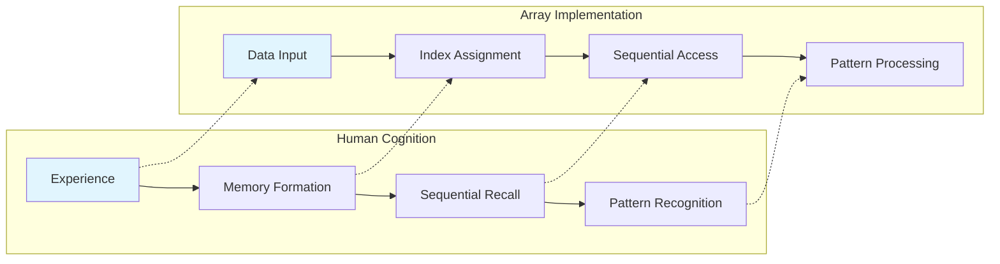
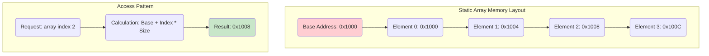
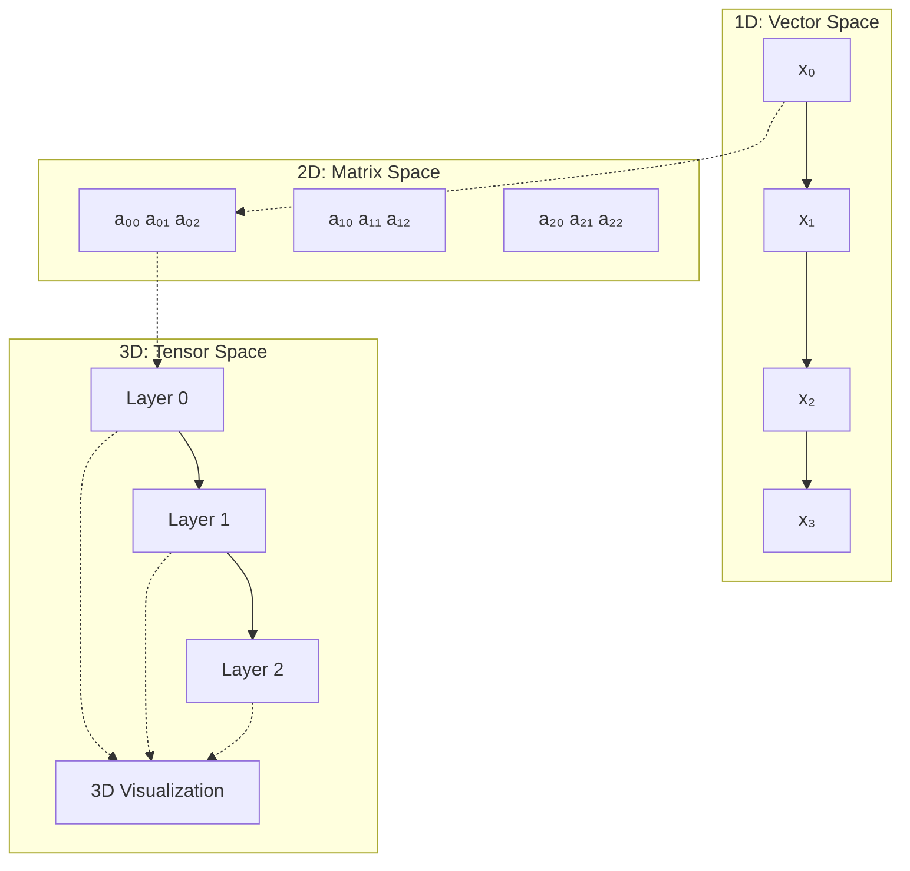
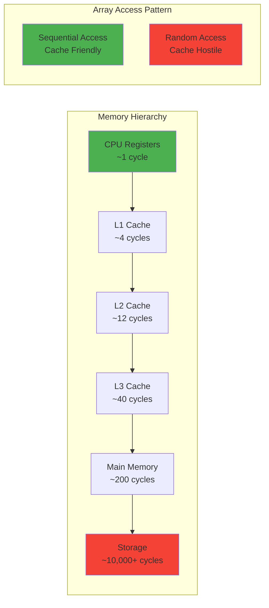
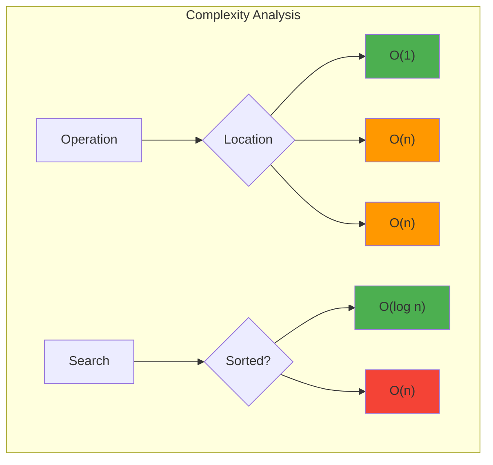
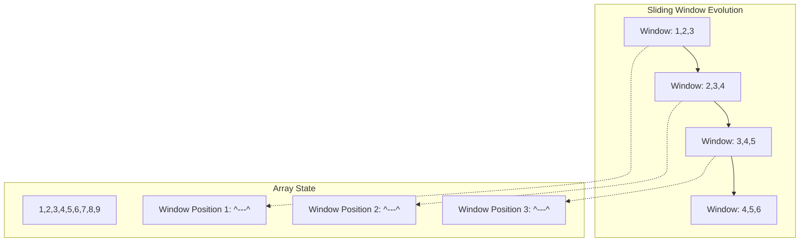
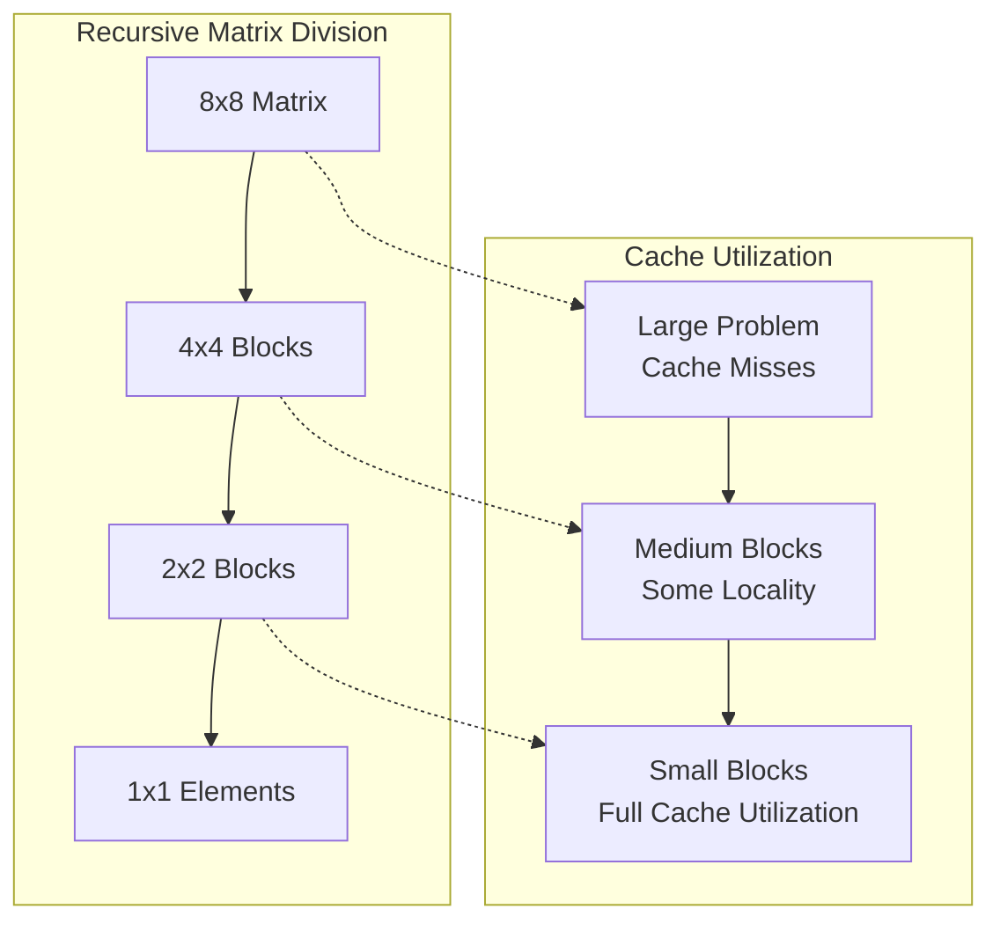
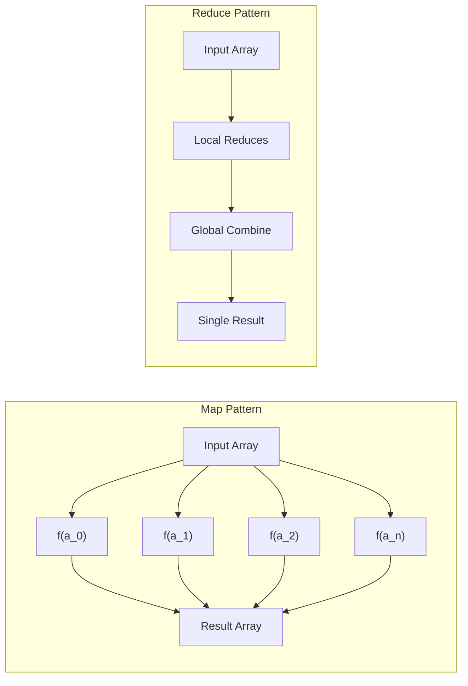
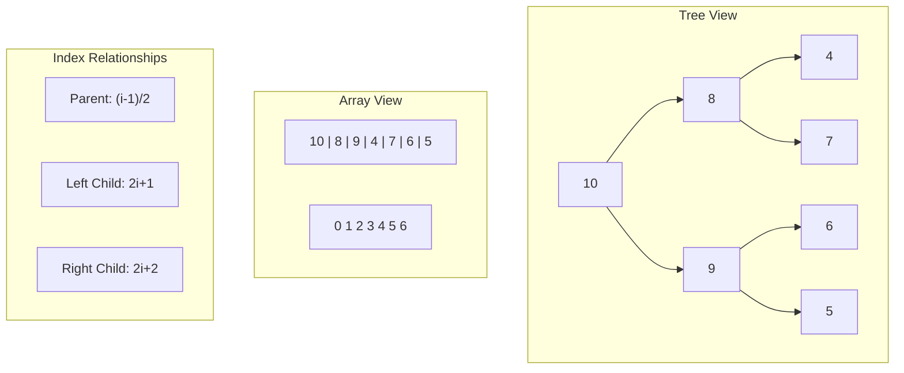
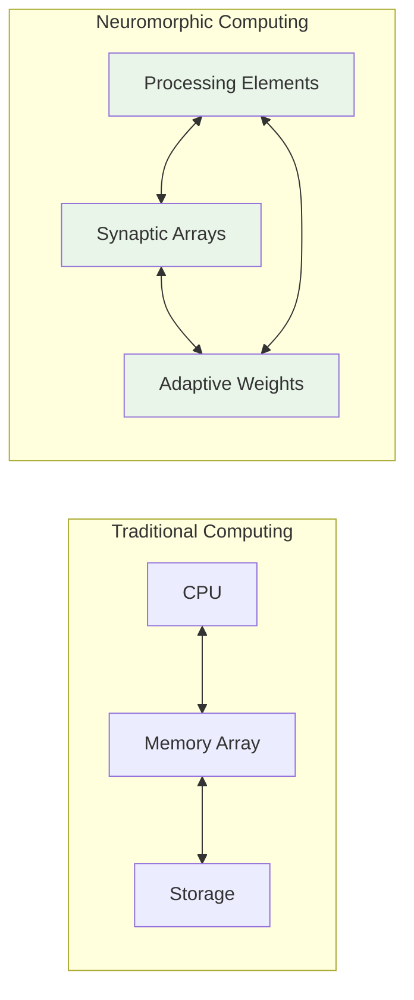

*A Deep Exploration of the Data Structure That Shapes Our Digital World*

---

## Introduction: Why Arrays Matter More Than You Think

When I first encountered arrays in computer science, I thought I understood them. A simple list of elements, accessed by index. But as I've spent years working with complex systems, building algorithms, and watching the evolution of computing, I've come to realize something profound: arrays are not just data structures. They are the fundamental building blocks of how we organize information, how we think about problems, and how we create the digital infrastructure that powers our world.

This isn't just another technical guide. This is an exploration of one of the most elegant and powerful concepts in computer science, examined through the lens of someone who has wrestled with its implications across decades of technological advancement.

---

## Chapter 1: The Nature of Sequential Organization

### 1.1 How Humans Think About Order

There's something deeply human about the desire to organize things in sequence. We tell stories with beginnings, middles, and ends. We count from one to ten. We arrange books on shelves. This isn't accidental—it reflects how our minds naturally process information.

Arrays capture this fundamental human intuition and make it computable. When we create an array, we're not just storing data; we're imposing a mental model of order onto the chaos of information.

### 1.2 The Philosophy of Indexing

Consider this: when you number the elements in an array starting from zero, you're making a philosophical statement about the nature of existence. Zero-based indexing isn't just a programming convention—it represents the mathematical concept that the first position is actually the absence of displacement from the origin.

This seemingly simple choice has profound implications. It means that when we write `array[3]`, we're not asking for the third element—we're asking for the element that is three positions away from the beginning. This distinction matters when you start thinking about arrays as vectors in mathematical space.

$$position = base\_address + (index \times element\_size)$$

This formula reveals something beautiful: array access is fundamentally about navigation through memory space. We're not just retrieving data; we're performing geometric calculations in the abstract space of computer memory.

---

## Chapter 2: The Spectrum of Array Implementations

### 2.1 Static Arrays: The Foundation

Static arrays are like classical physics—predictable, deterministic, and governed by immutable laws. When you declare a static array, you're making a contract with the computer: "I will use exactly this much memory, no more, no less."

{}

### Step 1: Memory Allocation

The system reserves a contiguous block of memory. This isn't just practical—it's beautiful. All elements live next to each other, like houses on a perfectly planned street.

### Step 2: Type Commitment

Every element must be the same type. This constraint seems limiting, but it enables incredible optimization. The processor can predict exactly where every element lives.

### Step 3: Compile-Time Determination

The size is fixed at compile time. This seems rigid, but it allows the compiler to perform optimizations that would be impossible with dynamic structures.

{}

# The Foundation of Computational Thought

### 2.2 Dynamic Arrays: The Evolution

Dynamic arrays represent a philosophical shift. Instead of accepting fixed constraints, we embrace uncertainty and growth. This is where arrays become truly interesting from an algorithmic perspective.



**Growth Strategies**: When a dynamic array needs more space, it faces a fundamental question: how much should it grow? Double the size? Add a fixed amount? This decision affects every subsequent operation. The most elegant solution—doubling—gives us amortized O(1) insertion time, a mathematical proof that sometimes aggressive growth is the most efficient strategy.

**Memory Management**: Dynamic arrays must dance with the memory allocator. Each resize operation is a negotiation with the operating system. The array says, "I need more space," and the OS responds by finding a new location, copying all existing data, and updating pointers. It's a complex choreography that happens invisibly.

**Performance Trade-offs**: Nothing is free. The flexibility of dynamic arrays comes at the cost of occasional expensive operations. But here's the beautiful part: when amortized over many operations, the cost approaches that of static arrays. It's a mathematical miracle of algorithmic design.



---

## Chapter 3: Multi-Dimensional Thinking

### 3.1 Beyond the Line: Matrices and Tensors

Linear arrays are just the beginning. When we move to two dimensions, we're not just adding complexity—we're fundamentally changing how we can think about problems.

A matrix isn't just an array of arrays. It's a mathematical object that represents linear transformations, systems of equations, and relationships between variables. When you multiply two matrices, you're not just performing arithmetic—you're composing transformations in abstract space.

### 3.2 The Memory Layout Challenge

Here's where things get philosophically interesting. A two-dimensional array doesn't exist in computer memory—memory is inherently one-dimensional. So we face a choice: row-major or column-major ordering?

This isn't just a technical detail. It affects cache performance, memory access patterns, and the efficiency of algorithms. Different programming languages made different choices, and these choices echo through decades of software development.

**Row-Major Ordering (C, Java, Python):**
$$address = base + (row \times num\_columns + column) \times element\_size$$

**Column-Major Ordering (Fortran, MATLAB):**
$$address = base + (column \times num\_rows + row) \times element\_size$$

The choice seems arbitrary, but it has profound implications for performance. Iterating through a matrix in the wrong order can make your program orders of magnitude slower, not because the algorithm is wrong, but because you're fighting against the fundamental organization of memory.

---

## Chapter 4: The Performance Landscape

### 4.1 Cache Locality: The Hidden Dimension

Modern processors don't actually access memory directly. They work through a hierarchy of caches, each smaller and faster than the last. This creates an invisible dimension in algorithm design: spatial and temporal locality.

Arrays excel at spatial locality. When you access `array[i]`, the processor automatically loads `array[i+1]`, `array[i+2]`, and several more elements into cache. If your next operation uses these elements, it's essentially free. If it doesn't, you've wasted the opportunity.

### 4.2 The Big O Complexity Framework

Understanding arrays through the lens of computational complexity reveals their true power:

**Access Time: O(1)**
This is the fundamental promise of arrays. Given an index, you can reach any element in constant time. This isn't just efficient—it's magical. In a world where most operations scale with input size, arrays offer a window into constant-time computation.

**Search Time: O(n) to O(log n)**
Unsorted arrays require linear search, but sorted arrays enable binary search. This difference—between O(n) and O(log n)—represents one of the most important trade-offs in computer science.

**Insertion/Deletion: O(1) to O(n)**
The complexity depends on where you're modifying the array. Insert at the end? Constant time. Insert at the beginning? Linear time, because every other element must shift.

---

## Chapter 5: Advanced Array Algorithms

### 5.1 The Art of Two Pointers

Some of the most elegant algorithms in computer science use two pointers moving through an array. This technique transforms O(n²) problems into O(n) solutions through a kind of algorithmic alchemy.

Consider the problem of finding two numbers in a sorted array that sum to a target. The naive approach checks every pair—that's O(n²). But with two pointers, one at the beginning and one at the end, you can solve it in O(n):

{}

### Step 1: Initialize Pointers

Place one pointer at the start (`left = 0`) and another at the end (`right = n-1`) of the sorted array.

### Step 2: Calculate Sum

Compute `sum = array[left] + array[right]`.

### Step 3: Adjust Pointers

If `sum < target`, increment `left`. If `sum > target`, decrement `right`. If `sum == target`, you've found the answer.

### Step 4: Repeat

Continue until pointers meet or you find the target.

{}

This algorithm works because of a profound insight: in a sorted array, if the current sum is too small, the only way to increase it is to move the left pointer right. If it's too large, the only way to decrease it is to move the right pointer left.

### 5.2 Sliding Window: The Dynamic Perspective

The sliding window technique treats arrays as streams of information flowing past a fixed-size window. This perspective is powerful for problems involving subarrays or substrings.

### 5.3 Prefix Sums: Preprocessing for Efficiency

Sometimes the key to efficient array operations is to precompute information. Prefix sums are a perfect example—by spending O(n) time upfront to compute cumulative sums, you can answer range sum queries in O(1) time.

$$prefix[i] = \sum_{j=0}^{i} array[j]$$

$$rangeSum(left, right) = prefix[right] - prefix[left-1]$$

This preprocessing strategy appears throughout advanced algorithms. It's a fundamental trade-off: space for time, preparation for performance.

---

## Chapter 6: Memory Models and Cache Optimization

### 6.1 Understanding Memory Hierarchies

Modern computing systems are built on a hierarchy of memory types, each with different characteristics. Understanding this hierarchy is crucial for writing efficient array-based algorithms.

The memory hierarchy creates an interesting paradox: the memory you can access fastest (CPU registers) is the smallest, while the memory you have the most of (storage) is the slowest. Arrays help us navigate this hierarchy efficiently.



**Cache Lines**: Memory is transferred in chunks called cache lines, typically 64 bytes. When you access `array[0]`, the processor loads `array[0]` through `array[15]` (for 4-byte integers) into cache. Sequential array access leverages this perfectly, while random access wastes it.

**Prefetching**: Modern processors can predict array access patterns and load data before you request it. Simple loops that iterate through arrays trigger hardware prefetchers, making them incredibly fast. Complex access patterns defeat prefetching, leading to cache misses.

**NUMA Effects**: On multi-socket systems, memory is distributed across processors. Arrays that span NUMA boundaries can experience uneven access times. This makes data locality not just a performance optimization, but a correctness concern in parallel programs.



### 6.2 Cache-Oblivious Algorithms

Some of the most sophisticated array algorithms are designed to perform well regardless of the cache hierarchy details. These "cache-oblivious" algorithms achieve optimal performance without knowing cache sizes or line sizes.

The classic example is cache-oblivious matrix multiplication, which recursively divides matrices into smaller blocks that eventually fit in cache. The algorithm adapts automatically to whatever cache sizes are available.

---

## Chapter 7: Parallel Array Processing

### 7.1 The Challenge of Parallelization

Arrays seem naturally parallel—different threads can work on different elements simultaneously. But the reality is more complex. True parallelization requires careful consideration of data dependencies, memory contention, and coordination overhead.

The fundamental question in parallel array processing is: how do you divide work among processors while minimizing communication and synchronization overhead?

### 7.2 Data Parallelism Patterns

**Map Operations**: Apply the same function to every element independently. This is embarrassingly parallel—no coordination needed between threads.

**Reduce Operations**: Combine all elements into a single result (sum, maximum, etc.). This requires careful coordination to avoid race conditions.

**Scan Operations**: Compute running totals or similar prefix operations. This seems inherently sequential but can be parallelized using sophisticated algorithms.

### 7.3 GPU Computing and Arrays

Graphics Processing Units represent the ultimate evolution of parallel array processing. A modern GPU can execute thousands of threads simultaneously, each processing array elements in parallel.

The GPU programming model forces you to think about arrays differently. Instead of processing elements one at a time, you design algorithms that process thousands of elements simultaneously. This shift in perspective has revolutionized fields from scientific computing to machine learning.

---

## Chapter 8: Advanced Data Structures Built on Arrays

### 8.1 Hash Tables: Arrays Meet Mathematics

Hash tables use arrays as their foundation but add a layer of mathematical sophistication. The hash function transforms arbitrary keys into array indices, creating a bridge between the discrete world of array indexing and the continuous space of possible data values.

The design of hash functions is both art and science. A good hash function distributes keys uniformly across the array, minimizing collisions. The mathematical properties of these functions—uniformity, avalanche effect, determinism—determine the performance characteristics of the entire data structure.

$$hash(key) = key \bmod array\_size$$

This simple modulo operation hides profound complexity. The choice of array size affects collision rates. Prime numbers often work better than powers of two. The quality of the hash function can make the difference between O(1) and O(n) performance.

### 8.2 Heaps: Arrays as Trees

Binary heaps demonstrate one of the most elegant mathematical relationships in computer science: how to represent a complete binary tree using a simple array.

For any node at index `i`:
- Left child: `2i + 1`
- Right child: `2i + 2`  
- Parent: `(i - 1) / 2`

This mathematical relationship eliminates the need for pointers, making heaps incredibly memory-efficient while maintaining the tree structure needed for priority queue operations.

### 8.3 Fenwick Trees: Binary Indexing Magic

Fenwick trees (Binary Indexed Trees) represent one of the most ingenious uses of binary representation in array indexing. They solve the range sum problem with O(log n) updates and queries using only an array and bit manipulation.

The key insight: use the binary representation of indices to encode tree structure. Each index represents a range of values, and the bit pattern determines which ranges to combine.

$$BIT[i] = \sum_{j=i-2^r+1}^{i} array[j]$$

Where `r` is the position of the rightmost set bit in `i`.

---

## Chapter 9: The Future of Array Computing

### 9.1 Quantum Arrays and Superposition

As we move toward quantum computing, the concept of arrays must evolve. Quantum arrays exist in superposition—each element can simultaneously hold multiple values until observed. This isn't just a technical curiosity; it represents a fundamental shift in how we think about data storage and retrieval.

In quantum systems, array access becomes probabilistic. You don't retrieve a definite value; you collapse a wave function and extract one of many possible values. This opens up entirely new classes of algorithms that leverage quantum parallelism.

$$|\psi\rangle = \sum_{i=0}^{2^n-1} \alpha_i |i\rangle$$

### 9.2 Neuromorphic Arrays: Computing Like the Brain

Neuromorphic computing systems use arrays to simulate neural networks at the hardware level. Instead of storing static data, these arrays store connection weights and activation states that evolve over time.

The array becomes a living system, adapting and learning. Each element doesn't just hold data—it participates in computation. This blurs the line between memory and processing, creating systems that compute by remembering and remember by computing.

### 9.3 DNA Storage Arrays

Perhaps the most futuristic application of array concepts lies in DNA storage. Scientists are encoding digital data into synthetic DNA sequences, creating arrays where the elements are nucleotides (A, T, G, C) instead of bits.

This biological array system offers incredible density—all the world's digital information could theoretically fit in a space smaller than a sugar cube. The access patterns are different from electronic arrays, but the fundamental concept remains: sequential organization of information for efficient retrieval.

---

## Chapter 10: Practical Mastery and Implementation

### 10.1 Language-Specific Considerations

Different programming languages implement arrays with varying philosophies, and understanding these differences is crucial for practical mastery.



**C/C++**: Arrays are raw memory blocks with minimal abstraction. You have complete control but also complete responsibility. Buffer overflows are possible but performance is optimal. Pointer arithmetic makes array manipulation incredibly flexible but potentially dangerous.

**Java**: Arrays are objects with bounds checking and automatic memory management. The JVM optimizes array operations heavily, often achieving performance close to C++. The type system prevents many common errors but adds some overhead.

**Python**: Lists (dynamic arrays) prioritize flexibility over performance. They can hold mixed types and resize automatically. The interpreter overhead is significant, but the expressiveness enables rapid development and prototyping.

**JavaScript**: Arrays are actually objects with array-like behavior. They can be sparse, hold mixed types, and have methods that blur the line between arrays and functional programming constructs. V8's optimizations make them surprisingly fast for interpreted code.



### 10.2 Performance Optimization Strategies

{}

### Step 1: Choose the Right Data Layout

Consider whether array-of-structures or structure-of-arrays better fits your access patterns. AoS is intuitive but SoA can be much faster for bulk operations.

### Step 2: Optimize Memory Access Patterns

Design your algorithms to access array elements sequentially when possible. Random jumps through large arrays are performance killers on modern hardware.

### Step 3: Consider SIMD Instructions

Modern processors can perform the same operation on multiple array elements simultaneously. Vectorization can provide 4x-8x speedups for appropriate algorithms.

### Step 4: Profile and Measure

Use profiling tools to understand where your array operations spend time. Cache misses, branch mispredictions, and memory bandwidth can all be bottlenecks.

{}

### 10.3 Common Pitfalls and How to Avoid Them

**Off-by-One Errors**: The classic array bug. Remember that arrays are zero-indexed, and the last valid index is `length - 1`, not `length`.

**Buffer Overflows**: Accessing beyond array bounds can corrupt memory and create security vulnerabilities. Always validate indices and use language features that provide bounds checking.

**Memory Leaks**: Dynamic arrays require careful memory management in languages without garbage collection. Every `malloc` needs a corresponding `free`.

**Cache Inefficiency**: Designing algorithms that fight against the cache hierarchy. Understand your access patterns and design them to work with, not against, the memory system.

---

## Conclusion: The Eternal Relevance of Arrays

As we stand at the threshold of quantum computing, artificial intelligence, and biological data storage, it might seem that arrays—with their simple, deterministic nature—are relics of a simpler computational era. But this would be a profound misunderstanding.

Arrays represent something fundamental about how we organize and access information. They are the computational manifestation of sequence, order, and structure. Whether we're storing qubits in quantum registers, weights in neural networks, or nucleotides in DNA sequences, we're still working with arrays at the deepest level.

The principles we've explored—cache locality, algorithmic complexity, parallel processing—these aren't just technical details. They're insights into the nature of computation itself. Understanding arrays deeply means understanding how information flows through systems, how hardware and software interact, and how algorithmic choices cascade through entire software ecosystems.

In my years of working with complex systems, I've found that the programmers who truly understand arrays—not just their syntax, but their deep properties—are the ones who build the most efficient, scalable, and elegant software. They think in terms of data flow, memory hierarchies, and algorithmic complexity because they understand the foundational data structure upon which all others are built.

Arrays are not just the beginning of computer science education; they are the foundation of computational thinking itself. Master them, and you master the art of organizing information in the digital age.

---

## Appendix: Mathematical Foundations

### Time Complexity Analysis

The mathematical analysis of array operations reveals the theoretical limits of what's possible:

**Access**: $T(n) = O(1)$ - Random access is the array's greatest strength
**Linear Search**: $T(n) = O(n)$ - Must examine each element in worst case  
**Binary Search**: $T(n) = O(\log n)$ - Only works on sorted arrays
**Insertion**: $T(n) = O(n)$ - May require shifting all elements
**Deletion**: $T(n) = O(n)$ - May require shifting all elements

### Space Complexity Considerations

Arrays have optimal space complexity for their use case:
- Static arrays: $S(n) = O(n)$ - No overhead beyond the data
- Dynamic arrays: $S(n) = O(n)$ - Amortized space usage is still linear
- Sparse arrays: $S(n) = O(k)$ where $k$ is the number of non-zero elements

### Advanced Mathematical Properties

**Locality of Reference**: The probability that an access to location $x$ will be followed by an access to location $x+1$ approaches 1 in many algorithms.

**Cache Performance**: The expected number of cache misses for sequential access is $\frac{n}{L}$ where $L$ is the cache line size.

**Memory Bandwidth Utilization**: Sequential array access can achieve near-theoretical memory bandwidth limits, while random access typically achieves less than 1% of theoretical bandwidth.

These mathematical relationships aren't just theoretical curiosities—they're the foundation of performance-critical code and the reason why understanding arrays deeply makes you a better programmer at every level of abstraction.