*An In-Depth Journey Through the Data Structure That Revolutionized How We Think About Connection*

---

## Introduction: The Philosophy of Connection

There's something profoundly beautiful about linked lists that goes beyond their technical implementation. While arrays represent order through position, linked lists represent order through relationship. Each element doesn't just contain data—it contains a story about what comes next.

When I first encountered linked lists, I was struck by their elegance. Here was a data structure that could grow and shrink organically, where memory could be scattered across the system yet still maintain perfect logical order. It was my first glimpse into the poetry of computer science—the idea that beautiful abstractions could emerge from simple rules.

This isn't just another data structures tutorial. This is an exploration of how linked lists changed the way we think about memory, relationships, and the fundamental nature of computation itself.

---

## Chapter 1: The Genesis of Dynamic Connection

### 1.1 Beyond the Tyranny of Contiguous Memory

Arrays, for all their elegance, impose a fundamental constraint: elements must live next to each other in memory. This works beautifully when you know exactly how much data you'll have, but real-world problems are messier. Data grows, shrinks, and changes in ways we can't predict at compile time.

Linked lists represent a philosophical breakthrough—the realization that logical order doesn't require physical adjacency. Instead of forcing data into contiguous blocks, we can scatter it throughout memory and maintain order through explicit connections.

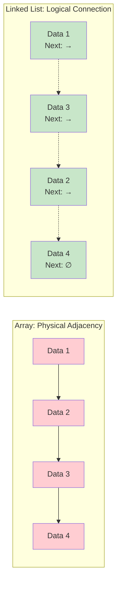

### 1.2 The Node: Atoms of Dynamic Structure

The fundamental unit of a linked list isn't just data—it's a relationship. A node contains two equally important pieces of information: the payload (what we're storing) and the connection (where to go next). This duality transforms simple data storage into a narrative structure.

Consider the elegance of this design: each node is simultaneously self-contained and part of a larger whole. It knows its own value and its place in the sequence, but it doesn't need to know about the entire structure. This locality of knowledge makes linked lists incredibly flexible and robust.

$$Node = \{Data, Pointer\}$$

Where the pointer either references the next node or contains null, signifying the end of the story.

### 1.3 The Psychology of Sequential Access

Linked lists force us to think differently about data access. With arrays, we can jump directly to any element—random access is instantaneous. Linked lists require us to follow the path, to traverse the connections one by one. This isn't a limitation; it's a different way of understanding sequence.

This sequential nature mirrors how we often encounter information in the real world. We read books page by page, not by jumping randomly to page 247. We follow conversations thread by thread, not by accessing arbitrary moments. Linked lists capture this natural flow of sequential discovery.

---

## Chapter 2: The Spectrum of Linked Structures

### 2.1 Singly Linked Lists: The Foundation

The simplest linked list tells a linear story with a clear beginning and end. Each node points to the next, creating a chain of connections that terminates with a null pointer. This structure is perfect for scenarios where you primarily access data in order and need efficient insertion at the front.

{}

### Step 1: The Head Pointer

Every linked list begins with a reference to its first node. This head pointer is the entry point into the entire structure—lose it, and you lose the entire list.

### Step 2: Node Traversal

To reach any element, you must start at the head and follow the chain of next pointers. Each step takes you deeper into the structure.

### Step 3: The Null Terminator

The last node's next pointer is null, marking the end of the sequence. This sentinel value is crucial—it prevents infinite loops and provides a clear stopping condition.

{}

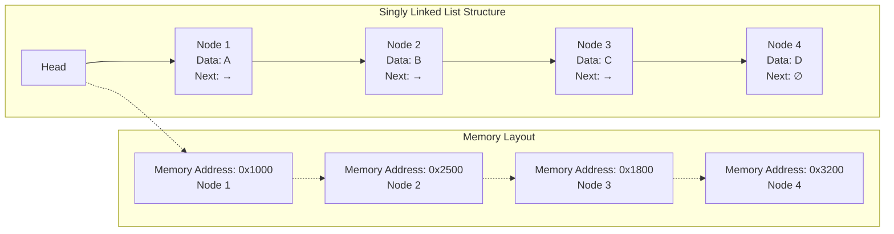

### 2.2 Doubly Linked Lists: Bidirectional Narratives

Doubly linked lists add a profound capability: the ability to move backward through the sequence. Each node maintains two relationships—forward and backward—creating a structure that can be traversed in either direction.

This bidirectionality comes at a cost: increased memory usage and more complex insertion/deletion logic. But it enables powerful operations like efficient removal of arbitrary nodes and backward iteration through the data.



**Memory Overhead**: Each node now requires two pointers instead of one, increasing memory usage by 50% for the pointer overhead. However, this enables operations that would be impossible or inefficient with singly linked lists, often making the trade-off worthwhile.

**Traversal Patterns**: With bidirectional links, algorithms can move forward and backward through the list at will. This enables sophisticated traversal patterns like palindrome checking, finding middle elements, and implementing undo functionality.

**Use Cases**: Doubly linked lists excel in scenarios requiring bidirectional navigation: browser history, music playlists, undo/redo systems, and cache implementations (like LRU caches) where you need to efficiently move elements between positions.



### 2.3 Circular Linked Lists: Eternal Loops

Circular linked lists eliminate the concept of "end" by connecting the last node back to the first. This creates an eternal loop—a structure with no beginning or end, only continuous flow.

The philosophical implications are fascinating. A circular linked list challenges our linear conception of sequence. There's no first element or last element, only relative positions. This makes certain algorithms more elegant while complicating others.

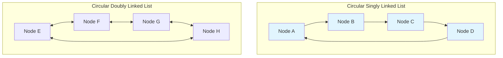

---

## Chapter 3: The Mathematics of Dynamic Operations

### 3.1 Insertion: The Art of Connection

Inserting a node into a linked list is fundamentally different from array insertion. Instead of shifting elements to make space, you're rewiring connections. This difference has profound implications for performance and algorithmic design.

**Insertion at the Head: O(1)**
Adding a new first element is trivial—create the new node, point it to the current head, and update the head pointer. No existing data moves.

**Insertion at the Tail: O(n) for singly, O(1) for doubly**
Singly linked lists require traversal to find the end. Doubly linked lists can maintain a tail pointer for constant-time insertion.

**Insertion at Position: O(n)**
You must traverse to the insertion point, but once there, the actual insertion is O(1).

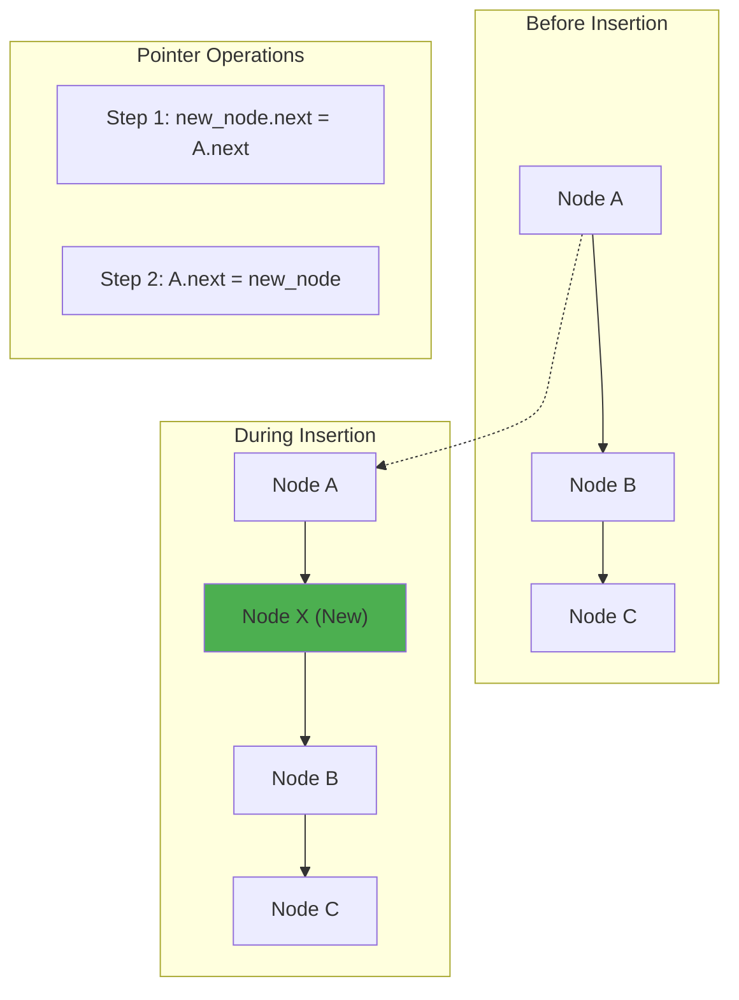

### 3.2 Deletion: The Philosophy of Removal

Deleting from a linked list involves breaking connections and allowing the garbage collector to reclaim memory. This process reveals something deep about computer memory management—how systems handle the lifecycle of data.

The key insight is that deleting a node requires access to its predecessor. This is why keeping track of the previous node during traversal is so important, and why doubly linked lists make deletion more elegant.

**Deletion Complexity Analysis:**
- **At Head**: O(1) - Simply update the head pointer
- **At Tail**: O(n) for singly linked (must find predecessor), O(1) for doubly linked
- **At Position**: O(n) - Must traverse to find the node and its predecessor

### 3.3 Search and Traversal: Following the Thread

Searching in a linked list is inherently sequential. There's no random access, no binary search on unsorted data, no shortcuts. You must follow the thread from beginning to end, examining each node in turn.

This limitation forces a different mindset. Instead of thinking about data as instantly accessible, you think about it as a journey. Each step in the traversal is deliberate, each comparison meaningful.

$$T_{search}(n) = \sum_{i=1}^{n} P(target\_at\_position\_i) \times i$$

For uniform distribution, this simplifies to O(n/2) average case, O(n) worst case.

---

## Chapter 4: Advanced Linked List Architectures

### 4.1 Skip Lists: Hierarchical Express Lanes

Skip lists represent one of the most elegant solutions to the sequential access limitation of linked lists. By maintaining multiple levels of connections—some nodes have express lanes that skip over intermediate nodes—skip lists achieve O(log n) search time while maintaining the dynamic insertion/deletion benefits of linked lists.

The beauty of skip lists lies in their probabilistic nature. Instead of carefully balancing a tree structure, skip lists use randomization to achieve good performance with high probability. It's a perfect example of how randomness can create order.

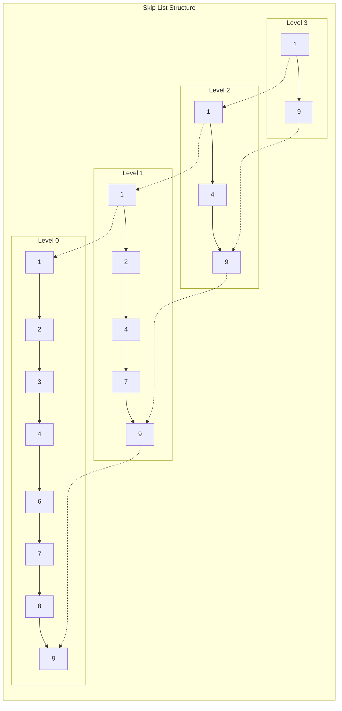

### 4.2 XOR Linked Lists: Memory-Efficient Bidirectionality

XOR linked lists achieve the functionality of doubly linked lists using only one pointer per node instead of two. They accomplish this through a clever use of the XOR operation, storing the XOR of the previous and next node addresses.

This technique is both brilliant and dangerous. It saves memory but makes the code more complex and less portable. It's a perfect example of how low-level bit manipulation can create elegant solutions at the cost of clarity.

**XOR Property**: `A ⊕ A = 0` and `A ⊕ 0 = A`
**Node Storage**: `link = prev_addr ⊕ next_addr`
**Navigation**: `next_addr = prev_addr ⊕ link`

### 4.3 Multi-Level Linked Lists

Some linked lists contain nodes that themselves point to other linked lists, creating hierarchical structures. These multi-level or flattened linked lists appear in scenarios like representing nested data structures or implementing certain types of caches.

The algorithmic challenge becomes maintaining consistent traversal order when flattening the structure into a single sequence. This requires careful stack-based or recursive algorithms that respect the nested relationships.

---

## Chapter 5: Memory Management and Performance Characteristics

### 5.1 The Cache Locality Challenge

Linked lists present a fundamental challenge to modern computer architecture. While arrays excel at cache locality—accessing nearby elements triggers efficient cache line fills—linked lists scatter data throughout memory, leading to cache misses on nearly every access.

This cache inefficiency is the price we pay for dynamic flexibility. Each node access potentially requires a main memory fetch, which can be 100-300 times slower than a cache hit. Understanding this trade-off is crucial for performance-critical applications.

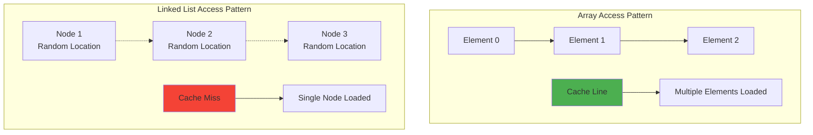

### 5.2 Memory Allocation Patterns

Linked lists interact with the memory allocator differently than arrays. Each node requires a separate allocation, leading to:

**Allocation Overhead**: Each node has metadata overhead from the memory allocator (typically 8-16 bytes per allocation).

**Fragmentation**: Frequent allocation and deallocation can fragment the heap, leading to memory waste and reduced performance.

**Allocation Cost**: Dynamic allocation is expensive compared to stack allocation or pre-allocated arrays.

### 5.3 Memory Pool Optimization

Sophisticated linked list implementations often use memory pools to mitigate allocation overhead. Instead of allocating nodes individually, they pre-allocate large blocks and sub-allocate nodes from these pools.

This technique trades memory efficiency for performance, reducing allocation overhead and improving cache locality within pools. It's a common optimization in high-performance systems where linked lists are used extensively.



**Pool Benefits**: Reduced allocation overhead, better cache locality within pools, predictable memory usage patterns, and elimination of external fragmentation within the pool. These benefits can make linked lists competitive with arrays in certain scenarios.

**Implementation Strategies**: Fixed-size pools for uniform node sizes, expanding pools that grow as needed, and specialized allocators that understand linked list access patterns. Some implementations maintain free lists of deleted nodes for quick reuse.

**Trade-offs**: Memory pools require upfront memory commitment and can lead to internal fragmentation if not properly sized. They also add complexity to memory management and can make debugging more difficult due to delayed memory reclamation.



---

## Chapter 6: Advanced Algorithms and Techniques

### 6.1 The Two-Pointer Technique

Some of the most elegant linked list algorithms use two pointers moving at different speeds or in different patterns. This technique can solve complex problems with simple, intuitive code.

**Floyd's Cycle Detection (Tortoise and Hare):**
Use two pointers, one moving one step at a time, another moving two steps. If there's a cycle, the fast pointer will eventually meet the slow pointer.

**Finding the Middle Element:**
Use two pointers, one moving one step at a time, another moving two steps. When the fast pointer reaches the end, the slow pointer is at the middle.

**Nth Node from End:**
Start two pointers N positions apart, then move both until the leading pointer reaches the end.

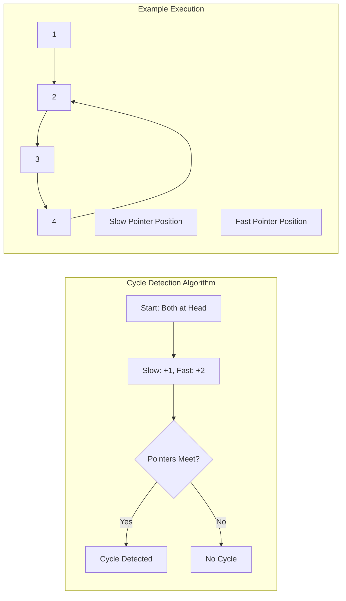

### 6.2 Merging and Splitting Operations

Linked lists excel at merging and splitting operations because they don't require copying data—only rewiring pointers. This makes them ideal for implementing merge sort and other divide-and-conquer algorithms.

**Merge Sort on Linked Lists:**
1. Split the list into two halves using the slow/fast pointer technique
2. Recursively sort each half
3. Merge the sorted halves by comparing heads and rewiring pointers

The elegance of this approach is that it requires no additional space for the merge operation—we're just rewiring existing nodes.

{}

### Step 1: Find the Middle

Use the tortoise and hare technique to find the middle of the list, then split it into two separate lists.

### Step 2: Recursive Sort

Recursively apply merge sort to both halves. The base case is a single node (already sorted).

### Step 3: Merge

Compare the heads of the two sorted lists, choose the smaller one as the next node in the result, and continue until one list is exhausted.

### Step 4: Append Remainder

Append any remaining nodes from the non-exhausted list to the result.

{}

### 6.3 Reversal Algorithms

Reversing a linked list is a classic problem that demonstrates the power of pointer manipulation. The iterative solution is elegant in its simplicity:

```
prev = null
current = head
while current != null:
    next = current.next
    current.next = prev
    prev = current
    current = next
head = prev
```

This algorithm rewires the entire list in a single pass, transforming the direction of every connection. The recursive solution is even more elegant, though it uses O(n) stack space.

---

## Chapter 7: Specialized Linked List Applications

### 7.1 Implementing Stacks and Queues

Linked lists provide natural implementations for abstract data types like stacks and queues, offering dynamic sizing without the pre-allocation requirements of array-based implementations.

**Stack Implementation:**
- Push: Insert at head (O(1))
- Pop: Remove from head (O(1))
- The head pointer effectively becomes the stack pointer

**Queue Implementation:**
- Enqueue: Insert at tail (O(1) with tail pointer)
- Dequeue: Remove from head (O(1))
- Requires both head and tail pointers for efficiency

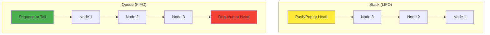

### 7.2 Hash Table Collision Resolution

Linked lists play a crucial role in hash table implementations, particularly for handling collisions through chaining. When multiple keys hash to the same index, a linked list at that index stores all the colliding key-value pairs.

This application showcases the flexibility of linked lists—they can grow and shrink dynamically as the hash table experiences different collision patterns. The performance characteristics change based on the load factor and quality of the hash function.

### 7.3 Graph Adjacency Lists

In graph theory, linked lists provide an efficient representation for sparse graphs through adjacency lists. Each vertex maintains a linked list of its adjacent vertices, providing space-efficient storage and easy traversal.

This representation is particularly powerful for algorithms like depth-first search and breadth-first search, where the natural traversal patterns align well with linked list iteration.

---

## Chapter 8: Concurrent and Lock-Free Linked Lists

### 8.1 The Challenge of Concurrent Access

Linked lists in concurrent environments face unique challenges. Unlike arrays, where concurrent reads are generally safe, linked lists require careful synchronization because their structure can change during traversal.

The fundamental problem is that pointers can become invalid while you're following them. A node might be deleted between the time you read its address and the time you dereference it, leading to undefined behavior.

### 8.2 Lock-Free Algorithms

Lock-free linked list algorithms use atomic operations to ensure consistency without traditional locking. These algorithms are complex but offer superior performance in highly concurrent scenarios.

The key technique is compare-and-swap (CAS) operations that atomically update pointers only if they haven't changed since they were read. This enables optimistic concurrency—assuming operations won't conflict and handling conflicts when they occur.

**Harris's Algorithm for Lock-Free Deletion:**
1. Mark nodes for deletion using atomic operations
2. Physically remove marked nodes during subsequent traversals
3. Use careful ordering of operations to maintain consistency

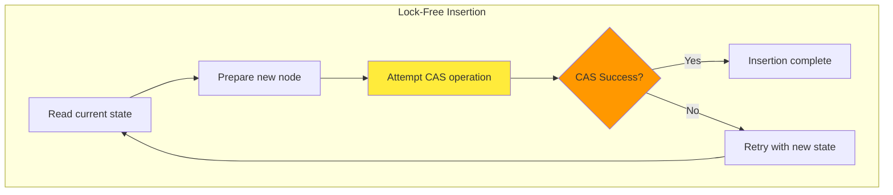

### 8.3 Hazard Pointers

Hazard pointers provide memory safety in lock-free data structures by preventing the ABA problem and ensuring that nodes aren't deleted while being accessed by other threads.

Each thread maintains a list of pointers it's currently using. The memory reclamation system ensures that nodes referenced by hazard pointers aren't freed, preventing use-after-free errors in concurrent environments.

---

## Chapter 9: The Future of Dynamic Data Structures

### 9.1 Persistent Data Structures

Persistent linked lists maintain historical versions of themselves, allowing access to previous states without copying the entire structure. This is achieved through structural sharing—new versions share unchanged portions with previous versions.

This concept is fundamental to functional programming languages and version control systems. Instead of modifying data in place, operations create new versions that coexist with old ones.

**Path Copying Strategy:**
When modifying a node, copy the path from the root to that node, leaving the rest of the structure unchanged. This creates a new version with minimal memory overhead.

### 9.2 Blockchain and Distributed Ledgers

Blockchain technology can be viewed as a globally distributed linked list where each block contains a cryptographic hash of the previous block. This creates an immutable chain of transactions that can be verified independently.

The parallels to traditional linked lists are striking:
- Sequential structure maintained through explicit links
- Append-only operations (new blocks added to the end)
- Traversal from genesis block to current state
- Cryptographic integrity instead of pointer validity

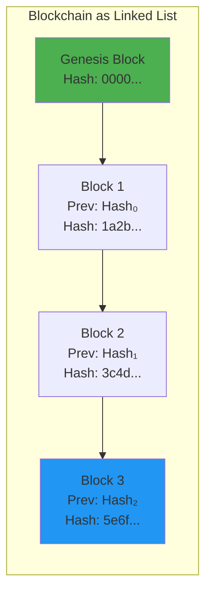

### 9.3 Quantum-Resistant Data Structures

As quantum computing advances, traditional cryptographic methods will become vulnerable. This affects data structures that rely on cryptographic integrity, including blockchain-based linked lists and authenticated data structures.

Research into quantum-resistant linked lists focuses on post-quantum cryptographic primitives that maintain security even against quantum attacks. These structures must balance security requirements with performance characteristics.

---

## Chapter 10: Practical Implementation Mastery

### 10.1 Language-Specific Considerations

Different programming languages handle linked lists with varying levels of abstraction and safety. Understanding these differences is crucial for practical implementation.



**C/C++**: Manual memory management gives complete control but requires careful attention to prevent memory leaks and dangling pointers. Pointer arithmetic enables powerful optimizations but increases the risk of errors. Templates in C++ allow type-safe generic implementations.

**Java**: Automatic garbage collection eliminates memory leaks but can create performance unpredictability. The LinkedList class in Java implements a doubly-linked list with additional methods for queue and stack operations. Generic types provide compile-time type safety.

**Python**: Lists are actually dynamic arrays, but you can implement linked lists using classes. The lack of explicit pointers makes the code cleaner but potentially less efficient. Python's garbage collection handles memory management automatically.

**Rust**: Ownership system prevents memory errors at compile time while maintaining performance. Implementing linked lists in Rust is challenging due to ownership rules but results in memory-safe code. The RefCell and Rc types enable interior mutability when needed.



### 10.2 Debugging Techniques

Linked lists can be notoriously difficult to debug due to their pointer-based nature. Effective debugging requires specific techniques and tools.

{}

### Step 1: Visualization

Draw the linked list structure on paper or use visualization tools. Many bugs become obvious when you can see the pointer relationships graphically.

### Step 2: Invariant Checking

Implement functions that verify the consistency of your linked list. Check that forward and backward pointers match in doubly-linked lists, that cycles exist only where expected, and that the node count matches expectations.

### Step 3: Memory Debugging

Use tools like Valgrind, AddressSanitizer, or language-specific memory debuggers to catch memory errors. Linked lists are particularly prone to use-after-free and double-free errors.

### Step 4: Unit Testing

Test edge cases extensively: empty lists, single-node lists, operations at head and tail, and operations in the middle. These boundary conditions often reveal bugs in pointer manipulation logic.

{}

### 10.3 Performance Optimization Strategies

While linked lists have inherent performance limitations, several optimization strategies can improve their practical performance.

**Memory Pool Allocation**: Pre-allocate nodes in contiguous blocks to improve cache locality and reduce allocation overhead.

**Node Embedding**: Instead of storing pointers to data, embed small data directly in nodes to reduce memory indirection.

**Cache-Conscious Layouts**: Arrange frequently accessed fields at the beginning of node structures to improve cache utilization.

**Prefetching**: In performance-critical code, use software prefetching to load the next node while processing the current one.

---

## Chapter 11: Advanced Applications and Case Studies

### 11.1 Operating System Kernel Structures

Modern operating systems make extensive use of linked lists for managing dynamic resources. Process lists, memory allocation tracking, and I/O request queues all rely on linked list structures.

**Process Scheduling**: The kernel maintains linked lists of processes in different states (ready, blocked, running). The scheduler traverses these lists to make scheduling decisions.

**Memory Management**: Free memory blocks are often organized in linked lists, allowing the kernel to efficiently find and coalesce available memory.

**Device Drivers**: I/O requests are queued in linked lists, enabling efficient handling of asynchronous operations and request reordering for optimization.

### 11.2 Database Systems

Database management systems use linked lists in various contexts, from buffer pool management to query execution plans.

**Buffer Pool LRU Lists**: Database buffer pools maintain linked lists of pages ordered by access time, implementing LRU replacement policies for efficient memory utilization.

**Transaction Logs**: Some database systems organize transaction log entries as linked lists, enabling efficient sequential writes and recovery operations.

**B-Tree Node Organization**: While B-trees use arrays for key storage, they often use linked lists for managing overflow pages and maintaining consistency during concurrent updates.

### 11.3 Network Protocol Stacks

Network protocols frequently use linked lists for managing packet buffers, connection states, and routing information.

**Packet Buffers**: Network stacks chain packet buffers together using linked lists, allowing efficient handling of packets that span multiple memory regions.

**TCP Connection Management**: TCP implementations maintain linked lists of connection control blocks, enabling efficient lookup and state management for active connections.

**Routing Tables**: Some routing protocols use linked lists to maintain alternative paths and handle route convergence efficiently.

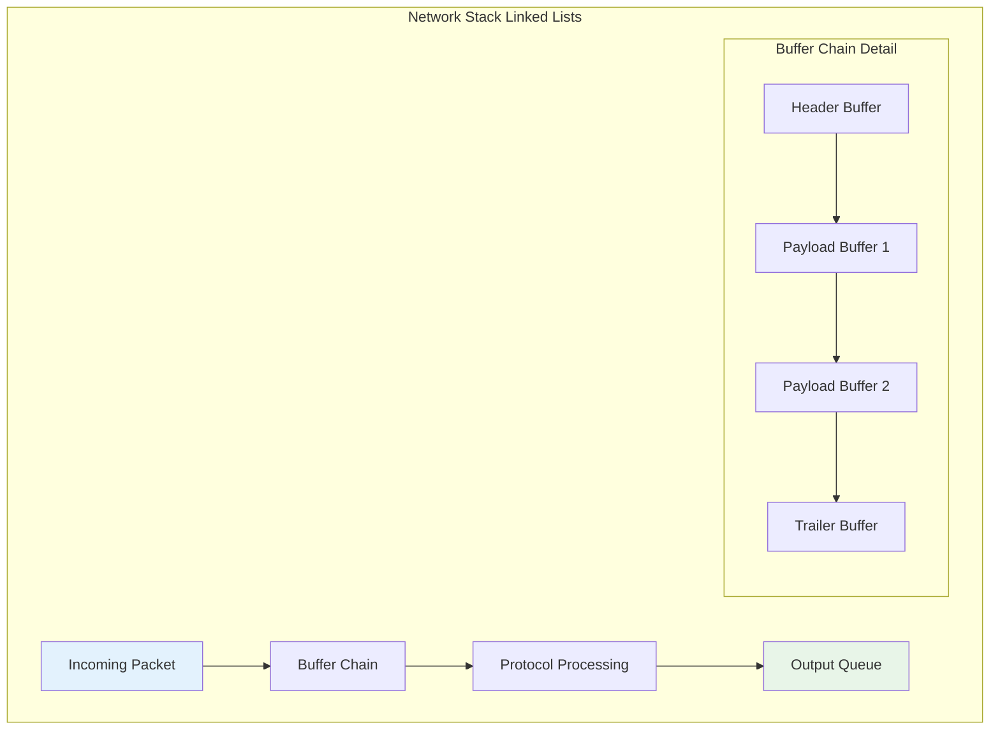

---

## Chapter 12: Error Patterns and Anti-Patterns

### 12.1 Common Pitfalls

Linked list implementations are prone to specific categories of errors that can be subtle and difficult to debug.

**Null Pointer Dereference**: Failing to check for null pointers before dereferencing is the most common linked list error. This often occurs at list boundaries or after failed searches.

**Memory Leaks**: Forgetting to free deleted nodes leads to memory leaks. In languages without garbage collection, every allocated node must eventually be freed.

**Dangling Pointers**: Keeping references to deleted nodes creates dangling pointers. Accessing these pointers results in undefined behavior.

**Lost Head Pointer**: Modifying the head pointer incorrectly can make the entire list inaccessible, effectively losing all data.

### 12.2 Design Anti-Patterns

Certain design choices, while functionally correct, lead to inefficient or unmaintainable code.

**Excessive Traversal**: Repeatedly traversing the list from the beginning instead of maintaining position pointers leads to O(n²) algorithms where O(n) is possible.

**Inconsistent State**: Allowing the linked list to exist in inconsistent states (mismatched forward/backward pointers in doubly-linked lists) makes debugging extremely difficult.

**Premature Optimization**: Adding complexity for marginal performance gains often makes the code harder to maintain and more error-prone.

### 12.3 Testing Strategies

Comprehensive testing of linked list implementations requires attention to boundary conditions and error scenarios.

**Boundary Testing**: Test operations on empty lists, single-node lists, and operations at the head and tail of multi-node lists.

**Stress Testing**: Perform many operations in sequence to uncover memory leaks and performance degradation.

**Concurrent Testing**: If the linked list will be used in concurrent environments, test with multiple threads performing operations simultaneously.

**Property-Based Testing**: Use property-based testing frameworks to generate random sequences of operations and verify invariants are maintained.

---

## Conclusion: The Enduring Elegance of Dynamic Connection

As I reflect on the journey through linked lists—from their fundamental philosophy of connection through their sophisticated applications in modern systems—I'm struck by their enduring relevance. In an era of increasingly complex data structures and distributed systems, the simple elegance of nodes connected by pointers