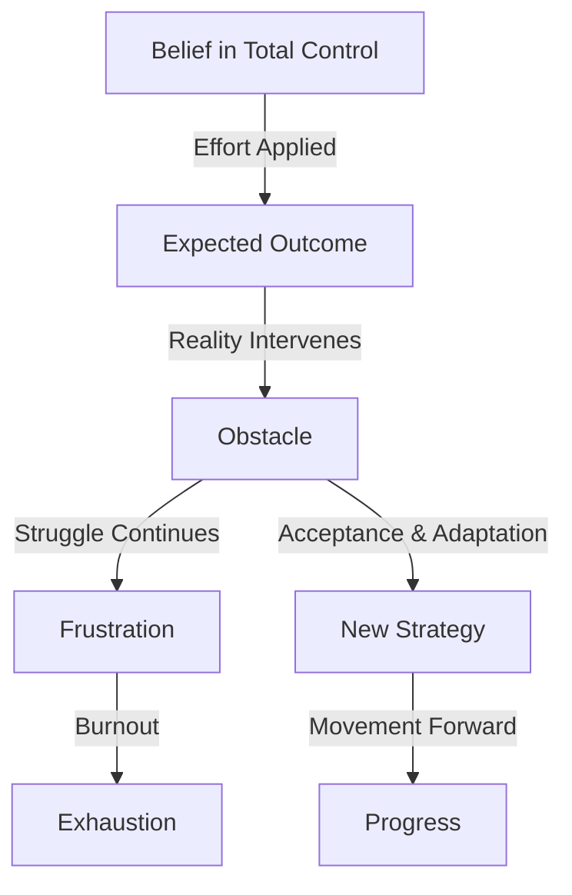

## The Reality We Struggle With  

There’s a fundamental truth about life that we all encounter at some point.  

It arrives quietly, sometimes through failure, sometimes through exhaustion. **Not everything is within our control**.  

At first, this idea is unsettling. It contradicts everything we’ve been told—work hard, stay disciplined, push through, and eventually, success will be inevitable.  

But that’s **not always true**.  

Life isn’t a **simple input-output system** where effort alone dictates outcomes.  

There are external forces—randomness, human behavior, unseen variables—that act without warning.  

So, what do we do?  
- Do we resist, fight harder, and burn out in frustration?  
- Do we surrender and let life push us wherever it wants?  

Neither approach works. The answer lies somewhere in between.  

It’s called **strategic acceptance**—the ability to discern between **what is worth fighting for** and **what is better understood, adjusted, or let go of entirely**.  

The reason this question matters isn’t just about personal growth—it’s about **understanding how life actually works**.  

## **The Illusion of Absolute Control**  

Many people grow up believing that success is entirely self-made.  

Put in effort, make smart choices, stay consistent—**and everything will align in your favor**.  

But reality doesn’t operate under such simple rules.  

To understand why this belief is misleading, let’s visualize it:  

Most people begin in **state A**—believing that effort alone **creates success**.  

But somewhere along the way, **reality intervenes**, leading to **state C**—obstacles appear, unexpected shifts happen, external forces disrupt expectations.  

At this point, people take one of two paths:  
- **Struggle endlessly (D) → leading to frustration and burnout (F).**  
- **Adapt intelligently (E) → finding a way forward despite disruption (G).**  

Success isn't simply about **force**, it's about **navigation**. Knowing when to push forward and when to **change direction** is what separates those who progress from those who remain stuck.  

## **Understanding Randomness**  

Most people avoid admitting this truth—**randomness plays a role in success**.  

Sure, effort matters. But **so does timing, opportunity, and conditions you don’t control**.  

Consider how these factors influence outcomes:  

<table>
    <tr>
        <th>Factor</th>
        <th>Influence on Success</th>
        <th>Degree of Control</th>
    </tr>
    <tr>
        <td>Personal Effort</td>
        <td>High</td>
        <td>Strong</td>
    </tr>
    <tr>
        <td>Social Structures</td>
        <td>Moderate to High</td>
        <td>Limited</td>
    </tr>
    <tr>
        <td>Economic Conditions</td>
        <td>High</td>
        <td>None</td>
    </tr>
    <tr>
        <td>Interpersonal Relationships</td>
        <td>Moderate</td>
        <td>Variable</td>
    </tr>
    <tr>
        <td>Luck & Timing</td>
        <td>High</td>
        <td>None</td>
    </tr>
</table>

People like to believe **success is purely earned**, but in reality, **it is navigated**.  

This is why **acceptance is necessary**—it allows us to adjust to external factors instead of **fighting a losing battle against things beyond our reach**.  

## **Acceptance as a Competitive Advantage**  

Once we accept that **control is limited**, the next step is **choosing where to direct our effort intelligently**.  

{}  

### **1. Energy Allocation** ⚖️  

Not every fight is worth engaging in. Some battles are distractions. **Wasting energy on things beyond control is costly**.  

### **2. The Art of Pivoting** 🏗️  

Rigidity leads to failure. Adaptability ensures survival. **The strongest minds shift when needed, rethink strategies, and adjust without hesitation**.  

### **3. Understanding What Matters** 🔍  

Effort is valuable, but **only when correctly applied**. **Not all effort translates into progress**.  

### **4. Finding Meaning in Chaos** 🌪️  

Not every loss is failure. Some setbacks refine judgment and strategy. **Some redirections are silent blessings**.  

{}  

At this point, **acceptance stops being passive**—it becomes a tool for **movement forward**.  

The real advantage isn’t just **understanding reality**—it’s knowing **how to work within it** instead of getting stuck.  

## **Closing Thoughts**  

There is an art to knowing when to fight and when to adjust.  

This isn’t **surrender**.  

This isn’t **passivity**.  

It is **precision**.  

Instead of exhausting myself on things beyond my reach, I focus on movement:  

- **Less frustration, more clarity.**  
- **Less hesitation, more trust in the process.**  
- **Less stubbornness, more adaptability.**  
- **Less emotional resistance, more strategic patience.**  

Because **sometimes, success isn’t about controlling everything**.  

It’s about **navigating what was never in your control in the first place**.  
