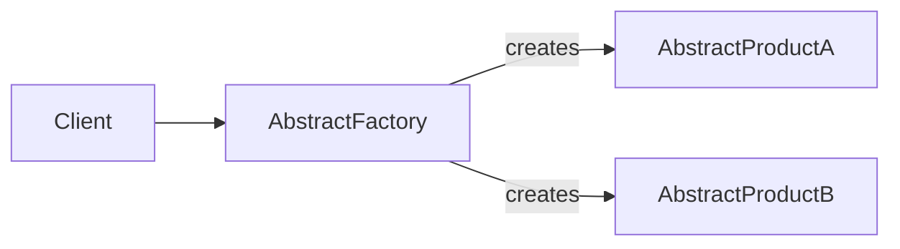

---
categories:
- Software Design
- Best Practices
- Object-Oriented Programming
comments: true
cover:
  image: https://images.pexels.com/photos/249798/pexels-photo-249798.png?auto=compress&cs=tinysrgb&h=650&w=940
date: 2025-06-18 15:56:31.477000
description: A comprehensive guide to the Abstract Factory design pattern, explaining
  its purpose, implementation, and practical considerations for developers.
math: true
tags:
- Design Patterns
- Creational Patterns
- Software Architecture
title: Abstract Factory Pattern
---


The Abstract Factory is a fundamental creational design pattern that focuses on creating families of related or dependent objects without specifying their concrete classes. This pattern ensures a system's independence from how its products are created, composed, and represented.

### Introduction

The **Abstract Factory pattern** provides an interface for creating families of related objects without explicitly specifying their concrete classes. It is particularly useful when:

*   A system needs to be independent of how its products are created, composed, and represented.
*   A family of related product objects is designed to be used together, and you need to enforce this constraint.
*   You want to provide a library of products, and you want to reveal only their interfaces, not their implementations.

This pattern centralizes the creation of objects belonging to a common theme or family, abstracting away the specifics of their concrete instantiations.

### Implementation

Consider a scenario where you need to create GUI components (Buttons and Checkboxes) that look and behave differently based on the operating system (Windows or MacOS).

```python
# 1. Abstract Products: Define interfaces for a set of product objects.
class Button:
    def paint(self):
        """Abstract method for painting a button."""
        raise NotImplementedError

class Checkbox:
    def toggle(self):
        """Abstract method for toggling a checkbox."""
        raise NotImplementedError

# 2. Concrete Products: Implement the abstract product interfaces.
class WindowsButton(Button):
    def paint(self):
        return "Rendering a Windows-style button."

class MacOSButton(Button):
    def paint(self):
        return "Rendering a macOS-style button."

class WindowsCheckbox(Checkbox):
    def toggle(self):
        return "Toggling a Windows-style checkbox."

class MacOSCheckbox(Checkbox):
    def toggle(self):
        return "Toggling a macOS-style checkbox."

# 3. Abstract Factory: Declare an interface for operations that create abstract product objects.
class GUIFactory:
    def create_button(self) -> Button:
        """Abstract method to create a button."""
        raise NotImplementedError
    def create_checkbox(self) -> Checkbox:
        """Abstract method to create a checkbox."""
        raise NotImplementedError

# 4. Concrete Factories: Implement the operations to create concrete product objects.
class WindowsFactory(GUIFactory):
    def create_button(self) -> Button:
        return WindowsButton()
    def create_checkbox(self) -> Checkbox:
        return WindowsCheckbox()

class MacOSFactory(GUIFactory):
    def create_button(self) -> Button:
        return MacOSButton()
    def create_checkbox(self) -> Checkbox:
        return MacOSCheckbox()

# Client Code: Uses the Abstract Factory and Abstract Products.
def application_client(factory: GUIFactory):
    """
    Client code interacts with products and factories only through their abstract interfaces.
    """
    button = factory.create_button()
    checkbox = factory.create_checkbox()

    print(button.paint())
    print(checkbox.toggle())

# Usage: Demonstrate creating product families for different environments.
print("--- Using Windows Components ---")
application_client(WindowsFactory())

print("\n--- Using macOS Components ---")
application_client(MacOSFactory())
```

In this example, `GUIFactory` is the Abstract Factory, `WindowsFactory` and `MacOSFactory` are Concrete Factories. `Button` and `Checkbox` are Abstract Products, with `WindowsButton`, `MacOSButton`, `WindowsCheckbox`, and `MacOSCheckbox` as Concrete Products. The `application_client` interacts only with the abstract interfaces, making it independent of the specific OS GUI components.

### Mermaid Diagram


*In the diagram:*
*   **Client**: Represents the application logic that uses the product families.
*   **AbstractFactory**: Defines the interface for creating product families.
*   **AbstractProductA, AbstractProductB**: Represent the abstract interfaces for the individual products within a family.

### Pros & Cons

**Advantages:**

*   **Isolation of Concrete Classes:** Client code is decoupled from the concrete product implementations, promoting loose coupling.
*   **Enforces Product Family Consistency:** Guarantees that the products created together belong to the same family, preventing incompatible product combinations.
*   **Easy Product Exchange:** Swapping an entire product family is straightforward; simply change the concrete factory implementation used by the client.
*   **Scalability for Product Families:** New product families (e.g., "LinuxFactory") can be introduced without altering existing client code.

**Disadvantages:**

*   **Increased Complexity:** Introduces many new interfaces and classes, which can increase the overall complexity of the codebase, especially for simple systems.
*   **Difficulty Adding New Product Types:** Adding a new type of product (e.g., a "Scrollbar" in our GUI example) requires modifying the Abstract Factory interface and all existing Concrete Factory implementations, violating the Open/Closed Principle.

### References

*   Gamma, E., Helm, R., Johnson, R., & Vlissides, J. (1994). *Design Patterns: Elements of Reusable Object-Oriented Software*. Addison-Wesley.
*   Refactoring.Guru. (n.d.). *Abstract Factory*. Retrieved from [https://refactoring.guru/design-patterns/abstract-factory](https://refactoring.guru/design-patterns/abstract-factory)
*   Wikipedia. (n.d.). *Abstract factory pattern*. Retrieved from [https://en.wikipedia.org/wiki/Abstract_factory_pattern](https://en.wikipedia.org/wiki/Abstract_factory_pattern)