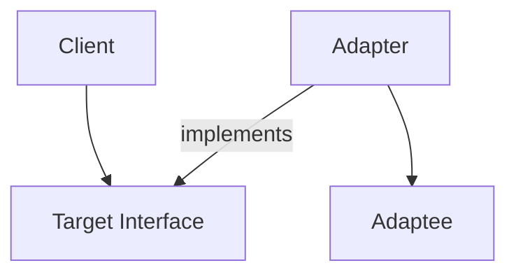

---
categories:
- Software Design
- Best Practices
comments: true
cover:
  image: https://images.pexels.com/photos/270549/pexels-photo-270549.jpeg?auto=compress&cs=tinysrgb&h=650&w=940
date: 2025-06-18 15:56:31.477000
description: A concise explanation of the Adapter Pattern, its implementation, and
  its role in bridging incompatible interfaces in software design.
math: true
tags:
- Design Patterns
- Architecture
- Software Design
title: Adapter Pattern - Bridging Incompatible Interfaces
---


The Adapter Pattern is a structural design pattern that enables objects with incompatible interfaces to collaborate. It acts as a wrapper, translating the interface of one class into another interface that a client expects. This pattern is particularly useful when integrating new components with existing systems or when working with third-party libraries that do not conform to existing interface standards.

## 1. Introduction

The Adapter Pattern aims to resolve interface mismatches. Imagine a physical power adapter that allows a device with one type of plug to connect to a different type of electrical outlet. In software, the Adapter Pattern functions similarly, allowing a class (the Adaptee) to be used by another class (the Client) that expects a different interface (the Target).

Key scenarios for its application include:
*   **Integrating Legacy Code:** Allowing newer components to interact with older, unmodifiable systems.
*   **Reusing Third-Party Libraries:** Using a library that offers desired functionality but with an interface different from your application's expectations.
*   **Unified Interface:** Providing a consistent interface for multiple classes that perform similar functions but have different underlying implementations.

## 2. Implementation

The Adapter Pattern typically involves three main components:

*   **Target Interface:** The interface that the client expects to work with.
*   **Adaptee:** The existing class with the incompatible interface that needs adapting.
*   **Adapter:** A class that implements the Target Interface and wraps an instance of the Adaptee, translating client requests into calls to the Adaptee's interface.

Consider a scenario where a client expects a `Printer` interface, but we only have a `LegacyLogger` class.

```python
# 1. Target Interface: The interface the client expects.
class Printer:
    def print_document(self, text: str) -> None:
        """Prints a given text document."""
        raise NotImplementedError("This method should be overridden.")

# 2. Adaptee: The existing class with an incompatible interface.
class LegacyLogger:
    def log_message(self, message: str) -> None:
        """Logs a message using a legacy logging system."""
        print(f"LEGACY LOG SYSTEM: {message}")

# 3. Adapter: Implements the Target interface and wraps the Adaptee.
class LoggerToPrinterAdapter(Printer):
    def __init__(self, logger: LegacyLogger) -> None:
        self._logger = logger

    def print_document(self, text: str) -> None:
        """Adapts the print_document call to the log_message of the LegacyLogger."""
        self._logger.log_message(f"Document Printing Attempt: {text}")

# Client Code: Works with the Target Interface.
def client_application(printer: Printer) -> None:
    """A client application that uses a Printer."""
    print("\nClient application attempting to print a document...")
    printer.print_document("Report for Q4 Earnings")
    print("Printing request sent.")

# Usage Example
if __name__ == "__main__":
    # Instantiate the Adaptee
    legacy_logger_instance = LegacyLogger()

    # Create the Adapter, wrapping the Adaptee
    adapter = LoggerToPrinterAdapter(legacy_logger_instance)

    # The client application interacts with the Adapter as if it were a Printer
    client_application(adapter)

    # Direct use of the legacy logger (for comparison)
    print("\n--- Direct Legacy Logger Use ---")
    legacy_logger_instance.log_message("Just a direct log message.")
```

In this example, `LoggerToPrinterAdapter` allows the `client_application`, which expects a `Printer`, to seamlessly use the functionality of `LegacyLogger`.

## 3. Mermaid Diagram


*   **Client**: The component that needs to use the functionality.
*   **Target Interface**: The interface the Client expects.
*   **Adapter**: Implements the Target Interface and contains the Adaptee.
*   **Adaptee**: The existing component whose interface is incompatible.

## 4. Pros & Cons

### Advantages:
*   **Interface Compatibility:** Enables collaboration between classes with incompatible interfaces without altering their source code.
*   **Reusability:** Allows the reuse of existing (Adaptee) classes in new contexts that require a different interface.
*   **Decoupling:** Separates the interface or implementation of the client from the Adaptee.
*   **Maintainability:** Changes in the Adaptee's interface only affect the Adapter, not the Client.

### Disadvantages:
*   **Increased Complexity:** Introduces new classes and potentially more objects, which can increase the overall complexity of the codebase.
*   **Performance Overhead:** May introduce a minor runtime overhead due to the extra layer of indirection (method calls through the adapter).
*   **Overuse Risk:** Can lead to a proliferation of small adapter classes if not applied judiciously, making the system harder to navigate.

## 5. References

*   Gamma, E., Helm, R., Johnson, R., & Vlissides, J. (1994). *Design Patterns: Elements of Reusable Object-Oriented Software*. Addison-Wesley.
*   Refactoring.Guru. (n.d.). *Adapter*. Retrieved from [https://refactoring.guru/design-patterns/adapter](https://refactoring.guru/design-patterns/adapter)