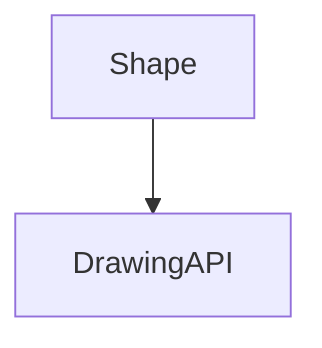

---
categories:
- Software Design
- Best Practices
- Architecture
comments: true
cover:
  image: https://images.pexels.com/photos/4977409/pexels-photo-4977409.jpeg?auto=compress&cs=tinysrgb&h=650&w=940
date: 2025-06-18 15:56:31.477000
description: Explore the Bridge pattern, a structural design pattern that decouples
  an abstraction from its implementation, allowing them to vary independently.
math: true
tags:
- Design Patterns
- Structural Patterns
- Software Architecture
- Decoupling
title: Understanding the Bridge Pattern
---


The Bridge pattern is a structural design pattern that addresses the challenge of managing two separate, but related, hierarchies within an application. It provides a means to decouple an abstraction from its implementation, enabling both to evolve independently.

### 1. Introduction

At its core, the Bridge pattern's purpose is to avoid a permanent binding between an abstraction and its implementation. This is particularly useful in scenarios where both the abstraction and its implementation have multiple variations, and combining them all would lead to an unmanageable class explosion.

**Where it is used:**
The Bridge pattern is typically applied when:
*   An abstraction and its implementation should not be permanently bound at compile-time.
*   Both the abstraction and its implementation hierarchies need to be extended independently.
*   Changes in an implementation should not necessitate changes in the abstraction and vice versa.
*   A growing number of classes (e.g., `RedSquare`, `BlueSquare`, `RedCircle`, `BlueCircle`) suggests a need to separate product features from platform features.

By separating these concerns into two distinct hierarchies—the Abstraction and the Implementor—the Bridge pattern facilitates cleaner code, improved extensibility, and reduced maintenance overhead.

### 2. Implementation

Consider a scenario where you have various `Shape` types (e.g., `Circle`, `Square`) and different `DrawingAPI` implementations (e.g., `RedAPI`, `GreenAPI`). The Bridge pattern allows us to combine any shape with any drawing API without creating a class for every combination (e.g., `RedCircle`, `GreenSquare`).

```python
# 1. The Implementor Interface
# Defines the interface for implementation classes.
class DrawingAPI:
    def draw_circle(self, x: int, y: int, radius: int) -> None:
        raise NotImplementedError("Subclasses must implement this method.")

# 2. Concrete Implementors
# Provide specific implementations for the Implementor interface.
class RedDrawingAPI(DrawingAPI):
    def draw_circle(self, x: int, y: int, radius: int) -> None:
        print(f"Drawing RED Circle at ({x},{y}) with radius {radius}")

class GreenDrawingAPI(DrawingAPI):
    def draw_circle(self, x: int, y: int, radius: int) -> None:
        print(f"Drawing GREEN Circle at ({x},{y}) with radius {radius}")

# 3. The Abstraction
# Defines the abstract interface and maintains a reference to an Implementor object.
class Shape:
    def __init__(self, drawing_api: DrawingAPI) -> None:
        self._drawing_api = drawing_api

    def draw(self) -> None:
        raise NotImplementedError("Subclasses must implement this method.")

# 4. Refined Abstraction(s)
# Extends the Abstraction interface.
class Circle(Shape):
    def __init__(self, x: int, y: int, radius: int, drawing_api: DrawingAPI) -> None:
        super().__init__(drawing_api)
        self._x = x
        self._y = y
        self._radius = radius

    def draw(self) -> None:
        self._drawing_api.draw_circle(self._x, self._y, self._radius)

# Client Code
if __name__ == "__main__":
    # Create concrete implementors
    red_renderer = RedDrawingAPI()
    green_renderer = GreenDrawingAPI()

    # Create abstractions with different implementors
    red_circle = Circle(10, 20, 5, red_renderer)
    green_circle = Circle(30, 40, 15, green_renderer)

    # Draw shapes, using the bridged implementation
    print("--- Drawing Shapes ---")
    red_circle.draw()
    green_circle.draw()
    print("--------------------")

    # Demonstrate flexibility: a new shape type could use existing renderers,
    # or a new renderer type could be used by existing shapes.
```

In this example, `Shape` is the Abstraction and `DrawingAPI` is the Implementor. `Circle` is a Refined Abstraction, while `RedDrawingAPI` and `GreenDrawingAPI` are Concrete Implementors. The `Shape` class contains a `DrawingAPI` object, forming the "bridge" between the two hierarchies.

### 3. Mermaid Diagram



The diagram illustrates the core relationship: the Abstraction (`Shape`) depends on the Implementor (`DrawingAPI`). Both can have their own independent hierarchies of subclasses, forming a bridge between them.

### 4. Pros & Cons

**Advantages:**
*   **Decoupling:** Clearly separates the abstraction from its implementation, allowing them to vary independently. This is the primary benefit.
*   **Extensibility:** Both the abstraction and implementation hierarchies can be extended independently without impacting the other. New shapes can be added without modifying drawing APIs, and new drawing APIs can be introduced without altering shapes.
*   **Reduced Class Explosion:** Prevents a combinatorial explosion of classes that would occur if each abstraction variation was combined directly with each implementation variation (e.g., `CircleRed`, `CircleBlue`, `SquareRed`, `SquareBlue`).
*   **Abstraction Hiding:** Clients interact only with the abstraction, remaining unaware of the underlying implementation details.

**Disadvantages:**
*   **Increased Complexity:** Introduces additional classes and interfaces, potentially increasing the overall complexity of the design, especially for simpler problems.
*   **Higher Initial Design Effort:** Requires more foresight and design effort upfront to correctly identify and separate the abstraction and implementation.
*   **Potential for Over-engineering:** May be overkill for systems where the abstraction and implementation are unlikely to change independently or where there are few variations.

### 5. References

*   **Gamma, E., Helm, R., Johnson, R., & Vlissides, J. (1994).** *Design Patterns: Elements of Reusable Object-Oriented Software*. Addison-Wesley. (The Gang of Four book)
*   **Refactoring.Guru.** *Bridge Design Pattern*. Available at: [https://refactoring.guru/design-patterns/bridge](https://refactoring.guru/design-patterns/bridge)
*   **Wikipedia.** *Bridge pattern*. Available at: [https://en.wikipedia.org/wiki/Bridge_pattern](https://en.wikipedia.org/wiki/Bridge_pattern)