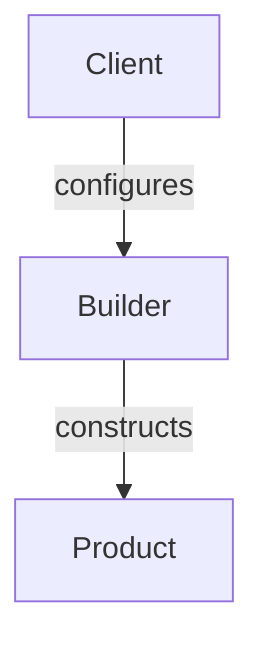

---
categories:
- Software Design
- Best Practices
comments: true
cover:
  image: https://images.pexels.com/photos/5582591/pexels-photo-5582591.jpeg?auto=compress&cs=tinysrgb&h=650&w=940
date: 2025-06-18 15:56:31.477000
description: A concise, academic exploration of the Builder design pattern, detailing
  its structure, implementation, benefits, and drawbacks for constructing complex
  objects.
math: true
tags:
- Design Patterns
- Creational Patterns
- Software Design
- Architecture
- Object-Oriented Programming
title: Builder Pattern
---


The Builder pattern is a creational design pattern that focuses on constructing a complex object step by step. It separates the construction of a complex object from its representation, allowing the same construction process to create different representations.

## 1. Introduction

The Builder pattern is employed when:
*   An object's construction process is complex and involves many steps.
*   An object has a large number of optional parameters, mitigating the "telescoping constructor" anti-pattern (multiple constructors with varying parameter counts).
*   Different representations or variations of a product need to be created using the same construction logic.

Its primary goal is to provide a flexible and readable way to construct objects, especially when the object's creation requires extensive setup or involves a multitude of configurable options.

## 2. Implementation

Consider building a `Computer` object with various configurable components like CPU, RAM, Storage, and GPU.

```python
# 1. Product: The complex object to be built
class Computer:
    def __init__(self):
        self.cpu = None
        self.ram = None
        self.storage = None
        self.gpu = None
        self.os = None

    def __str__(self):
        parts = [f"CPU: {self.cpu}", f"RAM: {self.ram}", f"Storage: {self.storage}"]
        if self.gpu:
            parts.append(f"GPU: {self.gpu}")
        if self.os:
            parts.append(f"OS: {self.os}")
        return f"Computer Config: {', '.join(parts)}"

# 2. Builder: Defines the interface for creating parts of the Product object
class ComputerBuilder:
    def __init__(self):
        self.computer = Computer() # Initializes a new product

    def with_cpu(self, cpu: str):
        self.computer.cpu = cpu
        return self  # Enables method chaining

    def with_ram(self, ram: str):
        self.computer.ram = ram
        return self

    def with_storage(self, storage: str):
        self.computer.storage = storage
        return self

    def with_gpu(self, gpu: str):
        self.computer.gpu = gpu
        return self

    def with_os(self, os: str):
        self.computer.os = os
        return self

    def build(self) -> Computer:
        """Returns the constructed product."""
        return self.computer

# 3. Client Usage: Uses the Builder to construct a Computer
if __name__ == "__main__":
    # Build a Gaming PC
    gaming_pc = ComputerBuilder() \
        .with_cpu("Intel Core i9-13900K") \
        .with_ram("32GB DDR5") \
        .with_storage("2TB NVMe SSD") \
        .with_gpu("NVIDIA GeForce RTX 4090") \
        .with_os("Windows 11 Pro") \
        .build()
    print(f"Gaming PC: {gaming_pc}\n")

    # Build an Office PC
    office_pc = ComputerBuilder() \
        .with_cpu("Intel Core i5-12400") \
        .with_ram("16GB DDR4") \
        .with_storage("512GB SATA SSD") \
        .with_os("Ubuntu 22.04 LTS") \
        .build()
    print(f"Office PC: {office_pc}\n")

    # Build a minimal PC (without GPU)
    minimal_pc = ComputerBuilder() \
        .with_cpu("AMD Ryzen 3 3200G") \
        .with_ram("8GB DDR4") \
        .with_storage("256GB HDD") \
        .build() # No OS or GPU specified
    print(f"Minimal PC: {minimal_pc}\n")
```

## 3. Mermaid Diagram



This diagram illustrates the relationship where the `Client` interacts with the `Builder` to assemble the parts, and the `Builder` is responsible for producing the `Product`.

## 4. Pros & Cons

### Advantages:
*   **Decouples Construction:** Separates the construction process from the object's concrete representation.
*   **Step-by-Step Construction:** Enables creation of objects incrementally, which is beneficial for objects with complex construction logic.
*   **Immutable Objects:** Can facilitate the creation of immutable objects by ensuring all necessary parts are set before `build()` is called.
*   **Readability:** Improves the readability and clarity of object creation, especially with method chaining.
*   **Avoids Telescoping Constructors:** Mitigates the need for multiple overloaded constructors, each with a different subset of parameters.

### Disadvantages:
*   **Increased Complexity:** Introduces more classes (Builder, Product) for what might be a simple object, potentially leading to over-engineering for less complex scenarios.
*   **Verbose Code:** Can result in more verbose code for object creation compared to a simple constructor if the object has very few parameters.
*   **State Management:** The builder itself might become stateful, requiring careful management if multiple products are built sequentially using the same builder instance.

## 5. References

*   **Gamma, E., Helm, R., Johnson, R., & Vlissides, J. (1994).** *Design Patterns: Elements of Reusable Object-Oriented Software*. Addison-Wesley. (The original "Gang of Four" book)
*   **Refactoring.Guru.** *Builder Pattern*. [https://refactoring.guru/design-patterns/builder](https://refactoring.guru/design-patterns/builder)
*   **Wikipedia.** *Builder pattern*. [https://en.wikipedia.org/wiki/Builder_pattern](https://en.wikipedia.org/wiki/Builder_pattern)