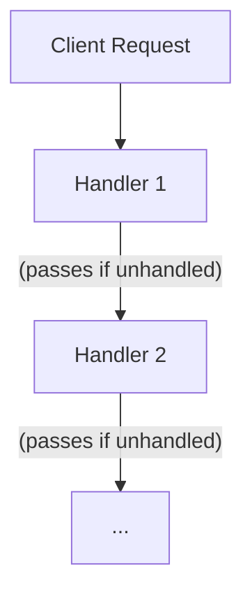

---
categories:
- Software Design
- Best Practices
comments: true
cover:
  image: https://images.pexels.com/photos/4484151/pexels-photo-4484151.jpeg?auto=compress&cs=tinysrgb&h=650&w=940
date: 2025-06-18 15:56:31.477000
description: A concise, academic overview of the Chain of Responsibility design pattern,
  detailing its structure, implementation, and practical applications for developers.
math: true
tags:
- Design Patterns
- Behavioral Patterns
- Software Architecture
title: Chain of Responsibility Pattern
---


The Chain of Responsibility is a behavioral design pattern that allows a request to be passed along a chain of handlers. Each handler decides whether to process the request or pass it to the next handler in the chain.

## 1. Introduction

The Chain of Responsibility pattern aims to decouple the sender of a request from its receiver by giving multiple objects a chance to handle the request. This pattern constructs a chain of processing objects. When a request is sent, it traverses this chain until a handler processes it or the end of the chain is reached.

**Typical Use Cases:**
*   **Event Handling:** UI systems where events propagate through nested components.
*   **Logging Systems:** Different loggers (e.g., file logger, console logger) process messages based on severity.
*   **Approval Workflows:** Requests (e.g., expense reports) needing approval from multiple levels of management.
*   **Request Filtering/Pre-processing:** Web application middlewares or servlet filters.

## 2. Implementation

Consider a simple logging system where log messages (DEBUG, INFO, ERROR) are processed by different handlers.

```python
from abc import ABC, abstractmethod

# 1. Handler Interface (Abstract Base Class)
class AbstractLogger(ABC):
    DEBUG = 1
    INFO = 2
    ERROR = 3

    _next_logger = None
    _level = None

    def __init__(self, level):
        self._level = level

    def set_next(self, next_logger):
        self._next_logger = next_logger
        return next_logger # Allows chaining calls

    def log_message(self, level, message):
        if self._level <= level:
            self._write(message)
        if self._next_logger:
            self._next_logger.log_message(level, message)

    @abstractmethod
    def _write(self, message):
        pass

# 2. Concrete Handlers
class ConsoleLogger(AbstractLogger):
    def __init__(self, level):
        super().__init__(level)

    def _write(self, message):
        print(f"Standard Console Log: {message}")

class ErrorLogger(AbstractLogger):
    def __init__(self, level):
        super().__init__(level)

    def _write(self, message):
        print(f"Error Console Log: {message}")

class FileLogger(AbstractLogger):
    def __init__(self, level):
        super().__init__(level)

    def _write(self, message):
        print(f"File Log: {message}") # In a real app, this would write to a file

# 3. Client Code
def build_chain():
    error_logger = ErrorLogger(AbstractLogger.ERROR)
    file_logger = FileLogger(AbstractLogger.DEBUG) # Lowest level for file
    console_logger = ConsoleLogger(AbstractLogger.INFO)

    # Build the chain: FileLogger -> ConsoleLogger -> ErrorLogger
    # A log message will first be handled by FileLogger, then passed to ConsoleLogger, then ErrorLogger
    file_logger.set_next(console_logger).set_next(error_logger)
    return file_logger

if __name__ == "__main__":
    logger_chain = build_chain()

    print("--- Processing INFO message ---")
    logger_chain.log_message(AbstractLogger.INFO, "This is an information message.")

    print("\n--- Processing DEBUG message ---")
    logger_chain.log_message(AbstractLogger.DEBUG, "This is a debug message.")

    print("\n--- Processing ERROR message ---")
    logger_chain.log_message(AbstractLogger.ERROR, "This is an error message.")
```

## 3. Mermaid Diagram



*Note: For simplicity and mobile view, the diagram shows a conceptual flow rather than every single handler in a long chain.*

## 4. Pros & Cons

### Advantages:
*   **Decoupling:** Reduces coupling between the sender and receiver of a request. The sender does not need to know which handler will process the request.
*   **Flexibility:** Allows dynamic addition, removal, or reordering of handlers at runtime.
*   **Single Responsibility Principle:** Each handler focuses on a specific type of request or a specific part of the processing logic.
*   **Open/Closed Principle:** New handlers can be added to the chain without modifying existing client code or handlers.

### Disadvantages:
*   **No Guaranteed Receipt:** A request might reach the end of the chain without being handled, which can lead to unhandled situations if not managed carefully.
*   **Debugging Complexity:** Tracing the flow of a request can be challenging, especially in long or complex chains.
*   **Performance Overhead:** The request may traverse multiple handlers, potentially impacting performance if the chain is extensive or handlers perform costly operations.

## 5. References

*   **Gamma, E., Helm, R., Johnson, R., & Vlissides, J. (1994).** *Design Patterns: Elements of Reusable Object-Oriented Software*. Addison-Wesley. (The original Gang of Four book)
*   **Refactoring.Guru.** *Chain of Responsibility*. Available at: [https://refactoring.guru/design-patterns/chain-of-responsibility](https://refactoring.guru/design-patterns/chain-of-responsibility)
*   **Wikipedia.** *Chain-of-responsibility pattern*. Available at: [https://en.wikipedia.org/wiki/Chain-of-responsibility_pattern](https://en.wikipedia.org/wiki/Chain-of-responsibility_pattern)