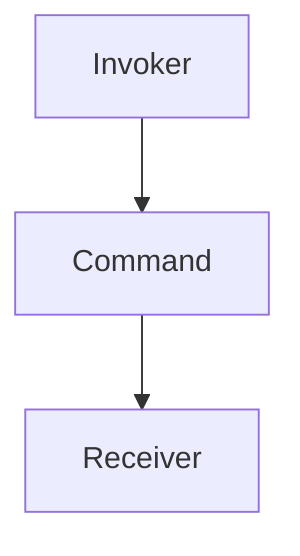

---
categories:
- Software Design
- Best Practices
- Object-Oriented Programming
comments: true
cover:
  image: https://images.pexels.com/photos/3862605/pexels-photo-3862605.jpeg?auto=compress&cs=tinysrgb&h=650&w=940
date: 2025-06-18 15:56:31.477000
description: An academic and practical overview of the Command design pattern, detailing
  its structure, implementation, benefits, and drawbacks for software developers.
math: true
tags:
- Design Patterns
- Behavioral Patterns
- Command Pattern
- Software Architecture
title: Command Pattern
---


## Introduction

The Command pattern is a behavioral design pattern that encapsulates a request as an object, thereby allowing for parameterization of clients with different requests, queuing of requests, and logging of requests. It separates the object that invokes the operation from the object that performs the operation.

This pattern is particularly useful in scenarios requiring:
*   **Decoupling:** Separating the invoker of an operation from its concrete implementation.
*   **Undo/Redo Functionality:** Operations can be stored and reversed.
*   **Command Queues and Logging:** Requests can be queued, executed asynchronously, or logged for auditing.
*   **Macro Recording:** Sequences of commands can be recorded and replayed.

## Implementation

The core components of the Command pattern are:

1.  **Command:** An interface or abstract class declaring an `execute()` method.
2.  **Concrete Command:** Implements the `Command` interface, binding a `Receiver` object with an action. It typically stores the `Receiver` as an instance variable.
3.  **Receiver:** The object that performs the actual work. It knows how to perform the operations required to carry out the request.
4.  **Invoker:** Holds a `Command` object and invokes its `execute()` method. It does not know the concrete class of the command or the identity of the `Receiver`.
5.  **Client:** Creates a `Concrete Command` object and sets its `Receiver`. It then associates the `Concrete Command` with the `Invoker`.

Here's a concise example in Python demonstrating a simple light control system:

```python
import abc

# 1. Command Interface
class Command(abc.ABC):
    """
    The Command interface declares a method for executing a command.
    """
    @abc.abstractmethod
    def execute(self) -> None:
        pass

# 2. Receiver
class Light:
    """
    The Receiver class contains some business logic.
    """
    def turn_on(self) -> None:
        print("Light: The light is ON.")

    def turn_off(self) -> None:
        print("Light: The light is OFF.")

# 3. Concrete Commands
class LightOnCommand(Command):
    """
    Concrete Commands implement various kinds of requests.
    A Concrete Command stores a reference to the Receiver.
    """
    def __init__(self, light: Light) -> None:
        self._light = light

    def execute(self) -> None:
        self._light.turn_on()

class LightOffCommand(Command):
    """
    Another Concrete Command for turning the light off.
    """
    def __init__(self, light: Light) -> None:
        self._light = light

    def execute(self) -> None:
        self._light.turn_off()

# 4. Invoker
class RemoteControl:
    """
    The Invoker is associated with one or several commands.
    It sends a request to the command.
    """
    def __init__(self) -> None:
        self._command: Command = None

    def set_command(self, command: Command) -> None:
        self._command = command

    def press_button(self) -> None:
        """
        Executes the set command.
        """
        if self._command:
            print("RemoteControl: Pressing button...")
            self._command.execute()
        else:
            print("RemoteControl: No command is set.")

# 5. Client
if __name__ == "__main__":
    # Create the Receiver
    bedroom_light = Light()

    # Create Concrete Commands, binding them to the Receiver
    light_on_cmd = LightOnCommand(bedroom_light)
    light_off_cmd = LightOffCommand(bedroom_light)

    # Create the Invoker
    remote = RemoteControl()

    # Client associates commands with the Invoker and triggers them
    remote.set_command(light_on_cmd)
    remote.press_button() # Output: Light: The light is ON.

    remote.set_command(light_off_cmd)
    remote.press_button() # Output: Light: The light is OFF.

    # Demonstrates no command set
    empty_remote = RemoteControl()
    empty_remote.press_button() # Output: RemoteControl: No command is set.
```

## Mermaid Diagram



*Figure 1: Simplified Command Pattern Structure*

## Pros & Cons

### Advantages

*   **Decoupling:** Decouples the invoker from the receiver, promoting loose coupling. The invoker does not need to know anything about the operations it executes or the objects that perform them.
*   **Extensibility:** New commands can be added easily without changing existing code. This adheres to the Open/Closed Principle.
*   **Undo/Redo Functionality:** Commands can be easily made reversible by adding an `undo()` method to the `Command` interface, as each command encapsulates all necessary information for its execution and reversal.
*   **Command Queues and Logging:** Commands can be stored in a queue, executed asynchronously, or logged for auditing purposes and recovery.
*   **Composite Commands (Macros):** Simple commands can be combined into more complex, composite commands.

### Disadvantages

*   **Increased Complexity:** Introduces additional classes and objects for each command, which can increase the overall complexity of the codebase, especially for simple operations.
*   **Overhead:** For very simple applications, the overhead of implementing the Command pattern might outweigh its benefits.
*   **Potential for Over-engineering:** If not applied judiciously, it can lead to unnecessary abstraction where a direct method call would suffice.

## References

*   Gamma, E., Helm, R., Johnson, R., & Vlissides, J. (1994). *Design Patterns: Elements of Reusable Object-Oriented Software*. Addison-Wesley.
*   Refactoring.Guru. (n.d.). *Command Design Pattern*. Retrieved from [https://refactoring.guru/design-patterns/command](https://refactoring.guru/design-patterns/command)