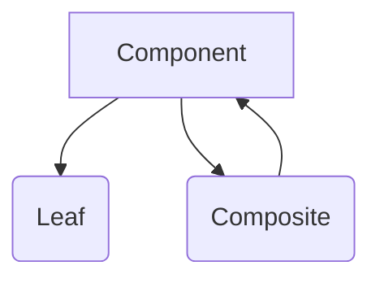

---
categories:
- Software Design
- Object-Oriented Programming
comments: true
cover:
  image: https://images.pexels.com/photos/29126434/pexels-photo-29126434.jpeg?auto=compress&cs=tinysrgb&h=650&w=940
date: 2025-06-18 15:56:31.477000
description: Understand the Composite Pattern, a structural design pattern that lets
  you compose objects into tree structures and treat individual objects and compositions
  of objects uniformly.
math: true
tags:
- Design Patterns
- Structural Patterns
- Software Architecture
title: Composite Pattern
---


The Composite Pattern is a structural design pattern that enables developers to treat individual objects and compositions of objects uniformly. It is particularly useful for representing part-whole hierarchies, where a group of objects should be treated as a single instance of the object.

### 1. Introduction

The Composite Pattern aims to allow clients to treat individual objects and compositions of objects consistently. This pattern composes objects into tree structures to represent part-whole hierarchies. It defines a common interface for both individual components (leaves) and composite components (which can contain other components).

**Common Use Cases:**
*   **Graphical User Interfaces (GUIs):** UI elements like buttons, text fields (leaves) and panels, frames (composites) which can contain other UI elements.
*   **File Systems:** Files (leaves) and directories (composites) that can contain files or other directories.
*   **Document Structures:** Words (leaves) and paragraphs, sections (composites) that contain words or other structural elements.

### 2. Implementation

Consider a graphic editor where you can draw shapes like circles and squares, and also group these shapes. The Composite Pattern allows you to `draw()` a single circle or `draw()` an entire group of shapes, which internally draws each of its components.

```python
import abc

# 1. Component: The common interface for all objects in the hierarchy
class Graphic(abc.ABC):
    @abc.abstractmethod
    def draw(self):
        """Abstract method to draw the graphic."""
        pass

# 2. Leaf: Represents individual objects in the hierarchy
class Circle(Graphic):
    def __init__(self, x: int, y: int, radius: int):
        self.x = x
        self.y = y
        self.radius = radius

    def draw(self):
        print(f"Drawing Circle at ({self.x},{self.y}) with radius {self.radius}")

class Square(Graphic):
    def __init__(self, x: int, y: int, side: int):
        self.x = x
        self.y = y
        self.side = side

    def draw(self):
        print(f"Drawing Square at ({self.x},{self.y}) with side {self.side}")

# 3. Composite: Represents a composition of objects
class GraphicGroup(Graphic):
    def __init__(self, name: str = "Unnamed Group"):
        self.name = name
        self.children: list[Graphic] = []

    def add(self, graphic: Graphic):
        """Adds a graphic component to the group."""
        self.children.append(graphic)

    def remove(self, graphic: Graphic):
        """Removes a graphic component from the group."""
        self.children.remove(graphic)

    def draw(self):
        """Draws the group and all its contained graphics."""
        print(f"--- Drawing {self.name} ---")
        for graphic in self.children:
            graphic.draw()
        print(f"--- Finished Drawing {self.name} ---\n")

# Client Code
if __name__ == "__main__":
    # Create individual shapes (leaves)
    circle1 = Circle(10, 10, 5)
    square1 = Square(20, 20, 10)
    circle2 = Circle(30, 30, 7)

    # Create groups (composites)
    primary_group = GraphicGroup("Primary Graphics")
    primary_group.add(circle1)
    primary_group.add(square1)

    secondary_group = GraphicGroup("Secondary Graphics")
    secondary_group.add(circle2)

    # Create a master group containing other groups and individual shapes
    master_group = GraphicGroup("Master Collection")
    master_group.add(primary_group)
    master_group.add(secondary_group)
    master_group.add(Square(5, 5, 2)) # Can add a leaf directly to the master group

    # Client can treat individual graphics and groups uniformly
    print("Drawing a single Circle:")
    circle1.draw()
    print("\n")

    print("Drawing the Primary Group:")
    primary_group.draw()

    print("Drawing the Master Collection (containing groups and leaves):")
    master_group.draw()
```

### 3. Mermaid Diagram


*   **Component:** The abstract base class or interface for both leaves and composites. It declares the interface for objects in the composition.
*   **Leaf:** Represents primitive objects that have no children.
*   **Composite:** Represents complex objects that have children (which can be either leaves or other composites). It implements the `Component` interface and provides methods to manage its children.

### 4. Pros & Cons

**Advantages:**
*   **Uniformity:** Clients can treat individual objects and compositions of objects uniformly, simplifying client code.
*   **Extensibility:** New types of components (leaves or composites) can be added without modifying existing client code.
*   **Hierarchy Representation:** Provides a clear and flexible way to represent part-whole hierarchies.
*   **Code Simplicity:** Simplifies client code by abstracting away the differences between individual and composite objects.

**Disadvantages:**
*   **Design Complexity:** Can be over-engineered for simple systems that do not require object hierarchies.
*   **Type Safety Concerns:** If the `Component` interface is too general, it might be possible to add components to a composite that don't logically fit, potentially leading to runtime errors if operations are not meaningful for all component types.
*   **Restrictions:** Difficult to restrict the types of components that can be added to a composite if the common interface is very broad.

### 5. References

*   Gamma, E., Helm, R., Johnson, R., & Vlissides, J. (1994). *Design Patterns: Elements of Reusable Object-Oriented Software*. Addison-Wesley.
*   Refactoring.Guru. (n.d.). *Composite Pattern*. Retrieved from [https://refactoring.guru/design-patterns/composite](https://refactoring.guru/design-patterns/composite)
*   Wikipedia. (n.d.). *Composite pattern*. Retrieved from [https://en.wikipedia.org/wiki/Composite_pattern](https://en.wikipedia.org/wiki/Composite_pattern)