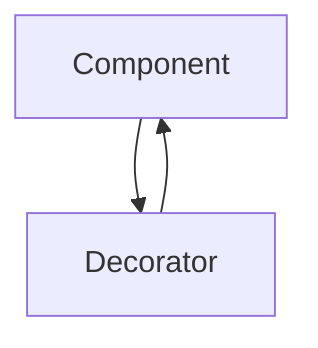

---
categories:
- Software Design
- Architecture
- Best Practices
comments: true
cover:
  image: https://images.pexels.com/photos/3861969/pexels-photo-3861969.jpeg?auto=compress&cs=tinysrgb&h=650&w=940
date: 2025-06-18 15:56:31.477000
description: An academic and practical guide to the Decorator structural design pattern,
  explaining its use for dynamically adding responsibilities to objects without modifying
  their original structure.
math: true
tags:
- Design Patterns
- Structural Patterns
- Object-Oriented Programming
title: Decorator Pattern Enhancing Objects Dynamically
---


The Decorator pattern is a structural design pattern that allows behaviors to be added to an individual object dynamically, without affecting the behavior of other objects from the same class. It provides a flexible alternative to subclassing for extending functionality.

## 1. Introduction

The Decorator pattern aims to attach additional responsibilities to an object. This is achieved by "wrapping" the original object in a decorator object, which provides the new or altered functionality. Both the original object and its decorators typically conform to a common interface, allowing them to be used interchangeably.

This pattern is particularly useful in scenarios where:
- Functionality needs to be added to objects at runtime.
- Subclassing would lead to an unmanageable number of classes due to an explosion of combinations of features (e.g., a `Window` class with `BorderedWindow`, `ScrollableWindow`, `BorderedScrollableWindow`, etc.).
- You want to extend an object's capabilities without altering its fundamental structure or breaking the Open/Closed Principle.

Common examples include I/O stream processing (e.g., adding buffering or compression to a file stream) and GUI toolkit widgets.

## 2. Implementation

Consider a simple coffee ordering system where we want to add condiments (milk, sugar) dynamically to a basic coffee.

```python
# Component Interface
class Coffee:
    """Defines the interface for objects that can have responsibilities added to them."""
    def get_cost(self) -> float:
        pass

    def get_description(self) -> str:
        pass

# Concrete Component
class BasicCoffee(Coffee):
    """A concrete implementation of the Component interface."""
    def get_cost(self) -> float:
        return 5.0

    def get_description(self) -> str:
        return "Basic Coffee"

# Decorator Abstract Class
class CoffeeDecorator(Coffee):
    """
    Abstract Decorator class. It maintains a reference to a Component object
    and implements the Component interface.
    """
    def __init__(self, decorated_coffee: Coffee):
        self._decorated_coffee = decorated_coffee

    def get_cost(self) -> float:
        return self._decorated_coffee.get_cost() # Delegates to the wrapped object

    def get_description(self) -> str:
        return self._decorated_coffee.get_description() # Delegates to the wrapped object

# Concrete Decorators
class MilkDecorator(CoffeeDecorator):
    """Concrete Decorator for adding milk."""
    def get_cost(self) -> float:
        return super().get_cost() + 1.5

    def get_description(self) -> str:
        return super().get_description() + ", Milk"

class SugarDecorator(CoffeeDecorator):
    """Concrete Decorator for adding sugar."""
    def get_cost(self) -> float:
        return super().get_cost() + 0.5

    def get_description(self) -> str:
        return super().get_description() + ", Sugar"

# Client Usage
if __name__ == "__main__":
    # Order a basic coffee
    my_coffee = BasicCoffee()
    print(f"{my_coffee.get_description()}: ${my_coffee.get_cost():.2f}")

    # Add milk to the coffee
    my_coffee_with_milk = MilkDecorator(my_coffee)
    print(f"{my_coffee_with_milk.get_description()}: ${my_coffee_with_milk.get_cost():.2f}")

    # Order a new coffee with milk AND sugar
    my_fancy_coffee = SugarDecorator(MilkDecorator(BasicCoffee()))
    print(f"{my_fancy_coffee.get_description()}: ${my_fancy_coffee.get_cost():.2f}")
```

## 3. Mermaid Diagram

The core idea of the Decorator pattern involves a `Component` that can be wrapped by a `Decorator`. The `Decorator` itself also acts as a `Component`.



This diagram illustrates that a `Decorator` both "is a" `Component` (inherits/implements the `Component` interface) and "has a" `Component` (wraps an instance of `Component`).

## 4. Pros & Cons

### Advantages:
-   **Flexibility**: Responsibilities can be added or removed from objects dynamically at runtime.
-   **Avoids Class Explosion**: Prevents the creation of many subclasses to handle every combination of behaviors, which can occur with inheritance.
-   **Adheres to Open/Closed Principle**: Functionality can be extended without modifying existing code.
-   **Single Responsibility Principle**: Separates the core concerns of an object from optional, added behaviors.

### Disadvantages:
-   **Increased Complexity**: The pattern can lead to a system with many small, similar objects, making it harder to understand and debug.
-   **Configuration Overhead**: It can be complex to instantiate a decorated object due to potentially many layers of decorators.
-   **Identity Issues**: A decorated object is not identical to its wrapper (even if it behaves identically), which can lead to issues with object identity checks (e.g., `==` or `is` in Python) if not carefully managed.
-   **Order Dependency**: The order in which decorators are applied can sometimes affect the final behavior.

## 5. References

-   **Gamma, E., Helm, R., Johnson, R., & Vlissides, J.** (1994). *Design Patterns: Elements of Reusable Object-Oriented Software*. Addison-Wesley.
-   **Refactoring.Guru**. *Decorator Design Pattern*. Available at: [https://refactoring.guru/design-patterns/decorator](https://refactoring.guru/design-patterns/decorator)
-   **Wikipedia**. *Decorator pattern*. Available at: [https://en.wikipedia.org/wiki/Decorator_pattern](https://en.wikipedia.org/wiki/Decorator_pattern)
---