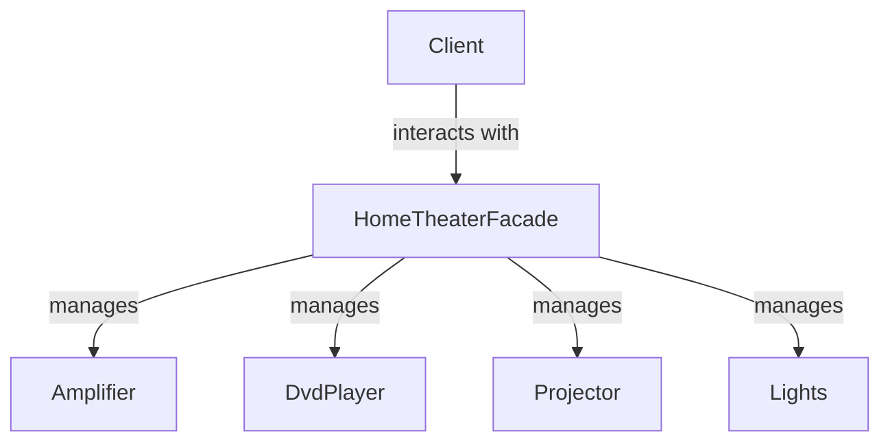

---
categories:
- Software Design
- Best Practices
- Architectural Patterns
comments: true
cover:
  image: https://images.pexels.com/photos/4668378/pexels-photo-4668378.jpeg?auto=compress&cs=tinysrgb&h=650&w=940
date: 2025-06-18 15:56:31.477000
description: A concise guide to the Facade Design Pattern, simplifying complex subsystems
  by providing a unified, higher-level interface.
math: true
tags:
- Design Patterns
- Software Architecture
- Gang of Four
- Object-Oriented Programming
- Abstraction
title: Understanding the Facade Pattern
---


The Facade Pattern is a structural design pattern that provides a simplified, unified interface to a complex subsystem. It acts as a wrapper, hiding the complexities of the subsystem and making it easier for clients to interact with it.

### Introduction

The primary goal of the Facade Pattern is to decouple clients from the inner workings of a complex system. Instead of clients needing to understand and interact with multiple classes within a subsystem, they communicate with a single Facade object. This object then delegates the requests to the appropriate subsystem classes, managing their interactions.

**Where it is used:**
*   **Simplifying Complex APIs:** When dealing with libraries or third-party APIs that have many classes and intricate interactions, a Facade can provide a streamlined interface.
*   **Legacy Systems:** To interact with an older, poorly structured codebase without directly modifying its internal components.
*   **Layered Architectures:** As an entry point to a specific layer or module, ensuring clean separation and controlled access.

### Implementation

Consider a home theater system with multiple components: an amplifier, DVD player, projector, and lights. Without a Facade, a client would need to interact with each component individually to watch a movie. A Facade can simplify this into a single `watchMovie()` method.

```python
# Subsystem Classes
class Amplifier:
    def on(self):
        print("Amplifier On")
    def set_dvd(self, dvd_player):
        print(f"Amplifier setting DVD player to {dvd_player.__class__.__name__}")
    def set_volume(self, volume):
        print(f"Amplifier setting volume to {volume}")
    def off(self):
        print("Amplifier Off")

class DvdPlayer:
    def on(self):
        print("DVD Player On")
    def play(self, movie):
        print(f"DVD Player playing '{movie}'")
    def stop(self):
        print("DVD Player Stop")
    def off(self):
        print("DVD Player Off")

class Projector:
    def on(self):
        print("Projector On")
    def wide_screen_mode(self):
        print("Projector in widescreen mode")
    def off(self):
        print("Projector Off")

class Lights:
    def dim(self, level):
        print(f"Lights dimming to {level}%")
    def on(self):
        print("Lights On")

# Facade Class
class HomeTheaterFacade:
    def __init__(self, amp, dvd, projector, lights):
        self.amp = amp
        self.dvd = dvd
        self.projector = projector
        self.lights = lights

    def watch_movie(self, movie):
        print("\n--- Get ready to watch a movie ---")
        self.lights.dim(10)
        self.projector.on()
        self.projector.wide_screen_mode()
        self.amp.on()
        self.amp.set_dvd(self.dvd)
        self.amp.set_volume(5)
        self.dvd.on()
        self.dvd.play(movie)

    def end_movie(self):
        print("\n--- Shutting movie theater down ---")
        self.dvd.stop()
        self.dvd.off()
        self.amp.off()
        self.projector.off()
        self.lights.on()

# Client Usage
if __name__ == "__main__":
    amp = Amplifier()
    dvd = DvdPlayer()
    projector = Projector()
    lights = Lights()

    home_theater = HomeTheaterFacade(amp, dvd, projector, lights)

    home_theater.watch_movie("Inception")
    print("-" * 30)
    home_theater.end_movie()
```

In this example, the `HomeTheaterFacade` provides two simple methods (`watch_movie`, `end_movie`) that encapsulate complex interactions with the underlying home theater components. The client only needs to interact with the Facade.

### Mermaid Diagram



### Pros & Cons

Like all design patterns, the Facade has specific advantages and disadvantages depending on the context.

**Advantages:**
*   **Simplifies Complexity:** Provides a high-level, unified interface, making a complex subsystem easier to use.
*   **Reduces Coupling:** Decouples the client from the subsystem's individual components, allowing changes within the subsystem without affecting client code.
*   **Encapsulation:** Hides the internal implementation details and interactions of the subsystem.
*   **Improved Readability:** Client code becomes cleaner and more intuitive as it interacts with fewer, higher-level objects.
*   **Easier Refactoring:** Modifications to the subsystem's internal structure are less likely to impact clients.

**Disadvantages:**
*   **Potential for Bloat:** If the Facade tries to expose too much functionality or becomes responsible for too many operations, it can become a "God Object," accumulating too many responsibilities.
*   **Limited Flexibility:** In some cases, a client might need direct access to a subsystem component's specific functionality that the Facade doesn't expose, forcing them to bypass the Facade.
*   **Added Abstraction Layer:** Introduces an additional layer, which can slightly increase overhead or make debugging marginally more complex in very simple scenarios.

### References

*   **Gamma, E., Helm, R., Johnson, R., & Vlissides, J. (1994).** *Design Patterns: Elements of Reusable Object-Oriented Software*. Addison-Wesley.
*   **Refactoring.Guru.** *Facade Design Pattern*. Available at: [https://refactoring.guru/design-patterns/facade](https://refactoring.guru/design-patterns/facade)