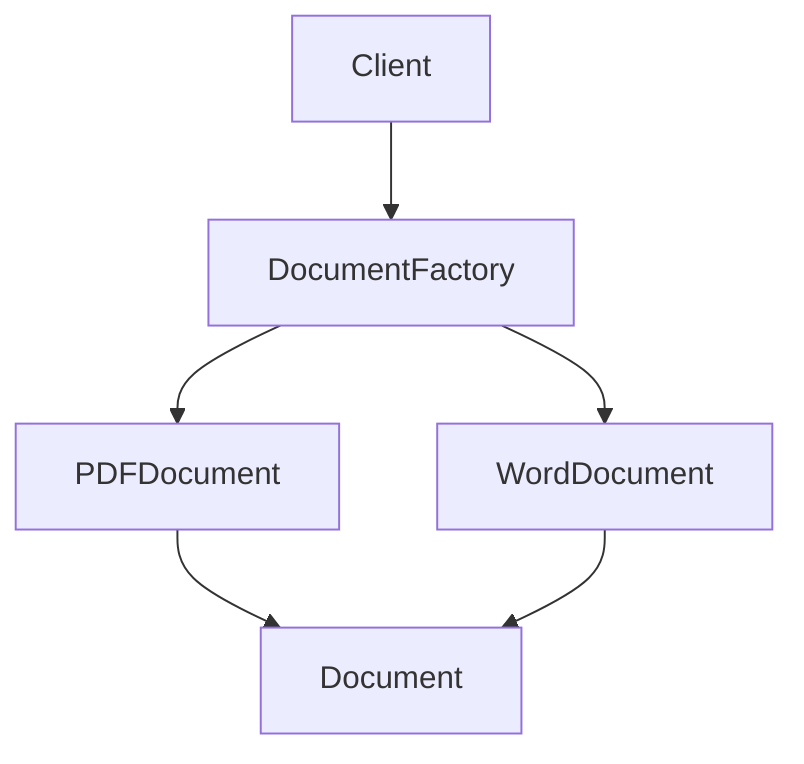

---
categories:
- Software Design
- Best Practices
comments: true
cover:
  image: https://images.pexels.com/photos/249798/pexels-photo-249798.png?auto=compress&cs=tinysrgb&h=650&w=940
date: 2025-06-18 15:56:31.477000
description: A concise and practical explanation of the Factory design pattern, detailing
  its structure, implementation, and implications for software architecture.
math: true
tags:
- Design Patterns
- Creational Patterns
- Software Architecture
- Object-Oriented Programming
title: Factory Pattern Explained
---


## Factory Pattern Explained

The Factory Pattern is a creational design pattern that provides an interface for creating objects in a superclass, but allows subclasses to alter the type of objects that will be created. It encapsulates the object creation logic, promoting loose coupling between the client code and the concrete classes it instantiates.

### 1. Introduction

The Factory Pattern is primarily used to abstract the instantiation process. Instead of directly instantiating objects using the `new` keyword, a factory method is employed to create instances. This pattern is beneficial in scenarios where:

*   A class cannot anticipate the class of objects it needs to create.
*   A class wants its subclasses to specify the objects it creates.
*   You want to centralize object creation logic.
*   You need to create objects that share a common interface but have varying concrete implementations.

### 2. Implementation

The core components include a product interface, concrete product implementations, and a factory class with a creation method.

Here's a Python example:

```python
from abc import ABC, abstractmethod

# 1. Product Interface (or Abstract Class)
class Document(ABC):
    """
    Defines the interface for objects the factory method creates.
    """
    @abstractmethod
    def get_type(self) -> str:
        pass

    @abstractmethod
    def print_content(self) -> str:
        pass

# 2. Concrete Products
class PDFDocument(Document):
    """
    A concrete implementation of the Document interface.
    """
    def get_type(self) -> str:
        return "PDF Document"

    def print_content(self) -> str:
        return "Printing content of a PDF file."

class WordDocument(Document):
    """
    Another concrete implementation of the Document interface.
    """
    def get_type(self) -> str:
        return "Word Document"

    def print_content(self) -> str:
        return "Printing content of a Word file."

# 3. Factory Class
class DocumentFactory:
    """
    The Factory class that provides a method to create Document objects.
    """
    def create_document(self, doc_type: str) -> Document:
        if doc_type == "pdf":
            return PDFDocument()
        elif doc_type == "word":
            return WordDocument()
        else:
            raise ValueError(f"Unknown document type: {doc_type}")

# Client Code
if __name__ == "__main__":
    factory = DocumentFactory()

    # Create a PDF document without knowing its concrete class
    pdf_doc = factory.create_document("pdf")
    print(f"Created: {pdf_doc.get_type()}")
    print(pdf_doc.print_content())

    print("-" * 20)

    # Create a Word document
    word_doc = factory.create_document("word")
    print(f"Created: {word_doc.get_type()}")
    print(word_doc.print_content())

    # Attempt to create an unknown type
    try:
        unknown_doc = factory.create_document("excel")
    except ValueError as e:
        print(f"\nError: {e}")
```

### 3. Mermaid Diagram

The diagram below illustrates the basic interaction flow in the Factory Pattern.



### 4. Pros & Cons

Like all design patterns, the Factory Pattern offers specific advantages and disadvantages.

**Advantages:**

*   **Decoupling:** Separates the product's construction code from the code that uses the product. The client interacts only with the factory and the product interface, not with specific concrete product classes.
*   **Single Responsibility Principle (SRP):** Concentrates object creation logic in one place (the factory), making it easier to manage and modify.
*   **Open/Closed Principle (OCP):** New product types can be added without modifying existing client code that uses the factory. You only need to add a new concrete product and potentially update the factory.
*   **Encapsulation:** Object creation details are hidden from the client.
*   **Flexibility:** Allows for easier configuration and extension of the system.

**Disadvantages:**

*   **Increased Complexity:** Introduces new interfaces and classes, which can add overhead, especially for very simple object creation needs.
*   **Potential for Over-engineering:** For applications with only a few simple product types that are unlikely to change, the pattern might introduce unnecessary abstraction.

### 5. References

*   **Gamma, E., Helm, R., Johnson, R., & Vlissides, J. (1994).** *Design Patterns: Elements of Reusable Object-Oriented Software*. Addison-Wesley. (The original "Gang of Four" book)
*   **Refactoring.Guru.** *Factory Method*. Available at: [https://refactoring.guru/design-patterns/factory-method](https://refactoring.guru/design-patterns/factory-method)