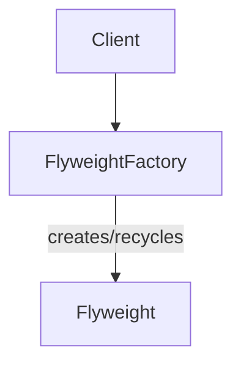

---
categories:
- Software Design
- Best Practices
comments: true
cover:
  image: https://images.pexels.com/photos/4759930/pexels-photo-4759930.jpeg?auto=compress&cs=tinysrgb&h=650&w=940
date: 2025-06-18 15:56:31.477000
description: Explore the Flyweight design pattern, a structural pattern focused on
  minimizing memory usage by sharing common object states. Learn its principles, implementation,
  benefits, and drawbacks.
math: true
tags:
- Design Patterns
- Architecture
- Performance
- Memory Optimization
title: Understanding the Flyweight Pattern
---


The Flyweight pattern is a structural design pattern that aims to minimize memory usage by sharing as much data as possible among multiple objects. It is particularly effective in scenarios where an application needs to create a vast number of fine-grained objects that consume significant memory.

## 1. Introduction

The core principle of the Flyweight pattern lies in distinguishing between an object's *intrinsic* and *extrinsic* state:

*   **Intrinsic State:** This is the unchangeable, shared state of an object. It is stored within the flyweight object itself and can be shared among many objects.
*   **Extrinsic State:** This is the changeable, unique state of an object. It cannot be shared and must be passed to the flyweight methods by the client at runtime.

The pattern works by creating a "factory" that manages and provides access to a pool of shared flyweight objects. When a client requests an object, the factory checks if a flyweight with the desired intrinsic state already exists. If it does, the existing object is returned; otherwise, a new one is created and cached for future reuse.

**Use Cases:**
The Flyweight pattern is typically applied in situations characterized by:
*   An application creating a large number of objects.
*   High memory consumption due to these objects.
*   A significant portion of an object's state being sharable (intrinsic).
*   The ability to extract the non-sharable (extrinsic) state and pass it contextually.

Common applications include:
*   **Text Editors:** Sharing character font, size, and color properties across many characters.
*   **Game Development:** Reusing common models (e.g., trees, particles, enemies) with varied positions and orientations.
*   **Graphical Editors:** Sharing common brush types or shapes.

## 2. Implementation

Consider a scenario in a game where a vast number of trees need to be rendered. Each tree might have a unique position, but many share the same species, color, and texture. The `TreeType` can be a flyweight (intrinsic state), while `Tree` (client object) holds the extrinsic state (position).

```python
import sys

# ConcreteFlyweight: Stores intrinsic state
class TreeType:
    def __init__(self, name: str, color: str, texture: str):
        self._name = name
        self._color = color
        self._texture = texture
        # print(f"Creating new TreeType: {name}, {color}, {texture}")

    def display(self, x: int, y: int) -> None:
        """
        Displays the tree type with extrinsic state (x, y).
        """
        print(f"Displaying {self._color} {self._name} with {self._texture} texture at ({x}, {y})")

# FlyweightFactory: Manages and provides TreeType instances
class TreeFactory:
    _tree_types = {}

    @classmethod
    def get_tree_type(cls, name: str, color: str, texture: str) -> TreeType:
        key = (name, color, texture)
        if key not in cls._tree_types:
            cls._tree_types[key] = TreeType(name, color, texture)
        return cls._tree_types[key]

# Client object: Uses Flyweights and holds extrinsic state
class Tree:
    def __init__(self, x: int, y: int, tree_type: TreeType):
        self._x = x
        self._y = y
        self._tree_type = tree_type # Reference to the shared Flyweight

    def display(self) -> None:
        self._tree_type.display(self._x, self._y)

# --- Usage Example ---
if __name__ == "__main__":
    forest = []

    # Create various tree types (Flyweights)
    oak_type = TreeFactory.get_tree_type("Oak", "Green", "RoughBark")
    pine_type = TreeFactory.get_tree_type("Pine", "DarkGreen", "NeedleTexture")
    maple_type = TreeFactory.get_tree_type("Maple", "Red", "SmoothBark")

    # Place trees in the forest (Client objects)
    # Notice multiple trees can share the same TreeType instance
    forest.append(Tree(10, 20, oak_type))
    forest.append(Tree(15, 25, pine_type))
    forest.append(Tree(12, 22, oak_type))  # Reuses existing oak_type
    forest.append(Tree(30, 40, maple_type))
    forest.append(Tree(35, 45, pine_type)) # Reuses existing pine_type

    print(f"Total individual trees in forest: {len(forest)}")
    print(f"Unique TreeType objects created: {len(TreeFactory._tree_types)}")

    # Demonstrate memory saving (conceptual)
    # In a real scenario, imagine thousands of trees sharing a few TreeType instances
    size_of_one_tree_type = sys.getsizeof(oak_type)
    size_of_one_tree_instance = sys.getsizeof(forest[0]) # Size of Tree object itself, not deeply
    total_tree_type_memory = sum(sys.getsizeof(t) for t in TreeFactory._tree_types.values())
    total_forest_instance_memory = sum(sys.getsizeof(t) for t in forest)

    print(f"\nSize of one TreeType instance (conceptual): {size_of_one_tree_type} bytes")
    print(f"Memory for all unique TreeTypes: {total_tree_type_memory} bytes")
    print(f"Memory for all Tree instances (excluding shared TreeType): {total_forest_instance_memory} bytes")
    # If TreeType was part of each Tree object, memory would be (num_trees * size_of_one_tree_type)
    # With Flyweight: size_of_all_unique_tree_types + (num_trees * size_of_tree_object_pointer)
```

## 3. Mermaid Diagram



## 4. Pros & Cons

The Flyweight pattern offers specific advantages and disadvantages:

**Advantages:**
*   **Reduced Memory Footprint:** The primary benefit is significant memory savings, especially when dealing with a large number of objects that share common data.
*   **Improved Performance:** Less memory usage often translates to fewer page faults and better cache utilization, leading to faster application performance.
*   **Simplified Object Management:** The Flyweight Factory centralizes the creation and management of shared objects, making it easier to maintain consistency.

**Disadvantages:**
*   **Increased Complexity:** The pattern introduces additional layers (Flyweight, Concrete Flyweight, Flyweight Factory, Client) and requires careful separation of intrinsic and extrinsic state, which can increase the overall complexity of the design.
*   **Runtime Overhead:** There is a minor overhead associated with looking up or creating flyweights in the factory, as well as passing extrinsic state to methods at runtime.
*   **Not Universally Applicable:** If objects primarily have unique states or if the number of objects is small, the overhead introduced by the pattern may outweigh the benefits.

## 5. References

*   Gamma, E., Helm, R., Johnson, R., & Vlissides, J. (1994). *Design Patterns: Elements of Reusable Object-Oriented Software*. Addison-Wesley.
*   Refactoring.Guru. (n.d.). *Flyweight Design Pattern*. Retrieved from [https://refactoring.guru/design-patterns/flyweight](https://refactoring.guru/design-patterns/flyweight)
*   Wikipedia. (n.d.). *Flyweight pattern*. Retrieved from [https://en.wikipedia.org/wiki/Flyweight_pattern](https://en.wikipedia.org/wiki/Flyweight_pattern)