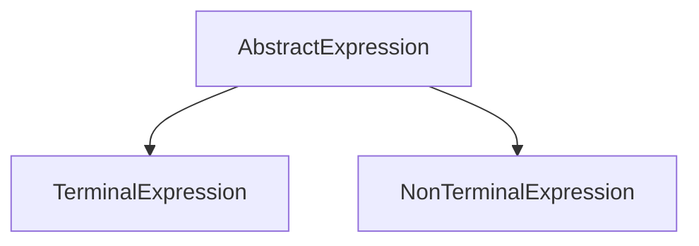

---
categories:
- Software Design
- Best Practices
comments: true
cover:
  image: https://images.pexels.com/photos/1089438/pexels-photo-1089438.jpeg?auto=compress&cs=tinysrgb&h=650&w=940
date: 2025-06-18 15:56:31.477000
description: Explore the Interpreter design pattern, a powerful approach for defining
  and interpreting language grammars within your applications, with practical examples
  and objective analysis.
math: true
tags:
- Design Patterns
- Behavioral Patterns
- Architecture
- Language Processing
title: Interpreter Pattern
---


## Interpreter Pattern

The Interpreter Pattern is a behavioral design pattern that defines a grammatical representation for a language and provides an interpreter to deal with this grammar. It's particularly useful when you have a language (or a subset of one) that needs to be interpreted, and you can represent sentences in that language as abstract syntax trees (ASTs).

### Introduction

This pattern is applied when a system needs to interpret expressions in a simple language. It structures the grammar rules into a class hierarchy, where each rule corresponds to a class. Sentences or expressions written in the language are then represented as instances of these classes, forming an Abstract Syntax Tree. The pattern then provides a way to traverse this tree and perform the interpretation.

Common applications include:
*   **Query Parsers:** Interpreting database queries or custom search syntaxes.
*   **Rule Engines:** Evaluating business rules defined in a domain-specific language.
*   **Regular Expressions:** The core of how regular expression engines work.
*   **Simple Scripting Languages:** Executing commands or expressions.

### Implementation

Consider a simple arithmetic expression language that supports addition and subtraction. We can define our grammar and interpreter using the Interpreter Pattern.

```python
# AbstractExpression defines the interpret operation.
class AbstractExpression:
    def interpret(self, context):
        """
        Interprets the expression given a context.
        Context can hold additional state or data needed during interpretation.
        """
        raise NotImplementedError

# TerminalExpression represents a specific number.
class NumberExpression(AbstractExpression):
    def __init__(self, value):
        self._value = value

    def interpret(self, context):
        return self._value

# NonTerminalExpression represents an operation (e.g., addition, subtraction).
# It composes other expressions.
class AddExpression(AbstractExpression):
    def __init__(self, left, right):
        self._left = left
        self._right = right

    def interpret(self, context):
        return self._left.interpret(context) + self._right.interpret(context)

class SubtractExpression(AbstractExpression):
    def __init__(self, left, right):
        self._left = left
        self._right = right

    def interpret(self, context):
        return self._left.interpret(context) - self._right.interpret(context)

# Client Usage: Builds the Abstract Syntax Tree and initiates interpretation.
if __name__ == "__main__":
    # Represents the expression: (5 + 10) - 2
    # The 'context' object (an empty dictionary here) could carry state
    # for more complex interpreters (e.g., variable values).
    expression_tree = SubtractExpression(
        AddExpression(NumberExpression(5), NumberExpression(10)),
        NumberExpression(2)
    )

    # Interpret the expression
    result = expression_tree.interpret({})
    print(f"Expression: (5 + 10) - 2")
    print(f"Result: {result}") # Expected output: 13
```

In this example, `AbstractExpression` is the common interface. `NumberExpression` is a `TerminalExpression`, representing a leaf node in our AST. `AddExpression` and `SubtractExpression` are `NonTerminalExpressions`, representing internal nodes that combine results from their child expressions. The client builds the AST manually and then calls `interpret()` on the root.

### Mermaid Diagram

The core structure of the Interpreter pattern involves an abstract expression and its concrete implementations, which can be terminal (leaf) or non-terminal (composite) nodes in an Abstract Syntax Tree.



### Pros & Cons

The Interpreter Pattern, like all design patterns, offers specific advantages and disadvantages that should be considered based on the problem domain.

**Advantages:**
*   **Extensibility:** Easy to extend the grammar by adding new classes for new rules or expressions.
*   **Simplicity:** For simple grammars, the pattern can be straightforward to implement.
*   **Grammar Representation:** Each rule in the grammar is represented by a class, making the grammar easy to understand and maintain.
*   **Ease of Change:** Changes to grammar rules can often be isolated to specific classes.

**Disadvantages:**
*   **Complexity for Large Grammars:** Becomes unwieldy and difficult to manage when the grammar is extensive, leading to a large number of classes.
*   **Performance Overhead:** Can incur performance overhead due to the creation of many objects for complex expressions.
*   **Overkill for Simple Operations:** For very simple parsing needs, a simpler approach like regular expressions or basic string parsing might be more appropriate.

### References

*   Gamma, E., Helm, R., Johnson, R., & Vlissides, J. (1994). *Design Patterns: Elements of Reusable Object-Oriented Software*. Addison-Wesley.
*   Refactoring Guru. (n.d.). *Interpreter Design Pattern*. Retrieved from [https://refactoring.guru/design-patterns/interpreter](https://refactoring.guru/design-patterns/interpreter)
*   Wikipedia. (n.d.). *Interpreter pattern*. Retrieved from [https://en.wikipedia.org/wiki/Interpreter_pattern](https://en.wikipedia.org/wiki/Interpreter_pattern)