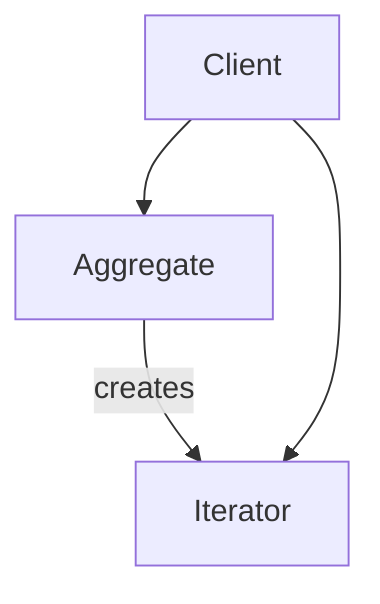

---
categories:
- Software Design
- Best Practices
- Programming Concepts
comments: true
cover:
  image: https://images.pexels.com/photos/330771/pexels-photo-330771.jpeg?auto=compress&cs=tinysrgb&h=650&w=940
date: 2025-06-18 15:56:31.477000
description: Explore the Iterator Pattern, a behavioral design pattern for traversing
  collections without exposing their internal structure.
math: true
tags:
- Design Patterns
- Behavioral Patterns
- Software Architecture
- Collections
- Iteration
title: Understanding the Iterator Pattern
---


### 1. Introduction

The **Iterator Pattern** is a behavioral design pattern that provides a way to access the elements of an aggregate object sequentially without exposing its underlying representation. It decouples the algorithm for traversing a collection from the collection itself.

This pattern is employed whenever there is a need to iterate over the elements of a collection (e.g., lists, arrays, trees, graphs) in a standardized manner, without requiring the client to understand the collection's internal structure. This separation of concerns allows for flexible traversal strategies and maintains the encapsulation of the collection.

### 2. Implementation

The Iterator Pattern typically involves two main components:
- **Iterator**: An interface or abstract class defining methods for accessing and traversing elements (e.g., `next()`, `has_next()`).
- **Aggregate**: An interface or abstract class defining a method for creating an Iterator (e.g., `create_iterator()`).

Here is a concise Python example demonstrating a basic implementation:

```python
from abc import ABC, abstractmethod

# 1. Abstract Iterator Interface
class AbstractIterator(ABC):
    @abstractmethod
    def next(self):
        """Returns the next element in the collection."""
        pass

    @abstractmethod
    def has_next(self) -> bool:
        """Checks if there are more elements to iterate over."""
        pass

# 2. Abstract Aggregate Interface
class AbstractAggregate(ABC):
    @abstractmethod
    def create_iterator(self) -> AbstractIterator:
        """Returns a new Iterator for the aggregate."""
        pass

# 3. Concrete Iterator
class NumberIterator(AbstractIterator):
    def __init__(self, collection):
        self._collection = collection
        self._index = 0

    def next(self):
        if not self.has_next():
            raise StopIteration("No more elements in the collection.")
        value = self._collection[self._index]
        self._index += 1
        return value

    def has_next(self) -> bool:
        return self._index < len(self._collection)

# 4. Concrete Aggregate
class NumberCollection(AbstractAggregate):
    def __init__(self, data: list):
        self._data = data

    def create_iterator(self) -> AbstractIterator:
        return NumberIterator(self._data)

# Client Usage
if __name__ == "__main__":
    my_numbers = [10, 20, 30, 40, 50]
    collection = NumberCollection(my_numbers)

    # Obtain an iterator from the collection
    iterator = collection.create_iterator()

    print("Iterating through numbers:")
    while iterator.has_next():
        print(iterator.next())

    print("\nDemonstrating multiple iterators (new iterator for same collection):")
    iterator2 = collection.create_iterator() # A new independent iterator
    print(iterator2.next()) # Prints 10
    print(iterator2.next()) # Prints 20
```

### 3. Mermaid Diagram



### 4. Pros & Cons

**Advantages:**
*   **Decoupling:** Separates the traversal logic from the collection's internal representation, promoting cleaner code.
*   **Flexibility:** Allows for multiple, different traversal algorithms to be applied to the same collection without modifying the collection itself.
*   **Simultaneous Traversal:** Supports multiple independent traversals of the same collection simultaneously.
*   **Single Responsibility Principle:** Each component (collection, iterator) has a single, well-defined responsibility.

**Disadvantages:**
*   **Complexity:** Introduces additional classes and interfaces, which can increase complexity for very simple collections where direct access might suffice.
*   **Overhead:** Involves the creation and management of iterator objects, which may introduce minor performance overhead in highly performance-critical scenarios.
*   **Verbosity:** In languages with built-in iteration protocols (e.g., Python's `for...in` loop leveraging the `__iter__` and `__next__` methods), explicitly implementing the pattern might feel more verbose than using the native mechanisms.

### 5. References

*   Gamma, E., Helm, R., Johnson, R., & Vlissides, J. (1994). *Design Patterns: Elements of Reusable Object-Oriented Software*. Addison-Wesley.
*   Wikipedia. (n.d.). *Iterator pattern*. Retrieved from [https://en.wikipedia.org/wiki/Iterator_pattern](https://en.wikipedia.org/wiki/Iterator_pattern)
*   Refactoring.Guru. (n.d.). *Iterator Design Pattern*. Retrieved from [https://refactoring.guru/design-patterns/iterator](https://refactoring.guru/design-patterns/iterator)