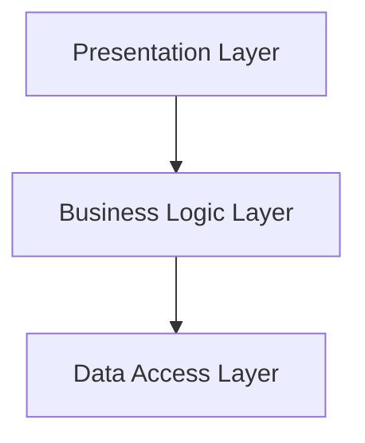

---
categories:
- Software Architecture
- Best Practices
comments: true
cover:
  image: https://images.pexels.com/photos/30547564/pexels-photo-30547564.jpeg?auto=compress&cs=tinysrgb&h=650&w=940
date: 2025-06-18 15:56:31.477000
description: A concise and practical explanation of Layered Architecture, a fundamental
  software design pattern for structuring applications.
math: true
tags:
- Architecture
- Design Patterns
- Software Design
- System Design
title: Layered Architecture
---


Layered Architecture is a foundational software design pattern used to structure applications into distinct, horizontally stacked layers. Each layer has a specific role and interacts only with the layers directly below it, establishing a strict hierarchy of dependencies. This pattern promotes separation of concerns, facilitating modularity and maintainability.

### 1. Introduction

**Definition:** Layered Architecture organizes an application into logically distinct layers, each performing a specific set of responsibilities. Communication between layers typically flows unidirectionally from higher layers to lower ones. A classic four-layer model often includes Presentation, Business Logic, Persistence (or Data Access), and Database layers.

**Usage:** This architectural pattern is widely applied in traditional enterprise applications, monolithic systems, and any software where a clear separation of operational concerns is beneficial. It is particularly common in web applications where user interfaces, business rules, and data storage are managed separately.

### 2. Implementation Example

While Layered Architecture defines a structural pattern, its implementation involves organizing code into modules or classes that represent each layer and enforcing the unidirectional dependencies. The following Python-like pseudocode illustrates how a `Presentation Layer` might call a `Business Logic Layer`, which in turn interacts with a `Data Access Layer`.

```python
# data_access_layer.py
# Represents interaction with a database or external data source
class UserRepository:
    def get_user_by_id(self, user_id: int) -> dict | None:
        """Simulates fetching user data from a database."""
        if user_id == 101:
            return {"id": 101, "name": "Alice Smith", "email": "alice@example.com"}
        return None

# business_logic_layer.py
# Contains application-specific business rules and orchestrates data access
from data_access_layer import UserRepository

class UserService:
    def __init__(self):
        self.user_repo = UserRepository()

    def get_formatted_user_details(self, user_id: int) -> str:
        """Applies business rules to user data before presentation."""
        user = self.user_repo.get_user_by_id(user_id)
        if user:
            return f"User: {user['name']} (ID: {user['id']}), Contact: {user['email']}"
        return "User not found."

# presentation_layer.py
# Handles user interaction and displays information
from business_logic_layer import UserService

def display_user_profile(user_id: int):
    """Simulates an API endpoint or UI component displaying user info."""
    user_service = UserService()
    user_info_display = user_service.get_formatted_user_details(user_id)
    print(user_info_display)

# --- Application Entry Point ---
if __name__ == "__main__":
    print("--- Fetching User 101 ---")
    display_user_profile(101)

    print("\n--- Fetching User 202 (Non-existent) ---")
    display_user_profile(202)
```

In this example:
- `UserRepository` (Data Access Layer) only knows how to retrieve data.
- `UserService` (Business Logic Layer) uses `UserRepository` to get raw data, then applies business formatting.
- `display_user_profile` (Presentation Layer) uses `UserService` to get formatted data and displays it, unaware of data retrieval specifics.

### 3. Mermaid Diagram



This diagram illustrates the unidirectional flow of control and dependencies, from the user-facing Presentation Layer down to the Data Access Layer.

### 4. Pros & Cons

**Advantages:**

*   **Separation of Concerns:** Each layer has a well-defined responsibility, improving modularity and clarity.
*   **Testability:** Individual layers can be tested in isolation, as dependencies are typically unidirectional and can be mocked.
*   **Maintainability:** Changes in one layer are less likely to impact other layers, simplifying maintenance and updates.
*   **Reusability:** Components within a layer (e.g., a data access object) can potentially be reused across different parts of the application.
*   **Enforced Structure:** The strict dependency rules guide developers, making the system easier to understand and extending for new team members.

**Disadvantages:**

*   **Performance Overhead:** A request might traverse multiple layers, potentially introducing minor performance overhead due to extra processing in each layer.
*   **Complexity for Simple Applications:** For small or straightforward applications, a rigid layered structure can introduce unnecessary complexity and boilerplate code.
*   **Tight Coupling within Layers:** While layers are decoupled, components *within* a single layer can still become tightly coupled if not designed carefully.
*   **Deployment Monolith:** Typically, a layered application is deployed as a single unit, which can complicate independent scaling or deployment of specific functionalities.
*   **"Big Ball of Mud" Risk:** Without strict adherence to layer rules, dependencies can become tangled, leading to a system that loses its architectural benefits.

### 5. References

*   Fowler, M. (2002). *Patterns of Enterprise Application Architecture*. Addison-Wesley.
*   Wikipedia. (n.d.). *Multilayered architecture*. Retrieved from [https://en.wikipedia.org/wiki/Multilayered_architecture](https://en.wikipedia.org/wiki/Multilayered_architecture)