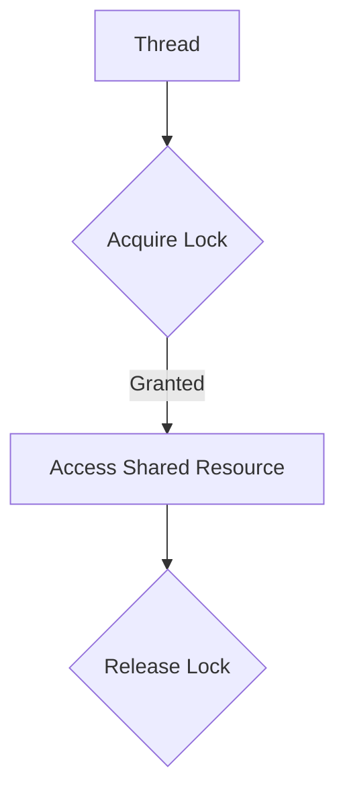

---
categories:
- Software Design
- Concurrency Control
- Best Practices
comments: true
cover:
  image: https://images.pexels.com/photos/16955319/pexels-photo-16955319.jpeg?auto=compress&cs=tinysrgb&h=650&w=940
date: 2025-06-18 15:56:31.477000
description: Explore the Locking Pattern, a fundamental concurrency control mechanism
  used to ensure exclusive access to shared resources in multi-threaded environments,
  preventing race conditions and data corruption.
math: true
tags:
- Concurrency
- Design Patterns
- Synchronization
- Threading
- Critical Section
title: Locking Pattern
---


## Introduction

The **Locking Pattern** is a foundational design pattern used in concurrent programming to manage access to shared resources. Its primary purpose is to ensure that only one thread or process can access a particular shared resource or a critical section of code at any given time, thereby preventing race conditions, data corruption, and ensuring data integrity.

This pattern is widely applied in multi-threaded applications, operating systems, database systems, and distributed systems where multiple execution flows might attempt to modify the same data concurrently. By establishing mutually exclusive access, the Locking Pattern guarantees predictable behavior and consistent states for shared data.

## Implementation

The Locking Pattern is typically implemented using mutexes (mutual exclusions), semaphores, or other synchronization primitives provided by programming languages or operating systems. These primitives allow a thread to "acquire" a lock before entering a critical section and "release" it upon exiting, ensuring exclusive access.

The following Python example demonstrates a simple implementation using `threading.Lock` to protect a shared counter.

```python
import threading
import time

class SharedCounter:
    """
    A simple shared counter demonstrating the Locking Pattern.
    """
    def __init__(self):
        self.value = 0
        self.lock = threading.Lock() # Initialize a re-entrant lock

    def increment(self):
        """
        Increments the counter safely using a lock.
        The 'with' statement ensures the lock is acquired and released automatically.
        """
        with self.lock: # Acquire the lock
            # Critical section: Code that accesses the shared resource
            current_value = self.value
            time.sleep(0.001) # Simulate some work
            self.value = current_value + 1
            # Lock is automatically released when exiting the 'with' block

def worker(counter, num_iterations):
    """
    Worker function to increment the counter multiple times.
    """
    for _ in range(num_iterations):
        counter.increment()

if __name__ == "__main__":
    shared_counter = SharedCounter()
    num_threads = 5
    iterations_per_thread = 1000

    threads = []
    for _ in range(num_threads):
        thread = threading.Thread(target=worker, args=(shared_counter, iterations_per_thread))
        threads.append(thread)
        thread.start()

    for thread in threads:
        thread.join() # Wait for all threads to complete

    # Expected value without locking: varies due to race conditions
    # Expected value with locking: num_threads * iterations_per_thread
    print(f"Final counter value: {shared_counter.value}")
    expected_value = num_threads * iterations_per_thread
    print(f"Expected counter value: {expected_value}")
    print(f"Result is correct: {shared_counter.value == expected_value}")
```

In this example, the `with self.lock:` statement ensures that the `increment` method's critical section (where `self.value` is read and updated) is only executed by one thread at a time.

## Mermaid Diagram

The following diagram illustrates the basic flow of a thread interacting with a locked shared resource:



## Pros & Cons

Objectively evaluating the Locking Pattern reveals several advantages and disadvantages:

### Advantages

*   **Data Integrity:** Guarantees mutual exclusion, preventing race conditions and ensuring that shared data remains consistent and uncorrupted.
*   **Simplicity for Critical Sections:** For straightforward critical sections, locks offer a clear and often simple mechanism to protect shared state.
*   **Predictable Behavior:** By controlling access, locks help ensure that the system's behavior is predictable even under heavy concurrency.
*   **Widely Supported:** Most programming languages and operating systems provide robust, optimized locking primitives.

### Disadvantages

*   **Performance Overhead:** Acquiring and releasing locks involves computational overhead, which can become significant in highly contended scenarios or with frequent locking.
*   **Deadlocks:** Incorrect lock usage (e.g., acquiring locks in different orders across threads) can lead to deadlocks, where two or more threads are perpetually blocked, waiting for each other to release a resource.
*   **Starvation:** A thread might repeatedly lose the race for a lock, leading to it being perpetually denied access to a shared resource.
*   **Increased Complexity:** While simple for basic cases, managing multiple locks, nested locks, or fine-grained locking can significantly increase code complexity and debugging difficulty.
*   **Reduced Concurrency:** Locks inherently serialize access to a resource, potentially limiting the degree of parallelism and underutilizing available CPU cores.

## References

*   Gamma, E., Helm, R., Johnson, R., & Vlissides, J. (1994). *Design Patterns: Elements of Reusable Object-Oriented Software*. Addison-Wesley. (Covers patterns foundational to concurrency concepts).
*   Goetz, B., Peierls, T., Bloch, J., Bowbeer, J., Holmes, D., & Lea, D. (2006). *Java Concurrency in Practice*. Addison-Wesley. (A comprehensive guide to concurrency, with detailed discussions on locking).
*   Python `threading` module documentation: [https://docs.python.org/3/library/threading.html](https://docs.python.org/3/library/threading.html) (Provides practical examples and details on Python's concurrency primitives, including locks).