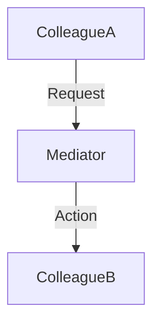

---
categories:
- Software Design
- Best Practices
comments: true
cover:
  image: https://images.pexels.com/photos/8242177/pexels-photo-8242177.jpeg?auto=compress&cs=tinysrgb&h=650&w=940
date: 2025-06-18 15:56:31.477000
description: A concise guide to the Mediator design pattern, focusing on its role
  in reducing coupling between components by centralizing communication logic.
math: true
tags:
- Design Patterns
- Architecture
- Software Engineering
title: Understanding the Mediator Pattern
---


The Mediator pattern is a behavioral design pattern that allows objects to communicate with each other indirectly, through a central mediator object. This approach aims to reduce direct dependencies between objects, thereby promoting looser coupling and enhancing maintainability.

### 1. Introduction

The **Mediator Pattern** defines an object that encapsulates how a set of objects interact. Instead of objects interacting directly with one another, which can lead to a tightly coupled system, all communication is handled via a mediator object. This pattern is particularly useful in systems where many objects need to collaborate, but direct connections between them would create a complex, unmanageable web of dependencies.

**Where it is used:**
*   **Graphical User Interfaces (GUIs):** UI components (buttons, text fields, checkboxes) often interact. A mediator can manage their state changes and actions, ensuring components react correctly without knowing about each other.
*   **Chat Applications:** Participants in a chat room don't send messages directly to each other; they send them to the chat room (mediator), which then dispatches them to other participants.
*   **Air Traffic Control Systems:** Aircraft (colleagues) do not communicate directly but through an air traffic controller (mediator).

### 2. Implementation Example

Consider a simple chat room where users send messages without directly knowing other users. The `ChatRoom` acts as the mediator.

```python
# Mediator Interface
class ChatRoomMediator:
    def send_message(self, message: str, participant: 'Participant'):
        """Sends a message from one participant to others."""
        pass

# Concrete Mediator
class ChatRoom(ChatRoomMediator):
    def __init__(self):
        self._participants = []

    def add_participant(self, participant: 'Participant'):
        """Adds a participant to the chat room."""
        self._participants.append(participant)

    def send_message(self, message: str, sender: 'Participant'):
        """Dispatches message to all participants except the sender."""
        for participant in self._participants:
            if participant != sender:
                participant.receive_message(message)

# Colleague Abstract Class
class Participant:
    def __init__(self, name: str, mediator: ChatRoomMediator):
        self.name = name
        self.mediator = mediator

    def send(self, message: str):
        """Sends a message via the mediator."""
        print(f"{self.name} sends: '{message}'")
        self.mediator.send_message(message, self)

    def receive_message(self, message: str):
        """Receives a message from the mediator."""
        print(f"{self.name} receives: '{message}'")

# Concrete Colleague
class User(Participant):
    def __init__(self, name: str, mediator: ChatRoomMediator):
        super().__init__(name, mediator)

# Usage
if __name__ == "__main__":
    chat_room = ChatRoom()

    alice = User("Alice", chat_room)
    bob = User("Bob", chat_room)
    charlie = User("Charlie", chat_room)

    chat_room.add_participant(alice)
    chat_room.add_participant(bob)
    chat_room.add_participant(charlie)

    print("--- Alice sends a message ---")
    alice.send("Hello everyone!")

    print("\n--- Bob sends a message ---")
    bob.send("Hi Alice, how are you?")
```

### 3. Mermaid Diagram

The diagram illustrates how `ColleagueA` and `ColleagueB` interact indirectly through the `Mediator`.



### 4. Pros & Cons

The Mediator pattern offers several advantages and some potential drawbacks:

**Pros:**
*   **Reduced Coupling:** Components (colleagues) become independent, knowing only their mediator. This makes them more reusable and easier to maintain.
*   **Improved Maintainability:** Changes in interaction logic are centralized within the mediator, reducing the impact on individual components.
*   **Simplified Component Logic:** Each component focuses solely on its own responsibility, delegating complex communication logic to the mediator.
*   **Centralized Control:** The interaction logic is encapsulated in one place, making it easier to understand, manage, and modify.

**Cons:**
*   **Mediator Becomes a God Object:** If not designed carefully, the mediator can become overly complex, accumulating too much logic and becoming a single point of failure or a bottleneck in the system.
*   **Increased Complexity (Initial):** For very simple interactions, introducing a mediator can add unnecessary layers of abstraction, making the system more complex than required.
*   **Performance Overhead:** Indirect communication might introduce a slight performance overhead, though this is typically negligible in most applications.

### 5. References

*   Gamma, E., Helm, R., Johnson, R., & Vlissides, J. (1994). *Design Patterns: Elements of Reusable Object-Oriented Software*. Addison-Wesley.
*   Refactoring Guru. (n.d.). *Mediator*. Retrieved from [https://refactoring.guru/design-patterns/mediator](https://refactoring.guru/design-patterns/mediator)