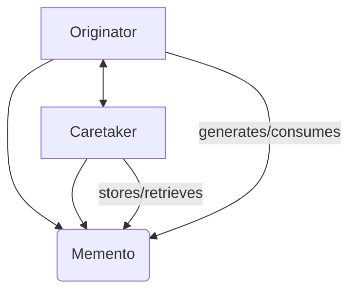

---
categories:
- Software Design
- Best Practices
comments: true
cover:
  image: https://images.pexels.com/photos/577585/pexels-photo-577585.jpeg?auto=compress&cs=tinysrgb&h=650&w=940
date: 2025-06-18 15:56:31.477000
description: Explore the Memento design pattern, a behavioral pattern used to save
  and restore an object's internal state without violating its encapsulation. Practical
  examples and a concise breakdown for developers.
math: true
tags:
- Design Patterns
- Architecture
- Software Design
- Behavioral Patterns
title: Memento Pattern
---


The Memento pattern is a powerful tool for managing object states. It's particularly useful when you need to provide features like "undo" or "rollback" capabilities in your applications.

## 1. Introduction

The Memento pattern is a **behavioral design pattern** that allows an object's internal state to be captured and externalized so that the object can be restored to this state later. Crucially, it achieves this without violating encapsulation.

**Where it is used:**
*   **Undo/Redo Mechanisms:** Common in text editors, graphic design tools, or any application requiring multi-level undo functionality.
*   **Saving Game States:** Allows players to save their progress and return to a specific point in a game.
*   **Database Transaction Rollbacks:** Although more complex, the principle of saving a state to revert to it is similar.
*   **System Checkpoints:** Capturing system states to recover from failures.

## 2. Implementation

The Memento pattern involves three key participants:

1.  **Originator:** The object whose state needs to be saved and restored. It creates a Memento containing a snapshot of its current internal state and uses a Memento to restore its state.
2.  **Memento:** An object that stores a snapshot of the Originator's internal state. It's opaque to any other object than the Originator itself (meaning the Caretaker cannot directly access its contents).
3.  **Caretaker:** Responsible for keeping track of the Mementos. It requests Mementos from the Originator and passes them back when a restore operation is needed. The Caretaker never operates on or examines the contents of a Memento.

Here's a concise Python example demonstrating a simple text editor with undo functionality:

```python
# Memento: Stores the state of the Originator
class EditorMemento:
    def __init__(self, content: str):
        self._content = content

    def get_content(self) -> str:
        """
        Only the Originator (TextEditor) should access this directly.
        For simplicity, it's public here.
        """
        return self._content

# Originator: The object whose state is being saved
class TextEditor:
    def __init__(self):
        self._content = ""

    def type(self, text: str):
        """Modifies the editor's content."""
        self._content += text
        print(f"Current editor content: '{self._content}'")

    def save(self) -> EditorMemento:
        """Saves the current state into a Memento."""
        print("Saving editor state...")
        return EditorMemento(self._content)

    def restore(self, memento: EditorMemento):
        """Restores the editor's state from a Memento."""
        self._content = memento.get_content()
        print(f"Restored editor content: '{self._content}'")

# Caretaker: Manages and stores Mementos
class History:
    def __init__(self):
        self._mementos = []

    def add_memento(self, memento: EditorMemento):
        """Adds a Memento to the history."""
        self._mementos.append(memento)

    def get_memento(self, index: int) -> EditorMemento:
        """Retrieves a Memento from the history."""
        if 0 <= index < len(self._mementos):
            return self._mementos[index]
        raise IndexError("Memento index out of bounds.")

# --- Usage Example ---
if __name__ == "__main__":
    editor = TextEditor()
    history = History()

    editor.type("Hello, ")
    history.add_memento(editor.save()) # Save 1

    editor.type("world!")
    history.add_memento(editor.save()) # Save 2

    editor.type(" How are you?")
    print(f"\nFinal content before restore: '{editor._content}'")

    # Restore to the "Hello, " state (first save)
    print("\nAttempting to restore to first state...")
    editor.restore(history.get_memento(0))

    # Restore to the "Hello, world!" state (second save)
    print("\nAttempting to restore to second state...")
    editor.restore(history.get_memento(1))
```

## 3. Mermaid Diagram



*   **Originator:** The `TextEditor` that generates and consumes `EditorMemento` objects.
*   **Memento:** The `EditorMemento` object, which holds the snapshot of the Originator's state.
*   **Caretaker:** The `History` object, which stores and retrieves `EditorMemento` objects without knowing their internal structure.

## 4. Pros & Cons

### Advantages:

*   **Encapsulation Preservation:** The Memento pattern allows the internal state of an object to be saved externally without exposing its internal structure, maintaining strong encapsulation.
*   **Simplified Originator:** The Originator does not need to manage the history of its states; this responsibility is delegated to the Caretaker.
*   **Easy Rollback:** Facilitates straightforward implementation of undo/redo operations or transactional rollbacks.
*   **Decoupling:** The Caretaker and Originator are loosely coupled. The Caretaker only interacts with the Memento's narrow interface.

### Disadvantages:

*   **Memory Overhead:** Storing a large number of Mementos, especially if the state is complex or large, can consume significant memory.
*   **Performance Impact:** Creating Mementos (especially deep copies of complex objects) can be computationally expensive.
*   **Complexity:** Can introduce additional classes (Memento, Caretaker) and increase the overall complexity of the system for simple state-saving needs.
*   **Serialization Challenges:** If Mementos need to be externalized (e.g., saved to disk), dealing with object graphs and serialization can be tricky.

## 5. References

*   **Gamma, E., Helm, R., Johnson, R., & Vlissides, J. (1994).** *Design Patterns: Elements of Reusable Object-Oriented Software*. Addison-Wesley. (The original "Gang of Four" book, which introduced the pattern).
*   **Wikipedia.** [Memento pattern](https://en.wikipedia.org/wiki/Memento_pattern). Accessed October 27, 2023.