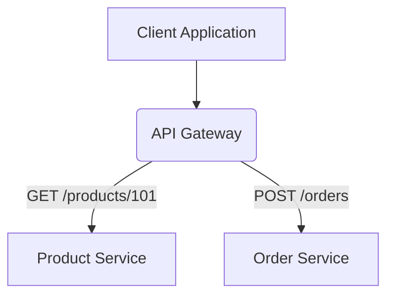

---
categories:
- Software Design
- Architecture Patterns
comments: true
cover:
  image: https://images.pexels.com/photos/32557725/pexels-photo-32557725.jpeg?auto=compress&cs=tinysrgb&h=650&w=940
date: 2025-06-18 15:56:31.477000
description: An academic and practical guide to Microservices Architecture, defining
  its principles, implementation concepts, benefits, and drawbacks for modern software
  development.
math: true
tags:
- Microservices
- Architecture
- Distributed Systems
title: Microservices Architecture
---


## Introduction

Microservices Architecture is a software development approach that structures an application as a collection of small, independent, and loosely coupled services. Each service is typically self-contained, owning its data and operating independently. This architectural style contrasts with monolithic applications, where all components are tightly integrated into a single deployable unit.

It is predominantly used in complex, large-scale applications that require high degrees of agility, scalability, and resilience. Common applications include large e-commerce platforms, streaming services, and cloud-native applications where rapid development, continuous deployment, and technological diversity are crucial.

## Implementation

Implementing microservices involves breaking down business capabilities into discrete services, each responsible for a specific function. These services communicate with each other, typically via lightweight mechanisms like HTTP/REST APIs or asynchronous message queues.

Below is a simplified example of a standalone "Product Service" written in Node.js using Express. This service manages product-related data and can be deployed and scaled independently of other services (e.g., an "Order Service" or "User Service").

```javascript
// products-service/app.js
const express = require('express');
const app = express();
const port = 3001; // Unique port for this service

// Middleware to parse JSON bodies
app.use(express.json());

// Example endpoint to get a product by ID
app.get('/products/:id', (req, res) => {
  const productId = req.params.id;
  // In a real application, this would query a database
  const products = {
    '101': { id: '101', name: 'Wireless Headphones', price: 99.99, stock: 50 },
    '102': { id: '102', name: 'Mechanical Keyboard', price: 129.99, stock: 30 }
  };

  const product = products[productId];
  if (product) {
    res.json(product);
  } else {
    res.status(404).send('Product not found');
  }
});

// Example endpoint to add a new product
app.post('/products', (req, res) => {
  const newProduct = req.body;
  // In a real application, this would save to a database
  console.log('Adding new product:', newProduct);
  res.status(201).json({ message: 'Product added successfully', product: newProduct });
});

app.listen(port, () => {
  console.log(`Product Service running on http://localhost:${port}`);
});

/*
To run this:
1. Save as products-service/app.js
2. In products-service directory, run: npm init -y && npm install express
3. Run: node app.js

You can then access it via:
- GET http://localhost:3001/products/101
- POST http://localhost:3001/products with body: {"id": "103", "name": "USB-C Hub", "price": 49.99, "stock": 100}
*/
```

## Architectural Overview

A typical interaction in a microservices architecture involves a client interacting with an API Gateway, which then routes the request to the appropriate backend service.



## Pros & Cons

Microservices offer significant advantages but also introduce new challenges.

### Advantages:

*   **Independent Deployment:** Services can be deployed independently, enabling faster release cycles and reducing risks associated with large-scale deployments.
*   **Scalability:** Individual services can be scaled based on demand, optimizing resource utilization. For instance, a "Product Service" can scale independently of a less-demanding "User Profile Service."
*   **Technology Diversity:** Teams can choose the best technology stack (language, framework, database) for each service, leveraging specific strengths.
*   **Resilience:** The failure of one service does not necessarily bring down the entire application, as other services can continue to operate.
*   **Team Autonomy:** Small, cross-functional teams can own and develop specific services end-to-end, fostering agility and accountability.

### Disadvantages:

*   **Complexity:** Managing a distributed system is inherently more complex than a monolith, requiring robust tools for service discovery, load balancing, and monitoring.
*   **Operational Overhead:** Deploying, monitoring, and debugging numerous independent services increases operational burden.
*   **Data Consistency:** Maintaining data consistency across multiple, independent service databases can be challenging and often requires complex distributed transaction patterns.
*   **Inter-Service Communication:** Network latency and communication failures between services can impact performance and reliability.
*   **Testing Complexity:** End-to-end testing across multiple interacting services can be more intricate than testing a single monolithic application.

## References

*   Fowler, M. (2014, March 25). *Microservices*. MartinFowler.com. [https://martinfowler.com/articles/microservices.html](https://martinfowler.com/articles/microservices.html)
*   Newman, S. (2015). *Building Microservices: Designing Fine-Grained Systems*. O'Reilly Media. (A foundational text on the topic).
*   Lewis, J., & Fowler, M. (2014). *Microservices: a definition of this new architectural term*. Retrieved from [https://martinfowler.com/articles/microservices.html](https://martinfowler.com/articles/microservices.html) (This is the original article often cited)