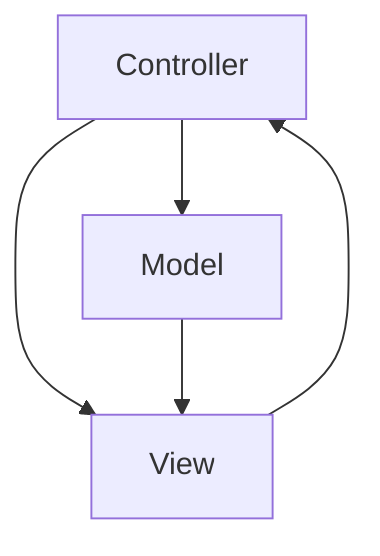

---
categories:
- Software Design
- Best Practices
comments: true
cover:
  image: https://images.pexels.com/photos/1188751/pexels-photo-1188751.jpeg?auto=compress&cs=tinysrgb&h=650&w=940
date: 2025-06-18 15:56:31.477000
description: An academic and practical overview of the Model-View-Controller (MVC)
  architectural pattern, explaining its components, implementation, benefits, and
  drawbacks for software development.
math: true
tags:
- Design Patterns
- Architecture
- MVC
- Software Design
- Best Practices
title: Model-View-Controller (MVC)
---


The Model-View-Controller (MVC) is an architectural pattern that separates an application into three main logical components: Model, View, and Controller. It is widely used for developing user interfaces that are decoupled from the underlying data and business logic. This separation aims to enhance modularity, organization, and maintainability in software projects.

### 1. Introduction

MVC was originally introduced by Trygve Reenskaug in 1979 for Smalltalk-79, designed to manage complex user interfaces. Its core principle is the separation of concerns, providing distinct responsibilities for each component:

*   **Model:** Manages the application's data, business rules, logic, and state. It is independent of the user interface and notifies the View when its data changes.
*   **View:** Displays a representation of the Model's data to the user. It presents information and sends user interactions (e.g., clicks, text input) to the Controller. The View typically observes the Model to update itself automatically.
*   **Controller:** Acts as an intermediary between the Model and the View. It receives user input from the View, translates it into actions for the Model (e.g., update data), and then updates the View to reflect any changes.

MVC is predominantly used in web application frameworks (e.g., Ruby on Rails, Django, ASP.NET MVC, Spring MVC) and desktop GUI frameworks.

### 2. Implementation

A conceptual Python-like pseudocode example illustrates the roles of Model, View, and Controller and their basic interaction.

```python
# Simplified Conceptual MVC Components

# 1. Model: Manages application data and business logic.
#    It knows nothing about the View or Controller.
class Model:
    def __init__(self, initial_data):
        self._data = initial_data

    def get_data(self):
        return self._data

    def update_data(self, new_value):
        # In a real app, this might involve database operations,
        # validation, and then notifying observers (Views).
        print(f"Model: Data updated from '{self._data}' to '{new_value}'")
        self._data = new_value

# 2. View: Renders the Model's data and captures user input.
#    It knows about the Model (to display data) and notifies the Controller
#    of user actions.
class View:
    def display_data(self, data):
        print(f"View: Displaying '{data}' to the user.")

    def get_user_input(self):
        # Simulates getting input, which would then be passed to Controller
        print("View: User performed an action (e.g., clicked a button).")
        return "update_action"

# 3. Controller: Handles user input, interacts with the Model,
#    and orchestrates View updates.
class Controller:
    def __init__(self, model, view):
        self._model = model
        self._view = view

    def handle_user_event(self, event):
        # 1. Controller receives user event from the View.
        if event == "update_action":
            new_val = "New Value from User" # Simulate user input
            # 2. Controller instructs Model to update its state.
            self._model.update_data(new_val)
            # 3. Controller then instructs View to display the updated state.
            #    (Alternatively, Model might notify View directly if Observer pattern is used).
            self._view.display_data(self._model.get_data())

# Conceptual Application Flow:
# 1. Instantiate components
# my_model = Model("Initial Value")
# my_view = View()
# my_controller = Controller(my_model, my_view)

# 2. Initial display (Controller orchestrates View displaying Model data)
# my_controller._view.display_data(my_controller._model.get_data())

# 3. Simulate user interaction triggering the Controller
# user_event_simulated = my_view.get_user_input()
# my_controller.handle_user_event(user_event_simulated)
```

### 3. Mermaid Diagram

The following diagram illustrates the typical interactions between the Model, View, and Controller components:



*   **Controller -> Model:** Controller updates the Model based on user input.
*   **Controller -> View:** Controller instructs the View to update its display.
*   **Model -> View:** Model notifies the View of data changes (often via Observer pattern), allowing the View to update itself.
*   **View -> Controller:** View sends user interactions/events to the Controller.

### 4. Pros & Cons

**Advantages:**

*   **Separation of Concerns:** Clearly separates data, logic, and presentation, making the codebase easier to understand, manage, and extend.
*   **Improved Testability:** Each component can be tested independently, simplifying unit and integration testing.
*   **Parallel Development:** Different teams can work concurrently on the Model, View, and Controller without significant conflicts.
*   **Modularity and Reusability:** Models and Controllers can often be reused with different Views, and vice-versa, promoting code reusability.
*   **Maintainability:** Changes in one component have minimal impact on others, reducing the risk of introducing bugs.

**Disadvantages:**

*   **Increased Complexity:** Can be overkill for small, simple applications, introducing unnecessary layers and boilerplate code.
*   **Learning Curve:** Requires developers to understand the pattern's principles and component interactions.
*   **Potential for Tight Coupling:** Without careful design, the View and Controller can become tightly coupled, especially if the Controller directly manipulates View elements.
*   **Navigation Complexity:** In large applications, managing the flow between multiple Models, Views, and Controllers can become complex.

### 5. References

*   Reenskaug, Trygve. (1979). "MVC (Model-View-Controller)". Xerox Palo Alto Research Center (PARC). While a specific original publication is elusive due to its internal development nature, its concept was documented in various internal memos and presentations.
*   Wikipedia. (n.d.). *Model–View–Controller*. Retrieved from [https://en.wikipedia.org/wiki/Model%E2%80%93View%E2%80%93Controller](https://en.wikipedia.org/wiki/Model%E2%80%93View%E2%80%93Controller)
*   Fowler, Martin. (2006). *GUI Architectures*. Martin Fowler's personal website. Retrieved from [https://martinfowler.com/eaaDev/uiArchs.html](https://martinfowler.com/eaaDev/uiArchs.html) (Briefly discusses MVC as a foundational GUI pattern)