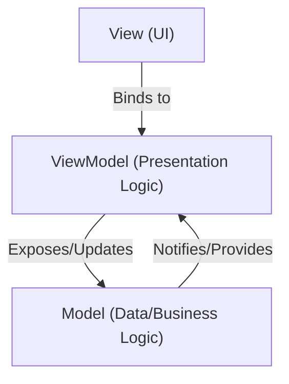

---
categories:
- Software Design
- Best Practices
- Front-End
comments: true
cover:
  image: https://images.pexels.com/photos/221185/pexels-photo-221185.jpeg?auto=compress&cs=tinysrgb&h=650&w=940
date: 2025-06-18 15:56:31.477000
description: An academic and practical guide to the Model-View-ViewModel (MVVM) design
  pattern, explaining its components, implementation, benefits, and drawbacks for
  modern UI development.
math: true
tags:
- Design Patterns
- Architecture
- MVVM
- UI Development
- Software Engineering
title: Model-View-ViewModel (MVVM)
---


## Introduction

The Model-View-ViewModel (MVVM) is an architectural design pattern primarily used for developing user interfaces (UIs). It facilitates a clear separation of concerns, enhancing the maintainability, testability, and extensibility of applications. Originating from Microsoft for Windows Presentation Foundation (WPF) and Silverlight, MVVM is now widely adopted in various UI frameworks, including Universal Windows Platform (UWP), Xamarin.Forms, and increasingly in web frameworks through similar conceptual patterns.

The core objective of MVVM is to abstract the "view" (UI) by separating its behavior and state from the "model" (data) and "view logic" (ViewModel).

## Implementation

MVVM comprises three core components:

1.  **Model:** Represents the data and business logic of the application. It is independent of the UI and typically consists of data structures, domain objects, and data access layers.
2.  **View:** The actual user interface, responsible for displaying data and handling user interactions. It observes the ViewModel for changes and relays user input back to the ViewModel, often through data binding.
3.  **ViewModel:** Acts as an intermediary between the Model and the View. It exposes data from the Model in a way that is easily consumable by the View and contains the presentation logic for the View. The ViewModel does not have direct knowledge of the View.

Here is a simplified C# example illustrating a basic MVVM structure for a text display:

```csharp
// 1. Model: Represents the data
public class TextData
{
    public string Content { get; set; }

    public TextData(string content)
    {
        Content = content;
    }
}

// 2. ViewModel: Exposes data and commands to the View
//    Requires System.ComponentModel for INotifyPropertyChanged
//    Requires System.Windows.Input for ICommand (or a custom RelayCommand)

using System.ComponentModel;
using System.Windows.Input;

public class TextDisplayViewModel : INotifyPropertyChanged
{
    private TextData _textModel;
    private string _displayText;

    public event PropertyChangedEventHandler PropertyChanged;

    public TextDisplayViewModel()
    {
        _textModel = new TextData("Initial Text");
        DisplayText = _textModel.Content;
        UpdateCommand = new RelayCommand(UpdateText); // Simplified command implementation assumed
    }

    public string DisplayText
    {
        get => _displayText;
        set
        {
            if (_displayText != value)
            {
                _displayText = value;
                OnPropertyChanged(nameof(DisplayText));
            }
        }
    }

    public ICommand UpdateCommand { get; }

    private void UpdateText(object parameter)
    {
        // Example logic: Update model and then update display text
        _textModel.Content = "Updated Text!";
        DisplayText = _textModel.Content; // This will notify the View
    }

    protected void OnPropertyChanged(string propertyName)
    {
        PropertyChanged?.Invoke(this, new PropertyChangedEventArgs(propertyName));
    }
}

// Simplified RelayCommand (often used in MVVM for command binding)
// For actual use, a full implementation would be needed.
public class RelayCommand : ICommand
{
    private readonly Action<object> _execute;
    private readonly Func<object, bool> _canExecute;

    public event EventHandler CanExecuteChanged
    {
        add { CommandManager.RequerySuggested += value; }
        remove { CommandManager.RequerySuggested -= value; }
    }

    public RelayCommand(Action<object> execute, Func<object, bool> canExecute = null)
    {
        _execute = execute ?? throw new ArgumentNullException(nameof(execute));
        _canExecute = canExecute;
    }

    public bool CanExecute(object parameter) => _canExecute?.Invoke(parameter) ?? true;
    public void Execute(object parameter) => _execute(parameter);
}

// 3. View: (Example XAML for a WPF application)
/*
<Window x:Class="MvvmExample.MainWindow"
        xmlns="http://schemas.microsoft.com/winfx/2006/xaml/presentation"
        xmlns:x="http://schemas.microsoft.com/winfx/2006/xaml"
        Title="MVVM Example">
    <Window.DataContext>
        <local:TextDisplayViewModel /> <!-- Instantiate ViewModel -->
    </Window.DataContext>
    <StackPanel>
        <TextBlock Text="{Binding DisplayText}" Margin="10"/> <!-- Data binding to ViewModel property -->
        <Button Content="Update Text" Command="{Binding UpdateCommand}" Margin="10"/> <!-- Command binding -->
    </StackPanel>
</Window>
*/
```

## Mermaid Diagram

The relationship between the MVVM components can be visualized as follows:



## Pros & Cons

### Advantages

*   **Separation of Concerns:** Clearly delineates UI, UI logic, and business logic, leading to more organized and manageable codebases.
*   **Enhanced Testability:** ViewModels can be tested independently of the UI, simplifying unit testing of presentation logic and business rules.
*   **Improved Maintainability:** Changes in the UI often require minimal or no changes to the ViewModel, and vice-versa, reducing maintenance overhead.
*   **Better Collaboration:** UI designers can work on the View (e.g., XAML) while developers focus on the ViewModel and Model logic concurrently.
*   **Increased Reusability:** ViewModels can often be reused across different Views or even different platforms if the underlying Models are compatible.

### Disadvantages

*   **Increased Complexity:** For very simple UIs, the overhead of setting up MVVM (data binding, commands, `INotifyPropertyChanged`) can be disproportionate to the benefits.
*   **Learning Curve:** Developers new to MVVM may find the concepts of data binding, commands, and `INotifyPropertyChanged` challenging initially.
*   **Potential for "God ViewModels":** Without careful design, ViewModels can become excessively large and contain too much logic, negating the benefits of separation.
*   **Debugging Data Binding:** Issues related to data binding can sometimes be challenging to diagnose due to their declarative nature and the lack of traditional call stacks.

## References

*   Microsoft Docs. (n.d.). *WPF MVVM Pattern*. Retrieved from [https://learn.microsoft.com/en-us/archive/blogs/msdn/the-mvvm-pattern](https://learn.microsoft.com/en-us/archive/blogs/msdn/the-mvvm-pattern)
*   Wikipedia. (n.d.). *Model–view–viewmodel*. Retrieved from [https://en.wikipedia.org/wiki/Model%E2%80%93view%E2%80%93viewmodel](https://en.wikipedia.org/wiki/Model%E2%80%93view%E2%80%93viewmodel)
*   Fowler, M. (2006). *Presentation Model*. Martin Fowler's Bliki. Retrieved from [https://martinfowler.com/eaaDev/PresentationModel.html](https://martinfowler.com/eaaDev/PresentationModel.html)