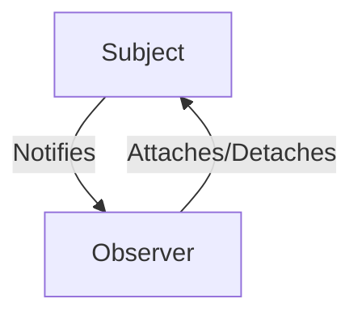

---
categories:
- Software Design
- Best Practices
comments: true
cover:
  image: https://images.pexels.com/photos/6214964/pexels-photo-6214964.jpeg?auto=compress&cs=tinysrgb&h=650&w=940
date: 2025-06-18 15:56:31.477000
description: Understand the Observer design pattern, a behavioral pattern for one-to-many
  dependencies, with practical code examples and a clear explanation of its pros and
  cons.
math: true
tags:
- Design Patterns
- Behavioral Patterns
- Software Architecture
- Event Handling
title: Observer Pattern - A Concise Guide
---


## Introduction

The Observer pattern is a **behavioral design pattern** that defines a one-to-many dependency between objects. When one object, known as the **Subject** (or Observable), changes its state, all its dependents, called **Observers**, are automatically notified and updated. This pattern is fundamental in scenarios requiring dynamic updates, such as:

*   **Event handling systems:** Notifying components about user actions (e.g., button clicks).
*   **Graphical User Interfaces (GUIs):** Updating UI elements based on model changes.
*   **Model-View-Controller (MVC) architecture:** The Model acts as the Subject, notifying Views and Controllers of data changes.

Its core principle is to promote loose coupling, allowing the Subject and Observer to interact without needing explicit knowledge of each other's concrete implementations.

## Implementation

The Observer pattern typically involves an abstract Subject interface with methods to attach, detach, and notify Observers, and an abstract Observer interface with an `update` method. Concrete Subjects and Observers implement these interfaces.

Here's a concise Python example:

```python
import abc

# Abstract Observer
class Observer(abc.ABC):
    @abc.abstractmethod
    def update(self, subject: 'Subject') -> None:
        """
        Receive update from subject.
        """
        pass

# Abstract Subject (Observable)
class Subject(abc.ABC):
    def __init__(self):
        self._observers: list[Observer] = []

    def attach(self, observer: Observer) -> None:
        """
        Attach an observer to the subject.
        """
        if observer not in self._observers:
            self._observers.append(observer)
            print(f"Subject: Attached {type(observer).__name__}")

    def detach(self, observer: Observer) -> None:
        """
        Detach an observer from the subject.
        """
        try:
            self._observers.remove(observer)
            print(f"Subject: Detached {type(observer).__name__}")
        except ValueError:
            pass # Observer not found

    def notify(self) -> None:
        """
        Notify all attached observers about a state change.
        """
        print("Subject: Notifying observers...")
        for observer in self._observers:
            observer.update(self)

# Concrete Subject
class ConcreteSubject(Subject):
    _state: int = 0

    @property
    def state(self) -> int:
        """
        For observers to retrieve subject's state.
        """
        return self._state

    @state.setter
    def state(self, value: int) -> None:
        """
        Sets state and notifies observers.
        """
        self._state = value
        print(f"\nSubject: State changed to {self._state}")
        self.notify()

# Concrete Observer A
class ConcreteObserverA(Observer):
    def update(self, subject: Subject) -> None:
        if isinstance(subject, ConcreteSubject) and subject.state < 3:
            print(f"ObserverA: Reacted to state change: {subject.state} (less than 3)")

# Concrete Observer B
class ConcreteObserverB(Observer):
    def update(self, subject: Subject) -> None:
        if isinstance(subject, ConcreteSubject) and subject.state >= 2:
            print(f"ObserverB: Reacted to state change: {subject.state} (greater or equal to 2)")

# Client Code
if __name__ == "__main__":
    subject = ConcreteSubject()

    observer_a = ConcreteObserverA()
    observer_b = ConcreteObserverB()

    subject.attach(observer_a)
    subject.attach(observer_b)

    print("\nClient: Changing subject state to 1.")
    subject.state = 1

    print("\nClient: Detaching ObserverA.")
    subject.detach(observer_a)

    print("\nClient: Changing subject state to 3.")
    subject.state = 3

    subject.detach(observer_b) # Clean up
```

## Mermaid Diagram



This diagram illustrates the core relationship: a `Subject` notifies its `Observer`s, and `Observer`s can register or unregister with the `Subject`.

## Pros & Cons

The Observer pattern offers distinct advantages and disadvantages:

### Advantages:

*   **Loose Coupling:** Subject and Observer objects can be reused independently. The Subject does not need to know the concrete classes of its Observers, only that they implement the Observer interface.
*   **Broadcast Communication:** A Subject can notify multiple Observers simultaneously, enabling efficient one-to-many communication.
*   **Scalability:** New Observers can be added without modifying the Subject code, promoting extensibility.
*   **Runtime Flexibility:** Observers can be attached or detached at any time during the application's lifecycle.

### Disadvantages:

*   **Unexpected Updates:** An Observer might not know *why* it's being updated if the Subject sends broad notifications, potentially leading to debugging challenges.
*   **Notification Order:** The order in which Observers are notified is generally not guaranteed, which can be problematic if dependencies exist between Observers.
*   **Memory Leaks:** If Observers are not properly detached from the Subject, they can prevent the Subject (or the Observers themselves) from being garbage collected, leading to memory leaks.
*   **Overhead:** For simple interactions, the overhead of implementing the Subject and Observer interfaces can be unnecessary.

## References

*   Gamma, E., Helm, R., Johnson, R., & Vlissides, J. (1994). *Design Patterns: Elements of Reusable Object-Oriented Software*. Addison-Wesley. (The original "Gang of Four" book)
*   Wikipedia. (n.d.). *Observer pattern*. Retrieved from [https://en.wikipedia.org/wiki/Observer_pattern](https://en.wikipedia.org/wiki/Observer_pattern)
*   Refactoring.Guru. (n.d.). *Observer*. Retrieved from [https://refactoring.guru/design-patterns/observer](https://refactoring.guru/design-patterns/observer)