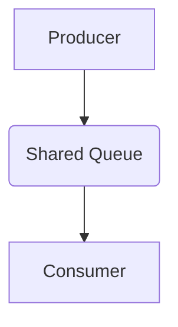

---
categories:
- Software Design
- Best Practices
comments: true
cover:
  image: https://images.pexels.com/photos/265087/pexels-photo-265087.jpeg?auto=compress&cs=tinysrgb&h=650&w=940
date: 2025-06-18 15:56:31.477000
description: An academic and practical guide to the Producer-Consumer design pattern,
  explaining its use in concurrent systems for efficient task management.
math: true
tags:
- Design Patterns
- Concurrency
- Multithreading
- Architecture
title: Producer-Consumer Pattern
---


The Producer-Consumer pattern is a widely used concurrency design pattern that addresses scenarios involving discrete units of work being generated by one entity (the Producer) and processed by another (the Consumer). This pattern facilitates efficient communication and load balancing between tasks operating at potentially different speeds, promoting system stability and responsiveness.

## 1. Introduction

The **Producer-Consumer Pattern** is a foundational design pattern in concurrent programming. It describes two types of entities:

*   **Producers**: Create data, tasks, or messages and add them to a shared buffer or queue.
*   **Consumers**: Retrieve data, tasks, or messages from the shared buffer and process them.

The core objective is to decouple the production of items from their consumption. This decoupling allows producers and consumers to operate independently and asynchronously, without needing direct knowledge of each other. A shared, synchronized buffer (often a queue) acts as the intermediary, preventing producers from overwhelming consumers (by blocking producers when the buffer is full) and preventing consumers from attempting to process non-existent items (by blocking consumers when the buffer is empty).

**Where it is used:**
*   **Task Queues:** Distributing work to multiple worker threads or processes.
*   **Message Brokers:** Systems like Kafka or RabbitMQ fundamentally operate on this pattern.
*   **Data Pipelines:** Processing streams of data, where one stage produces input for the next.
*   **Buffering I/O Operations:** Managing asynchronous reads/writes to disk or network.

## 2. Implementation Example

This Python example demonstrates a basic Producer-Consumer setup using a `queue.Queue` for the shared buffer and `threading` for concurrency.

```python
import threading
import queue
import time
import random

# Shared Queue
shared_queue = queue.Queue(maxsize=10)

class Producer(threading.Thread):
    def __init__(self, name, queue_ref):
        super().__init__()
        self.name = name
        self.queue = queue_ref

    def run(self):
        for i in range(5):
            item = f"Data-{i} from {self.name}"
            print(f"[{self.name}] Producing: {item}")
            self.queue.put(item)  # Blocks if queue is full
            time.sleep(random.uniform(0.1, 0.5)) # Simulate work
        print(f"[{self.name}] Finished producing.")

class Consumer(threading.Thread):
    def __init__(self, name, queue_ref):
        super().__init__()
        self.name = name
        self.queue = queue_ref

    def run(self):
        while True:
            try:
                item = self.queue.get(timeout=2) # Blocks if queue is empty, with timeout
                print(f"[{self.name}] Consuming: {item}")
                self.queue.task_done() # Indicate task is complete
                time.sleep(random.uniform(0.5, 1.0)) # Simulate work
            except queue.Empty:
                print(f"[{self.name}] Queue empty, exiting.")
                break

if __name__ == "__main__":
    print("Starting Producer-Consumer Example...\n")

    producer1 = Producer("Producer-A", shared_queue)
    consumer1 = Consumer("Consumer-X", shared_queue)
    consumer2 = Consumer("Consumer-Y", shared_queue)

    producer1.start()
    consumer1.start()
    consumer2.start()

    # Wait for the producer to finish putting items
    producer1.join()

    # Wait for all items in the queue to be processed
    # This is important for clean shutdown when consumers might still be running
    shared_queue.join()

    # Signal consumers to stop (a common pattern is to put a 'None' or sentinel value)
    # For this example, consumers have a timeout, so they'll eventually exit.
    # More robust shutdown would involve explicit signals or sentinel values.

    consumer1.join()
    consumer2.join()

    print("\nProducer-Consumer Example Finished.")
```

## 3. Mermaid Diagram


*The diagram illustrates the unidirectional flow: Producers add items to the Shared Queue, and Consumers retrieve items from it.*

## 4. Pros & Cons

### Advantages:

*   **Decoupling:** Producers and Consumers operate independently, reducing direct dependencies and allowing for easier maintenance and evolution of each component.
*   **Concurrency:** Enables parallel processing, as producers can generate items while consumers process previously generated ones, improving overall throughput.
*   **Load Balancing:** A single producer can feed multiple consumers, distributing the workload and scaling processing capacity. Conversely, multiple producers can feed one or more consumers.
*   **Responsiveness:** The system remains responsive, as tasks are buffered, preventing blocking operations from impacting the entire application.
*   **Flow Control:** The shared queue (especially if bounded) inherently handles back pressure, preventing producers from overwhelming consumers or exhausting system resources.

### Disadvantages:

*   **Increased Complexity:** Introducing a shared queue and managing concurrency adds overhead in terms of design, implementation, and debugging compared to a sequential approach.
*   **Overhead:** Synchronization mechanisms (locks, semaphores) used to protect the shared queue introduce performance overhead.
*   **Potential for Deadlock/Starvation:** Improper synchronization or poor design choices can lead to situations where producers or consumers block indefinitely, or where some threads never get a chance to execute.
*   **Debugging Challenges:** Debugging concurrent systems, especially those involving race conditions or deadlocks, can be significantly more difficult.
*   **Resource Management:** Careful consideration is required for the size of the shared buffer to avoid excessive memory consumption or unnecessary blocking.

## 5. References

*   Gamma, E., Helm, R., Johnson, R., & Vlissides, J. (1994). *Design Patterns: Elements of Reusable Object-Oriented Software*. Addison-Wesley. (The "GoF" book, although not explicitly detailing Producer-Consumer, it lays the groundwork for concurrent patterns).
*   Lea, D. (1999). *Concurrent Programming in Java: Design Principles and Patterns* (2nd ed.). Addison-Wesley. (Provides extensive coverage of concurrent patterns, including Producer-Consumer).
*   Wikipedia. (n.d.). *Producer-consumer problem*. Retrieved from [https://en.wikipedia.org/wiki/Producer%E2%80%93consumer_problem](https://en.wikipedia.org/wiki/Producer%E2%80%93consumer_problem)