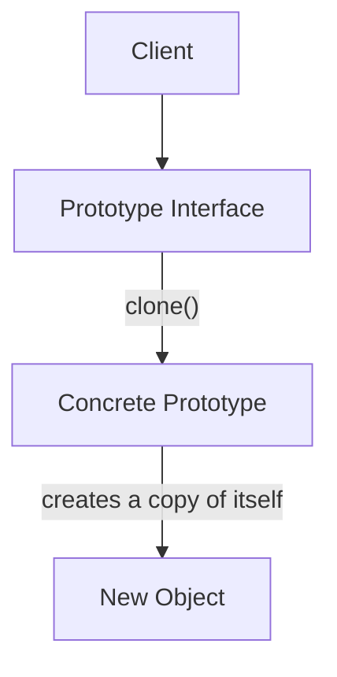

---
categories:
- Software Design
- Best Practices
comments: true
cover:
  image: https://images.pexels.com/photos/8869235/pexels-photo-8869235.jpeg?auto=compress&cs=tinysrgb&h=650&w=940
date: 2025-06-18 15:56:31.477000
description: A concise and practical guide to the Prototype design pattern, explaining
  its purpose, implementation, and trade-offs for efficient object creation.
math: true
tags:
- Design Patterns
- Creational Patterns
- Software Architecture
- Object-Oriented Programming
title: Understanding the Prototype Pattern
---


The Prototype pattern is a foundational creational design pattern. It offers an efficient mechanism for creating new objects by cloning existing ones, rather than instantiating them from scratch.

## 1. Introduction

The **Prototype pattern** enables the creation of new objects by copying an existing object, known as the *prototype*. This pattern is particularly useful when:

*   Object creation is computationally expensive or involves complex setup (e.g., reading from a database, performing heavy calculations).
*   The system needs to create a large number of similar objects, and creating them via a constructor is inefficient.
*   The client code needs to create objects without being coupled to their concrete classes, promoting polymorphism.
*   The objects required are determined at runtime.

Essentially, it delegates the cloning responsibility to the objects themselves.

## 2. Implementation

The core idea involves defining an interface or an abstract class with a `clone()` method. Concrete prototype classes then implement this method, returning a copy of themselves.

Here's a Python example demonstrating how to implement the Prototype pattern using different shapes:

```python
import copy

# 1. Prototype Interface/Base Class
class Prototype:
    """
    Abstract base class for all prototypes, declaring the clone method.
    """
    def clone(self):
        raise NotImplementedError("Subclasses must implement clone() method.")

# 2. Concrete Prototypes
class Circle(Prototype):
    """
    A concrete prototype representing a Circle.
    """
    def __init__(self, radius: float, x: float = 0.0, y: float = 0.0):
        self.radius = radius
        self.x = x
        self.y = y

    def clone(self):
        """
        Returns a deep copy of the Circle object.
        """
        # Using copy.deepcopy for proper isolation of mutable attributes
        return copy.deepcopy(self)

    def __str__(self):
        return f"Circle(radius={self.radius}, center=({self.x}, {self.y}))"

class Rectangle(Prototype):
    """
    A concrete prototype representing a Rectangle.
    """
    def __init__(self, width: float, height: float):
        self.width = width
        self.height = height

    def clone(self):
        """
        Returns a deep copy of the Rectangle object.
        """
        return copy.deepcopy(self)

    def __str__(self):
        return f"Rectangle(width={self.width}, height={self.height})"

# 3. Client Code
if __name__ == "__main__":
    # Create original prototypes
    original_circle = Circle(10.0, 5.0, 5.0)
    original_rectangle = Rectangle(20.0, 15.0)

    print(f"Original Circle: {original_circle}")
    print(f"Original Rectangle: {original_rectangle}\n")

    # Clone objects
    cloned_circle = original_circle.clone()
    cloned_rectangle = original_rectangle.clone()

    # Modify the cloned objects
    cloned_circle.radius = 12.0
    cloned_circle.x = 7.0
    cloned_rectangle.width = 25.0

    print(f"Cloned Circle (modified): {cloned_circle}")
    print(f"Cloned Rectangle (modified): {cloned_rectangle}\n")

    # Verify original objects remain unchanged
    print(f"Original Circle (after cloning and modification): {original_circle}")
    print(f"Original Rectangle (after cloning and modification): {original_rectangle}\n")

    # Verify they are separate instances in memory
    print(f"Are original_circle and cloned_circle the same object? {original_circle is cloned_circle}")
    print(f"Are original_rectangle and cloned_rectangle the same object? {original_rectangle is cloned_rectangle}")
```

In this example, the `clone()` method for `Circle` and `Rectangle` creates a new instance by deeply copying all attributes, ensuring that modifications to the cloned object do not affect the original.

## 3. Mermaid Diagram


This diagram illustrates that the Client interacts with the `Prototype` interface to request a clone. The `ConcretePrototype` then performs the actual cloning operation, yielding a new object.

## 4. Pros & Cons

### Advantages:
*   **Decoupling:** Reduces coupling between the client and concrete classes. The client does not need to know the specific type of object being created, only that it can be cloned.
*   **Efficiency:** Can be more efficient than creating objects from scratch, especially when object initialization is complex or resource-intensive.
*   **Flexibility:** Allows for dynamic object creation at runtime by registering and cloning different prototypes based on configuration.
*   **Simplified Client Code:** The client code is simpler, as it only needs to call a `clone()` method rather than invoking specific constructors with various parameters.

### Disadvantages:
*   **Complex Cloning:** Implementing `clone()` can be challenging for objects with complex internal structures, circular references, or when deep vs. shallow copying semantics are crucial.
*   **Inheritance Hierarchy:** Requires that all classes in an inheritance hierarchy implement the `clone()` method, which can be cumbersome and lead to code duplication if not managed carefully.
*   **Attribute Management:** Managing unique attributes (like IDs) for cloned objects may require additional logic beyond simple copying.

## 5. References

*   Gamma, E., Helm, R., Johnson, R., & Vlissides, J. (1994). *Design Patterns: Elements of Reusable Object-Oriented Software*. Addison-Wesley.
*   Refactoring.Guru. (n.d.). *Prototype Design Pattern*. Retrieved from [https://refactoring.guru/design-patterns/prototype](https://refactoring.guru/design-patterns/prototype)
*   Wikipedia. (n.d.). *Prototype pattern*. Retrieved from [https://en.wikipedia.org/wiki/Prototype_pattern](https://en.wikipedia.org/wiki/Prototype_pattern)