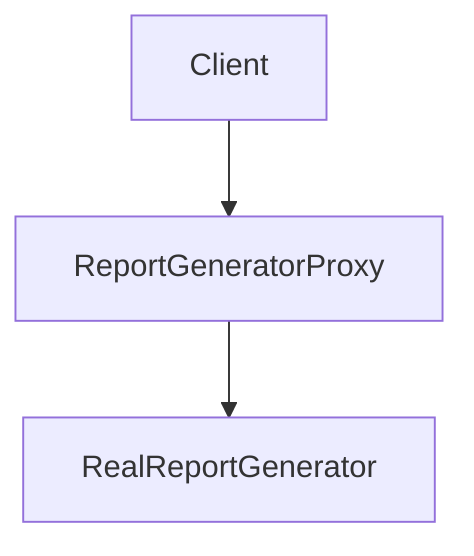

---
categories:
- Software Design
- Best Practices
comments: true
cover:
  image: https://images.pexels.com/photos/8534247/pexels-photo-8534247.jpeg?auto=compress&cs=tinysrgb&h=650&w=940
date: 2025-06-18 15:56:31.477000
description: Explore the Proxy Pattern, a structural design pattern that provides
  a surrogate or placeholder for another object to control access to it.
math: true
tags:
- Design Patterns
- Software Architecture
title: Proxy Pattern
---


The Proxy Pattern is a structural design pattern that allows you to provide a substitute or placeholder for another object. A proxy controls access to the original object, allowing you to perform something either before or after the request gets to the original object.

### 1. Introduction

The Proxy Pattern introduces an intermediary object, the "proxy," that acts as an interface to another object, known as the "real subject." This intermediary can add various functionalities, such as access control, caching, lazy initialization, or logging, without modifying the real subject's core logic.

**Common use cases include:**

*   **Protection Proxy:** Controls access to the real subject based on permissions.
*   **Virtual Proxy:** Creates expensive objects on demand (lazy loading).
*   **Remote Proxy:** Provides a local representation of an object that is in a different address space (e.g., in a remote server).
*   **Logging Proxy:** Logs requests to the real subject.
*   **Caching Proxy:** Caches results from the real subject to improve performance.

### 2. Implementation

Consider a scenario where you want to log access to a sensitive report.

```python
# 1. Subject Interface
class IReportGenerator:
    def generate_report(self):
        raise NotImplementedError

# 2. Real Subject
class RealReportGenerator(IReportGenerator):
    def generate_report(self):
        return "Sensitive financial report data."

# 3. Proxy
class ReportGeneratorProxy(IReportGenerator):
    def __init__(self, real_report_generator: RealReportGenerator, user_role: str):
        self._real_report_generator = real_report_generator
        self._user_role = user_role

    def generate_report(self):
        # Access control / Protection Proxy
        if self._user_role == "Admin" or self._user_role == "Auditor":
            print(f"Log: User with role '{self._user_role}' accessing report.")
            return self._real_report_generator.generate_report()
        else:
            print(f"Log: User with role '{self._user_role}' denied access to report.")
            return "Access Denied: You do not have permission to view this report."

# Client Code
if __name__ == "__main__":
    real_report = RealReportGenerator()

    # User with Admin role
    admin_proxy = ReportGeneratorProxy(real_report, "Admin")
    print(admin_proxy.generate_report())
    print("-" * 30)

    # User with Viewer role
    viewer_proxy = ReportGeneratorProxy(real_report, "Viewer")
    print(viewer_proxy.generate_report())
    print("-" * 30)

    # User with Auditor role
    auditor_proxy = ReportGeneratorProxy(real_report, "Auditor")
    print(auditor_proxy.generate_report())
```

**Explanation:**
-   `IReportGenerator` defines the common interface for both the real subject and the proxy.
-   `RealReportGenerator` is the actual object containing the sensitive report generation logic.
-   `ReportGeneratorProxy` acts as a proxy, intercepting the `generate_report` call. It adds logic to check the `user_role` before delegating the call to the `RealReportGenerator`, effectively implementing a protection proxy.

### 3. Mermaid Diagram



The client interacts with the `ReportGeneratorProxy`, which then conditionally forwards requests to the `RealReportGenerator`.

### 4. Pros & Cons

**Advantages:**

*   **Access Control:** Can restrict or grant access to the real subject based on certain criteria.
*   **Lazy Loading:** Delays the creation and initialization of an expensive object until it's actually needed, saving resources.
*   **Logging/Auditing:** Can easily intercept method calls to add logging, auditing, or monitoring capabilities.
*   **Caching:** Can store results of operations from the real subject to improve performance for subsequent requests.
*   **Remote Communication:** Facilitates interaction with objects located in different address spaces.
*   **Separation of Concerns:** Helps separate cross-cutting concerns (e.g., security, logging) from the core business logic of the real subject.

**Disadvantages:**

*   **Increased Complexity:** Introduces an additional layer of abstraction, which can make the code more complex and harder to understand.
*   **Potential Performance Overhead:** Each operation through the proxy incurs additional processing due to the proxy's logic, which might be negligible but can add up.
*   **Delayed Initialization Issues:** For virtual proxies, if the real object's creation fails, the error might occur later than expected, making debugging harder.

### 5. References

*   Gamma, E., Helm, R., Johnson, R., & Vlissides, J. (1994). *Design Patterns: Elements of Reusable Object-Oriented Software*. Addison-Wesley.
*   Refactoring.Guru. (n.d.). *Proxy Design Pattern*. Retrieved from [https://refactoring.guru/design-patterns/proxy](https://refactoring.guru/design-patterns/proxy)