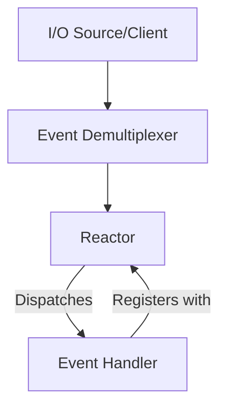

---
categories:
- Software Design
- Best Practices
- Concurrency Models
comments: true
cover:
  image: https://images.pexels.com/photos/225769/pexels-photo-225769.jpeg?auto=compress&cs=tinysrgb&h=650&w=940
date: 2025-06-18 15:56:31.477000
description: A concise and academic explanation of the Reactor design pattern, its
  implementation, benefits, drawbacks, and real-world applications for asynchronous
  event processing.
math: true
tags:
- Design Patterns
- Architecture
- Concurrency
- Asynchronous Programming
- Event-Driven
title: Understanding the Reactor Pattern
---


The Reactor pattern is a fundamental design pattern for handling concurrent service requests that arrive at a single application thread. It is particularly prevalent in event-driven systems and network programming where a server needs to process multiple I/O operations without using a dedicated thread per connection.

## 1. Introduction

The Reactor pattern addresses the challenge of managing multiple I/O streams or event sources efficiently within a single thread. It decouples the event demultiplexing (detecting when an event is ready) from the event handling (processing the event).

Its core principle involves an "Event Demultiplexer" that monitors multiple event sources (e.g., sockets, file descriptors) for readiness. When an event is ready, the Demultiplexer notifies a "Reactor," which then dispatches the event to the appropriate "Event Handler." This allows a single-threaded process to manage numerous concurrent operations, significantly reducing overhead compared to thread-per-connection models.

**Where it is used:**
*   **Network Servers:** Web servers, proxy servers, and chat applications (e.g., Node.js event loop, Netty, Nginx).
*   **GUI Frameworks:** Handling user input events (clicks, key presses) without blocking the UI.
*   **Reactive Programming Libraries:** Underlying mechanisms for processing streams of events.

## 2. Implementation

The Reactor pattern typically involves three main components:

1.  **Reactor:** The central component that runs the event loop. It registers, deregisters, and dispatches event handlers.
2.  **Event Demultiplexer:** An OS-level mechanism (e.g., `select()`, `poll()`, `epoll()`, `kqueue()`) that blocks until one or more registered I/O handles are ready for an operation (read, write, error).
3.  **Event Handler:** An interface or abstract class defining methods for handling specific types of events. Concrete handlers implement these methods to perform application-specific logic.

Here's a conceptual Python-like pseudocode example:

```python
# Conceptual Python-like Pseudocode illustrating Reactor components

class EventHandler:
    """Abstract Base Class for event handlers."""
    def handle_event(self, event_type, data):
        """Method to be implemented by concrete handlers."""
        raise NotImplementedError("Subclasses must implement handle_event")

class ConcreteHandlerA(EventHandler):
    """An example concrete event handler for 'READ' events."""
    def handle_event(self, event_type, data):
        if event_type == "READ":
            print(f"Handler A: Processing READ event for data: '{data}'")
        else:
            print(f"Handler A: Received unhandled event type '{event_type}'")

class Reactor:
    """Manages event demultiplexing and dispatching."""
    def __init__(self):
        self.handlers = {} # Map: handle (e.g., file descriptor) -> EventHandler

    def register_handler(self, handle, handler: EventHandler):
        """Registers an EventHandler for a specific 'handle' (e.g., a file descriptor or socket)."""
        self.handlers[handle] = handler
        print(f"Reactor: Registered handler for handle: {handle}")
        # In a real system, this would also register 'handle' with the underlying
        # Event Demultiplexer (e.g., epoll, select).

    def remove_handler(self, handle):
        """Removes an EventHandler and its associated handle."""
        if handle in self.handlers:
            del self.handlers[handle]
            print(f"Reactor: Removed handler for handle: {handle}")
            # In a real system, this would also unregister 'handle' from the
            # Event Demultiplexer.

    def _demultiplex_events(self):
        """
        Conceptual: Simulates waiting for I/O readiness on registered handles.
        In a real system, this is where the blocking call to `select()`, `epoll()`,
        `kqueue()`, etc., would occur.
        Returns a list of (handle, event_type, event_data) tuples for ready events.
        """
        # For demonstration, simulate some events based on registered handlers.
        # In reality, this would block until actual events occur via the OS.
        simulated_events = []
        if 1 in self.handlers:
            simulated_events.append((1, "READ", "Incoming data on socket 1"))
        if 2 in self.handlers:
            simulated_events.append((2, "WRITE", "Buffer ready on socket 2"))
        return simulated_events

    def run_event_loop(self):
        """The main event loop. Continuously waits for and dispatches events."""
        print("Reactor: Event loop started. (Conceptual run)")
        while True:
            # 1. Demultiplex: Wait for and collect events from event sources
            ready_events = self._demultiplex_events()

            # 2. Dispatch: Invoke appropriate handler for each ready event
            for handle, event_type, data in ready_events:
                handler = self.handlers.get(handle)
                if handler:
                    print(f"Reactor: Dispatching event for handle {handle} ({event_type})")
                    handler.handle_event(event_type, data)
                else:
                    print(f"Reactor: No handler found for handle {handle}. Event discarded.")
            # In a real system, there would typically be a short sleep or another blocking call here
            # if no events were ready, to avoid busy-waiting.
            if not ready_events:
                # print("Reactor: No events currently, pausing briefly...")
                pass # Conceptual pause. Real demultiplexer blocks.

# --- Illustrative Usage (not part of the core pattern implementation) ---
# reactor = Reactor()
# reactor.register_handler(1, ConcreteHandlerA())
# reactor.register_handler(2, ConcreteHandlerA()) # Another instance for another handle
# # reactor.run_event_loop() # This would run indefinitely in a real app
```

## 3. Mermaid Diagram



## 4. Pros & Cons

The Reactor pattern offers distinct advantages and disadvantages:

**Advantages:**
*   **Efficiency:** Achieves high concurrency with a single thread, reducing the overhead associated with context switching and thread management.
*   **Responsiveness:** Events are processed as soon as they are ready, leading to low latency in I/O-bound operations.
*   **Simplified Concurrency:** Avoids complex synchronization mechanisms (locks, semaphores) often required in multi-threaded designs for shared resources, as all event processing occurs in a single thread.
*   **Decoupling:** Clearly separates event detection from event handling logic.

**Disadvantages:**
*   **Blocking Operations:** If any event handler performs a blocking or CPU-intensive operation, it will block the entire event loop, preventing all other events from being processed. This necessitates offloading such tasks to separate threads or processes.
*   **Debugging Complexity:** Asynchronous and event-driven flows can be harder to debug and trace compared to sequential, synchronous code.
*   **"Callback Hell":** Can lead to deeply nested callbacks if not properly structured, making code harder to read and maintain (though modern async/await patterns mitigate this).
*   **Single Point of Failure:** The single-threaded nature means the Reactor itself can become a bottleneck or a single point of failure if not robustly implemented.

## 5. References

*   **Pattern-Oriented Software Architecture, Volume 2: Patterns for Concurrent and Networked Objects** by Douglas C. Schmidt, Michael Stal, Hans Rohnert, and Frank Buschmann. This is a primary source for the Reactor pattern.
*   **Wikipedia Article on Reactor Pattern:** [https://en.wikipedia.org/wiki/Reactor_pattern](https://en.wikipedia.org/wiki/Reactor_pattern)
*   **Node.js Event Loop (Conceptual Example):** While Node.js doesn't strictly implement the GoF Reactor pattern, its core event loop functions on similar principles of non-blocking I/O and event dispatching. Further reading on how Node.js handles its event loop can provide practical context.