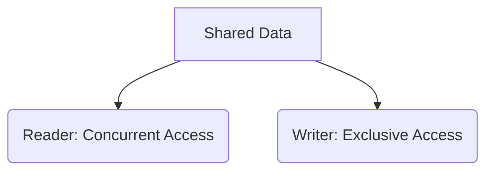

---
categories:
- Software Design
- Best Practices
- Concurrency Control
comments: true
cover:
  image: https://images.pexels.com/photos/15470522/pexels-photo-15470522.jpeg?auto=compress&cs=tinysrgb&h=650&w=940
date: 2025-06-18 15:56:31.477000
description: Explore the Read-Write Lock pattern, a concurrency mechanism designed
  to optimize performance for data structures with frequent reads and infrequent writes.
math: true
tags:
- Concurrency
- Design Patterns
- Synchronization
- Thread Safety
- Multithreading
title: Read-Write Lock Pattern
---


## Introduction

The Read-Write Lock pattern is a concurrency control mechanism that allows for improved performance in scenarios where shared data is read frequently but written infrequently. Unlike a traditional mutex (mutual exclusion lock) which permits only one thread to access a resource at a time (either for reading or writing), a Read-Write Lock differentiates between read and write operations:

*   **Multiple Readers:** Many threads can acquire a read lock simultaneously, allowing concurrent read access to the shared resource.
*   **Single Writer:** Only one thread can acquire a write lock at any given time, and no other threads (readers or writers) can hold a lock concurrently.

This pattern is particularly useful in environments where the overhead of an exclusive lock for every read operation would significantly degrade performance, such as caches, shared configuration objects, or data structures optimized for retrieval.

## Implementation

Implementing a Read-Write Lock typically involves a specialized lock primitive provided by the programming language's concurrency library. Below is a concise example using C#'s `ReaderWriterLockSlim`, which offers efficient read-write synchronization.

```csharp
using System;
using System.Threading;

public class ConcurrentDataStore
{
    // ReaderWriterLockSlim allows multiple readers or a single writer.
    private readonly ReaderWriterLockSlim _rwLock = new ReaderWriterLockSlim();
    private string _sharedData = "Initial Data";

    public string ReadData()
    {
        _rwLock.EnterReadLock(); // Acquire a read lock
        try
        {
            Console.WriteLine($"Thread {Thread.CurrentThread.ManagedThreadId} reading: '{_sharedData}'");
            Thread.Sleep(50); // Simulate processing time
            return _sharedData;
        }
        finally
        {
            _rwLock.ExitReadLock(); // Release the read lock
        }
    }

    public void WriteData(string newData)
    {
        _rwLock.EnterWriteLock(); // Acquire a write lock (exclusive)
        try
        {
            Console.WriteLine($"Thread {Thread.CurrentThread.ManagedThreadId} writing: '{newData}' (was '{_sharedData}')");
            _sharedData = newData;
            Thread.Sleep(100); // Simulate processing time
        }
        finally
        {
            _rwLock.ExitWriteLock(); // Release the write lock
        }
    }

    // Example of upgrading a read lock to a write lock (if needed)
    public void UpdateDataIfStale(string newValue)
    {
        _rwLock.EnterUpgradeableReadLock(); // Allows upgrading to write lock
        try
        {
            if (_sharedData != newValue)
            {
                _rwLock.EnterWriteLock(); // Upgrade to write lock
                try
                {
                    Console.WriteLine($"Thread {Thread.CurrentThread.ManagedThreadId} upgrading and writing: '{newValue}' (was '{_sharedData}')");
                    _sharedData = newValue;
                }
                finally
                {
                    _rwLock.ExitWriteLock(); // Release the write lock
                }
            }
        }
        finally
        {
            _rwLock.ExitUpgradeableReadLock(); // Release the upgradeable read lock
        }
    }
}
```

In this example, multiple threads can concurrently call `ReadData()`. However, if `WriteData()` or `UpdateDataIfStale()` (when upgraded) is called, it acquires an exclusive lock, preventing all other readers and writers until the write operation completes.

## Mermaid Diagram

The core principle of a Read-Write Lock involves differentiating access types.



## Pros & Cons

The Read-Write Lock pattern offers distinct advantages and disadvantages that inform its applicability.

### Advantages

*   **Improved Concurrency:** Significantly enhances performance for read-heavy workloads by allowing multiple readers to access shared resources concurrently.
*   **Reduced Contention:** Decreases the waiting time for read operations compared to using a simple exclusive lock.
*   **Granular Control:** Provides explicit control over different types of access (read vs. write).

### Disadvantages

*   **Increased Complexity:** More intricate to implement and manage correctly compared to a basic mutex due to multiple lock states.
*   **Potential for Writer Starvation:** In highly read-intensive scenarios, a continuous stream of readers might prevent writers from acquiring a lock, leading to writers waiting indefinitely. Implementations often address this with fairness policies.
*   **Overhead:** While generally more performant for read-heavy loads, the lock mechanism itself carries a higher overhead than a simple mutex due to its more complex state management.

## References

*   **C# `ReaderWriterLockSlim` Documentation:** [https://learn.microsoft.com/en-us/dotnet/api/system.threading.readerwriterlockslim](https://learn.microsoft.com/en-us/dotnet/api/system.threading.readerwriterlockslim)
*   **Java `ReentrantReadWriteLock` Documentation:** [https://docs.oracle.com/javase/8/docs/api/java/util/concurrent/locks/ReentrantReadWriteLock.html](https://docs.oracle.com/javase/8/docs/api/java/util/concurrent/locks/ReentrantReadWriteLock.html)
*   **Wikipedia - Reader-Writer Lock:** [https://en.wikipedia.org/wiki/Readers%E2%80%93writer_lock](https://en.wikipedia.org/wiki/Readers%E2%80%93writer_lock)