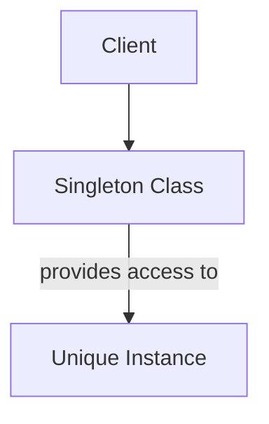

---
categories:
- Software Design
- Patterns
- Best Practices
comments: true
cover:
  image: https://images.pexels.com/photos/3862379/pexels-photo-3862379.jpeg?auto=compress&cs=tinysrgb&h=650&w=940
date: 2025-06-18 15:56:31.477000
description: An academic and practical overview of the Singleton design pattern, its
  implementation, use cases, advantages, and disadvantages for software developers.
math: true
tags:
- Design Patterns
- Software Architecture
- OOP
- Creational Patterns
title: Singleton Pattern
---


### Introduction

The Singleton design pattern is one of the twenty-three well-known Gang of Four (GoF) patterns, falling under the category of creational patterns. Its primary objective is to ensure that a class has only one instance and provides a global point of access to that instance. This pattern is particularly useful when exactly one object is needed to coordinate actions across the system.

Common applications for the Singleton pattern include:
*   **Logger:** A single logging instance across an application to centralize log writing.
*   **Configuration Manager:** Managing application settings, where all parts of the application access the same configuration.
*   **Database Connection Pool:** A single pool to manage and reuse database connections efficiently.
*   **Resource Manager:** Controlling access to a unique shared resource, such as a printer spooler or file system.

### Implementation

Implementing the Singleton pattern typically involves a private constructor to prevent direct instantiation, a static private member to hold the sole instance, and a static public method that returns the instance, creating it if it doesn't already exist (lazy initialization).

Here's a Python example demonstrating a thread-safe Singleton:

```python
import threading

class ConfigurationManager:
    _instance = None
    _lock = threading.Lock() # For thread-safety

    def __new__(cls):
        with cls._lock: # Acquire lock before checking/creating instance
            if cls._instance is None:
                cls._instance = super().__new__(cls)
                # Initialize attributes once
                cls._instance._initialized = False
        return cls._instance

    def __init__(self):
        # Ensure initialization only happens once
        if not self._initialized:
            self._settings = {"theme": "dark", "language": "en_US"}
            self._initialized = True
        
    def get_setting(self, key):
        """Retrieves a configuration setting."""
        return self._settings.get(key)

    def set_setting(self, key, value):
        """Sets or updates a configuration setting."""
        self._settings[key] = value

# Usage example:
if __name__ == "__main__":
    # Get the first instance
    config1 = ConfigurationManager()
    print(f"Config 1 Theme: {config1.get_setting('theme')}") # Output: dark

    # Modify a setting via config1
    config1.set_setting("theme", "light")
    print(f"Config 1 Theme (modified): {config1.get_setting('theme')}") # Output: light

    # Get another instance - it should be the same one
    config2 = ConfigurationManager()
    print(f"Config 2 Theme: {config2.get_setting('theme')}") # Output: light
    print(f"Are config1 and config2 the same instance? {config1 is config2}") # Output: True

    # Demonstrate initial state of a new attribute from another instance
    config3 = ConfigurationManager()
    config3.set_setting("font_size", "medium")
    print(f"Config 1 Font Size: {config1.get_setting('font_size')}") # Output: medium
```

### Mermaid Diagram

The following diagram illustrates the basic interaction with a Singleton:



### Pros & Cons

Objectively evaluating the Singleton pattern reveals both its utility and potential drawbacks:

#### Advantages:
*   **Controlled Access:** Ensures that there is only one instance of the class, preventing multiple instances from being created.
*   **Reduced Namespace Pollution:** Avoids populating the global namespace with numerous instances of the same object.
*   **Lazy Initialization:** The instance can be created only when it is requested for the first time, conserving resources until needed.
*   **Centralized Management:** Provides a single point of control for managing a shared resource or state.

#### Disadvantages:
*   **Violation of Single Responsibility Principle (SRP):** The class is responsible for both its primary functionality and ensuring its unique instantiation, potentially coupling unrelated concerns.
*   **Increased Coupling:** Introduces tight coupling within the application, as clients become directly dependent on the concrete Singleton class. This can make code harder to modify and extend.
*   **Difficult Testing:** The global state introduced by Singletons can make unit testing challenging, as tests may interfere with each other through shared state. Mocking or isolating Singletons for testing can be complex.
*   **Masked Dependencies:** Dependencies on a Singleton might not be explicitly declared in a class's constructor, making it harder to understand a class's requirements.
*   **Concurrency Issues:** Without careful implementation (e.g., using locks), concurrent access to the `getInstance` method can lead to multiple instances in a multi-threaded environment.
*   **Scalability Concerns:** While effective in single-process applications, Singletons do not inherently support distributed systems where state might need to be shared across multiple processes or machines.

### References

*   Gamma, E., Helm, R., Johnson, R., & Vlissides, J. (1994). *Design Patterns: Elements of Reusable Object-Oriented Software*. Addison-Wesley. (The original Gang of Four book)
*   Martin, R. C. (2009). *Clean Code: A Handbook of Agile Software Craftsmanship*. Prentice Hall. (Discusses disadvantages of global state and tight coupling often associated with Singletons).