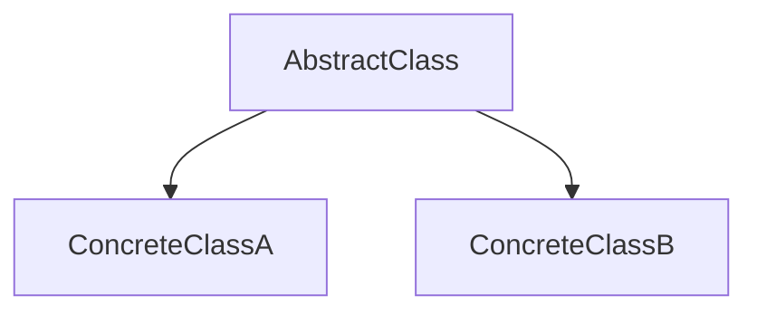

---
categories:
- Software Design
- Best Practices
comments: true
cover:
  image: https://images.pexels.com/photos/3862379/pexels-photo-3862379.jpeg?auto=compress&cs=tinysrgb&h=650&w=940
date: 2025-06-18 15:56:31.477000
description: A concise explanation of the Template Method design pattern, its implementation,
  pros, and cons for developers seeking structured code.
math: true
tags:
- Design Patterns
- Behavioral Patterns
- Architecture
- Software Design
title: Understanding the Template Method Pattern
---


The Template Method is a behavioral design pattern that defines the skeleton of an algorithm in the superclass but lets subclasses override specific steps of the algorithm without changing its structure.

## 1. Introduction

The Template Method Pattern provides a way to define a high-level algorithm in an abstract class, composed of common steps and abstract "primitive operations" or "hooks" that concrete subclasses must (or may) implement. This ensures the algorithm's overall structure remains consistent while allowing variation in specific steps.

This pattern is commonly used in frameworks and libraries where a standard process flow is desired, but certain parts need to be customizable. Examples include:
*   **Build systems:** A general build process (setup, compile, test, deploy) with specific steps varying for different project types (web, mobile, desktop).
*   **Report generation:** A standard report structure (header, body, footer) where the body content varies based on data sources.
*   **Data processing:** An algorithm for processing data that involves common loading and saving steps, but different transformation logic.

## 2. Implementation

Consider a scenario where you have different types of projects that all follow a similar build process.

```python
from abc import ABC, abstractmethod

class ProjectBuilder(ABC):
    """
    Abstract base class defining the template method for a project build process.
    """

    def build_project(self):
        """
        The template method defines the skeletal algorithm.
        """
        print("--- Starting Build Process ---")
        self._initialize_environment()
        self._compile_code()
        self._run_tests()
        self._deploy_application()
        print("--- Build Process Complete ---")

    @abstractmethod
    def _initialize_environment(self):
        """
        Abstract method: Subclasses must implement specific environment setup.
        """
        pass

    @abstractmethod
    def _compile_code(self):
        """
        Abstract method: Subclasses must implement specific compilation logic.
        """
        pass

    def _run_tests(self):
        """
        Hook method: Subclasses may override to add specific test logic.
        (Default behavior provided)
        """
        print("Running standard unit tests.")

    @abstractmethod
    def _deploy_application(self):
        """
        Abstract method: Subclasses must implement specific deployment logic.
        """
        pass

class WebProjectBuilder(ProjectBuilder):
    """
    Concrete class implementing specific steps for a web project.
    """
    def _initialize_environment(self):
        print("Web: Installing Node.js packages and dependencies.")

    def _compile_code(self):
        print("Web: Compiling TypeScript/JavaScript and bundling assets.")

    def _run_tests(self):
        print("Web: Running browser-based end-to-end tests.") # Overrides hook

    def _deploy_application(self):
        print("Web: Deploying static files to CDN/S3 bucket.")

class MobileProjectBuilder(ProjectBuilder):
    """
    Concrete class implementing specific steps for a mobile project.
    """
    def _initialize_environment(self):
        print("Mobile: Setting up Android SDK and Xcode toolchains.")

    def _compile_code(self):
        print("Mobile: Compiling native code for iOS and Android platforms.")

    def _deploy_application(self):
        print("Mobile: Publishing application to App Store and Google Play.")

# Client code
if __name__ == "__main__":
    print("Building Web Project:")
    web_builder = WebProjectBuilder()
    web_builder.build_project()

    print("\nBuilding Mobile Project:")
    mobile_builder = MobileProjectBuilder()
    mobile_builder.build_project()
```

## 3. Mermaid Diagram

The Template Method pattern typically involves an abstract class defining the template method and abstract primitive operations, and concrete subclasses implementing these operations.



*   **AbstractClass:** Defines the template method (e.g., `build_project`) which orchestrates calls to primitive operations. It also declares abstract primitive operations (e.g., `_initialize_environment`) that must be implemented by subclasses, and optionally defines "hook" methods (e.g., `_run_tests`) with default or empty implementations that subclasses can override.
*   **ConcreteClassA / ConcreteClassB:** Implement the primitive operations defined in the `AbstractClass`, providing specific behaviors for each step of the algorithm.

## 4. Pros & Cons

### Advantages:
*   **Code Reusability:** Common parts of the algorithm are consolidated in the abstract base class, reducing duplication.
*   **Inversion of Control:** The base class dictates the overall flow of the algorithm, ensuring consistency. Subclasses are responsible only for specific customizable steps.
*   **Flexibility:** Allows subclasses to customize parts of an algorithm without altering its structure, adhering to the Open/Closed Principle.
*   **Maintainability:** Changes to the overall algorithm structure are localized to the base class.

### Disadvantages:
*   **Increased Complexity:** Can lead to a deeper inheritance hierarchy, which might be harder to understand and navigate for very simple algorithms.
*   **Limited Flexibility:** Subclasses are constrained to the predefined steps and their order set by the template method. It's not suitable if the algorithm's steps themselves need to vary significantly in order or existence.
*   **Tight Coupling:** Subclasses are inherently coupled to the abstract class's definition of the algorithm and its primitive operations.
*   **Potential for Misuse:** Overuse of abstract methods can lead to abstract classes with too many responsibilities or methods that are rarely overridden, making the design less clear.

## 5. References

*   **Gamma, E., Helm, R., Johnson, R., & Vlissides, J. (1994).** *Design Patterns: Elements of Reusable Object-Oriented Software.* Addison-Wesley. (The original "Gang of Four" book)
*   **Refactoring.Guru.** *Template Method Pattern.* [https://refactoring.guru/design-patterns/template-method](https://refactoring.guru/design-patterns/template-method)
*   **Wikipedia.** *Template method pattern.* [https://en.wikipedia.org/wiki/Template_method_pattern](https://en.wikipedia.org/wiki/Template_method_pattern)