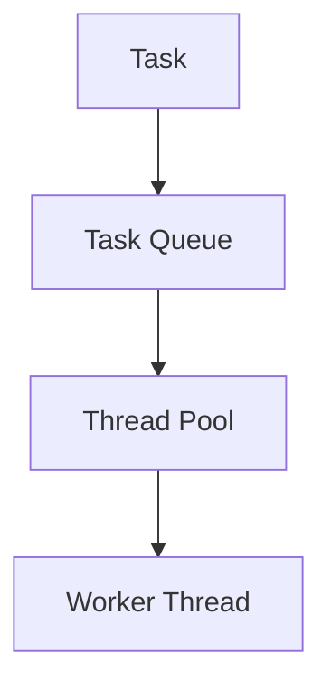

---
categories:
- Software Design
- Best Practices
- Concurrency Patterns
comments: true
cover:
  image: https://images.pexels.com/photos/3735215/pexels-photo-3735215.jpeg?auto=compress&cs=tinysrgb&h=650&w=940
date: 2025-06-18 15:56:31.477000
description: Explore the Thread Pool Pattern, a fundamental concurrency design pattern
  that efficiently manages worker threads to execute tasks, reducing overhead and
  improving application responsiveness.
math: true
tags:
- Design Patterns
- Concurrency
- Multithreading
- Performance
- Architecture
title: Thread Pool Pattern
---


## Introduction

The **Thread Pool Pattern** is a concurrency design pattern that manages a collection of worker threads to execute a set of submitted tasks. Instead of creating a new thread for each task, which incurs significant overhead, a thread pool reuses a fixed number of threads, making application execution more efficient and responsive.

This pattern is widely used in systems that handle numerous short-lived tasks, such as web servers processing client requests, database connection management, and batch processing systems. Its primary purpose is to reduce the overhead associated with thread creation and destruction, manage system resources by limiting the number of concurrently active threads, and improve overall application throughput and responsiveness.

## Implementation

The core idea behind a thread pool is a queue for tasks and a set of worker threads. Threads pick tasks from the queue, execute them, and then return to the pool, ready for the next task. Many programming languages provide built-in implementations or libraries for thread pools. The following Java example demonstrates a basic usage of the `ExecutorService`, a common abstraction for thread pools.

```java
import java.util.concurrent.ExecutorService;
import java.util.concurrent.Executors;
import java.util.concurrent.TimeUnit;

public class ThreadPoolExample {
    public static void main(String[] args) {
        // 1. Create a fixed-size thread pool with 5 worker threads
        ExecutorService executor = Executors.newFixedThreadPool(5);

        // 2. Submit 10 tasks to the pool
        for (int i = 0; i < 10; i++) {
            final int taskId = i;
            executor.submit(() -> {
                System.out.println("Executing Task " + taskId + " on thread: " + Thread.currentThread().getName());
                try {
                    // Simulate work being done
                    Thread.sleep(100);
                } catch (InterruptedException e) {
                    Thread.currentThread().interrupt(); // Restore interrupt status
                }
            });
        }

        // 3. Initiate an orderly shutdown of the pool
        executor.shutdown(); 
        try {
            // 4. Wait for all submitted tasks to complete within a timeout
            if (!executor.awaitTermination(60, TimeUnit.SECONDS)) {
                // If tasks haven't completed, force shutdown
                executor.shutdownNow(); 
            }
        } catch (InterruptedException e) {
            executor.shutdownNow(); // Force shutdown if interrupted while waiting
            Thread.currentThread().interrupt();
        }
        System.out.println("All tasks submitted and pool successfully shut down.");
    }
}
```

In this example, `Executors.newFixedThreadPool(5)` creates a pool with five threads. Ten tasks are submitted, but only five will run concurrently at any given time, demonstrating resource management.

## Mermaid Diagram

The following diagram illustrates the fundamental interaction within a Thread Pool Pattern:



## Pros & Cons

The Thread Pool Pattern offers distinct advantages and disadvantages that developers should consider:

### Advantages
*   **Reduced Overhead:** Eliminates the overhead of creating and destroying threads for each task, as threads are reused.
*   **Improved Responsiveness:** Threads are pre-initialized and ready to execute tasks immediately, leading to faster response times.
*   **Resource Management:** Limits the number of active threads, preventing resource exhaustion and system instability due to excessive thread creation.
*   **Easier Task Management:** Simplifies the management and scheduling of tasks, allowing for task queuing and prioritization.

### Disadvantages
*   **Potential for Deadlocks:** Incorrect task dependencies or pool sizing can lead to situations where tasks block each other, causing deadlocks if the pool threads are exhausted.
*   **Resource Contention:** If many tasks frequently access shared resources, contention for locks can become a bottleneck, potentially degrading performance.
*   **Complexity in Tuning:** Determining the optimal size of the thread pool can be challenging and highly dependent on the application's workload and system characteristics.
*   **Overhead of Pool Management:** While reducing task-specific thread overhead, the pool itself introduces some management overhead (e.g., queue management, thread lifecycle management).

## References

*   Goetz, B. (2006). *Java Concurrency in Practice*. Addison-Wesley. (Provides in-depth coverage of thread pools and concurrent programming in Java).
*   Oracle Documentation. *ExecutorService*. (Official documentation for Java's built-in thread pool framework).
*   Wikipedia. *Thread pool*. (General overview of the thread pool concept).