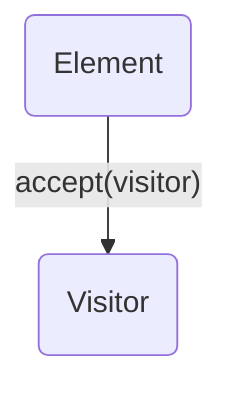

---
categories:
- Software Design
- Object-Oriented Programming
- Best Practices
comments: true
cover:
  image: https://images.pexels.com/photos/25626435/pexels-photo-25626435.jpeg?auto=compress&cs=tinysrgb&h=650&w=940
date: 2025-06-18 15:56:31.477000
description: An academic and practical guide to the Visitor design pattern, explaining
  its structure, implementation, and trade-offs for developers.
math: true
tags:
- Design Patterns
- Behavioral Patterns
- Software Architecture
title: Visitor Pattern
---


The Visitor design pattern is a behavioral pattern that allows you to separate algorithms from the objects on which they operate. This separation enables adding new operations to existing object structures without modifying those structures.

### 1. Introduction

The **Visitor Pattern** defines a new operation to be performed on the elements of an object structure without changing the element classes themselves. It is particularly useful when:

*   You need to perform many different and unrelated operations on a stable object structure.
*   The classes that form the object structure are not expected to change frequently, but you often need to add new operations.
*   An operation needs to access the internal state of several different objects within the hierarchy.

The pattern works by essentially "visiting" each element in the structure, passing the element itself to the visitor, which then performs the specific operation for that element type.

### 2. Implementation

Consider a scenario with different `Shape` objects (e.g., `Circle`, `Square`) and a need to perform various operations on them, such as calculating their area or drawing them, without altering the `Shape` classes.

```python
# 1. Element Interface
# Defines an accept operation that takes a visitor as an argument.
class Shape:
    def accept(self, visitor):
        raise NotImplementedError

# 2. Concrete Elements
# Implement the accept operation.
class Circle(Shape):
    def __init__(self, radius):
        self.radius = radius

    def accept(self, visitor):
        visitor.visit_circle(self) # Double dispatch

class Square(Shape):
    def __init__(self, side):
        self.side = side

    def accept(self, visitor):
        visitor.visit_square(self) # Double dispatch

# 3. Visitor Interface
# Declares a visit operation for each class of ConcreteElement in the object structure.
class ShapeVisitor:
    def visit_circle(self, circle):
        raise NotImplementedError
    def visit_square(self, square):
        raise NotImplementedError

# 4. Concrete Visitors
# Implement the operations defined by the Visitor interface.
class AreaCalculator(ShapeVisitor):
    def visit_circle(self, circle):
        area = 3.14159 * circle.radius ** 2
        print(f"Calculating area of Circle (R={circle.radius}): {area:.2f}")

    def visit_square(self, square):
        area = square.side ** 2
        print(f"Calculating area of Square (S={square.side}): {area:.2f}")

class DrawVisitor(ShapeVisitor):
    def visit_circle(self, circle):
        print(f"Drawing Circle with radius {circle.radius}...")

    def visit_square(self, square):
        print(f"Drawing Square with side {square.side}...")

# Client Code
if __name__ == "__main__":
    shapes = [Circle(5), Square(10), Circle(7)]

    area_visitor = AreaCalculator()
    draw_visitor = DrawVisitor()

    print("--- Calculating Areas ---")
    for shape in shapes:
        shape.accept(area_visitor)

    print("\n--- Drawing Shapes ---")
    for shape in shapes:
        shape.accept(draw_visitor)
```

In this example:
*   `Shape` is the **Element** interface.
*   `Circle` and `Square` are **Concrete Elements**.
*   `ShapeVisitor` is the **Visitor** interface.
*   `AreaCalculator` and `DrawVisitor` are **Concrete Visitors**.

### 3. Mermaid Diagram


*   `Element` represents the interface or abstract class for elements in the object structure.
*   `Visitor` represents the interface for visitors, declaring `visit` methods for each concrete element type.
*   The `accept(visitor)` method on the `Element` dispatches the call to the appropriate `visit` method on the `Visitor`.

### 4. Pros & Cons

**Advantages:**

*   **Open/Closed Principle:** New operations (visitors) can be added without modifying the existing element classes, promoting extensibility.
*   **Separation of Concerns:** Operations specific to different elements are grouped within their respective visitor classes, improving organization.
*   **Single Responsibility Principle:** Each visitor focuses on a single operation, making code easier to understand and maintain.
*   **Accumulation of State:** Visitors can maintain internal state while traversing the object structure, useful for complex computations.

**Disadvantages:**

*   **Violation of Open/Closed Principle for Elements:** Adding a new `ConcreteElement` type requires modifying the `Visitor` interface and all `ConcreteVisitor` implementations to add a new `visit` method. This can be a significant drawback if the element hierarchy changes frequently.
*   **Increased Complexity:** Introduces a new set of interfaces and classes, potentially making the codebase harder to navigate for simple operations.
*   **Breaks Encapsulation:** Visitors often need access to the internal state of the elements they visit, which might require making certain element fields public or providing public accessors, potentially compromising encapsulation.
*   **Cyclic Dependencies:** Can be challenging to implement if the object structure contains cyclical references.

### 5. References

*   Gamma, E., Helm, R., Johnson, R., & Vlissides, J. (1994). *Design Patterns: Elements of Reusable Object-Oriented Software*. Addison-Wesley.
*   Refactoring.Guru. (n.d.). *Visitor*. Retrieved from [https://refactoring.guru/design-patterns/visitor](https://refactoring.guru/design-patterns/visitor)
*   Wikipedia. (n.d.). *Visitor pattern*. Retrieved from [https://en.wikipedia.org/wiki/Visitor_pattern](https://en.wikipedia.org/wiki/Visitor_pattern)