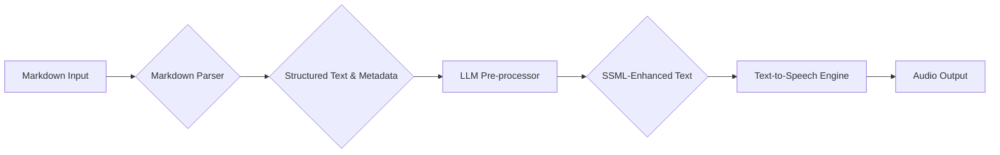

---
categories:
- AI
- Productivity
- Software Development
- Prompt Engineering
comments: true
cover:
  image: https://images.pexels.com/photos/4476162/pexels-photo-4476162.jpeg?auto=compress&cs=tinysrgb&h=650&w=940
date: 2025-06-17 08:34:45.333000
description: Explore how to build a powerful Markdown-to-Speech interface leveraging
  Large Language Models (LLMs) for intelligent text processing and enhanced audio
  delivery. Learn about parsing, LLM-driven refinement, and Text-to-Speech engines.
tags:
- AI
- LLM
- Gemini
- Text-to-Speech
- Markdown
- Productivity
- Development
title: Building a Markdown-to-Speech Interface with LLMs
---


## Building a Markdown-to-Speech Interface with LLMs

## The Voice of Your Notes: Unleashing Audio from Markdown

In an increasingly digital world, we consume vast amounts of information through text. From research papers and blog posts to personal notes and code documentation, Markdown has become a ubiquitous format for its simplicity and readability. But what if you could listen to your Markdown content, freeing your eyes and allowing for consumption on the go, during commutes, or while multitasking?

Enter the concept of a Markdown-to-Speech interface. While basic Text-to-Speech (TTS) engines have existed for years, simply converting raw Markdown to audio often results in a robotic, jumbled, or unhelpful experience, especially with complex structures like code blocks, tables, or footnotes. This is where Large Language Models (LLMs) become a game-changer. By intelligently pre-processing and refining Markdown content, LLMs can transform a bland text-to-speech output into a truly engaging and understandable audio experience.

This post will dive deep into building such an interface, covering the essential components: Markdown parsing, LLM-powered text enhancement, and sophisticated Text-to-Speech synthesis.

## The Core Stack: Markdown, LLMs, and TTS

Building an intelligent Markdown-to-Speech system involves orchestrating three primary layers:

1.  **Markdown Parsing**: Converting the structured Markdown into a format usable by LLMs and TTS engines.
2.  **LLM Processing**: Applying intelligence to refine, rephrase, and annotate the parsed text for optimal speech delivery.
3.  **Text-to-Speech Synthesis**: Generating natural-sounding audio from the LLM-processed text.

Let's break down each component.

### 1. Markdown Parsing: From Syntax to Structure

The first step is to transform your raw Markdown text into something more manageable. A direct feed of Markdown syntax (like `## Heading` or `* item`) to a TTS engine would sound terrible. We need to:

*   **Extract Pure Text**: Remove all Markdown formatting for basic readability.
*   **Identify Structural Elements**: Understand what's a heading, a list item, a code block, a quote, etc., to inform the LLM and TTS engine about context.

**Tools for Parsing:**

*   **`markdown-it` (Node.js)**: A highly extensible Markdown parser that generates an abstract syntax tree (AST) or HTML. Its plugin architecture allows for fine-grained control over parsing rules.
    *   [https://github.com/markdown-it/markdown-it](https://github.com/markdown-it/markdown-it)
*   **`marked.js` (Browser/Node.js)**: Another popular, fast Markdown parser that converts Markdown to HTML. While it's HTML-focused, you can extract plain text from the generated HTML or hook into its tokenization process.
    *   [https://marked.js.org/](https://marked.js.org/)

**Example (Conceptual `markdown-it` usage):**

```javascript
import MarkdownIt from 'markdown-it';

const md = new MarkdownIt();
const markdownText = `
# My Awesome Blog Post

This is a paragraph of text.

- Item 1
- Item 2

\`\`\`javascript
console.log("Hello, world!");
\`\`\`
`;

const tokens = md.parse(markdownText, {});

// Process tokens to extract content and structure.
// For instance, you might iterate through tokens,
// extract 'content' from 'paragraph' or 'heading_open' tokens,
// and identify 'fence' tokens for code blocks.
```

The challenge here lies in deciding *how* to represent non-standard text for speech. Should a code block be read line-by-line? Probably not. Should a table be read cell-by-cell? Unlikely to be useful. This is where the LLM steps in.

### 2. The LLM Layer: Intelligent Pre-processing

This is the most crucial layer for elevating a basic Markdown-to-Speech conversion into a powerful, intelligent interface. LLMs can take the parsed Markdown content and perform sophisticated transformations to optimize it for auditory consumption.

**Key Roles of the LLM:**

*   **Text Refinement & Simplification**: LLMs can summarize long paragraphs, rephrase complex sentences into more conversational language, or even expand acronyms on first mention for clarity.
    *   *Example Prompt*: "Refine the following text for natural speech delivery, ensuring clarity and conciseness. Avoid jargon where possible, or explain it briefly. If there are long sentences, break them down for easier understanding."
*   **Pronunciation & Contextual Cues**: One of the biggest challenges in TTS is correct pronunciation of technical terms, acronyms (e.g., "AI" vs. "A.I."), proper nouns, or foreign words. LLMs can identify these and suggest appropriate Speech Synthesis Markup Language (SSML) tags.
    *   *Example Prompt*: "Analyze the following text and insert SSML tags (e.g., `<say-as interpret-as='characters'>LLM</say-as>`, `<phoneme alphabet='ipa' ph='ˌprɑːˈnʌnsiˌeɪʃən'>pronunciation</phoneme>`, `<break time='500ms'/>`) for appropriate pauses, emphasis, and pronunciation guidance. Highlight any acronyms or technical terms."
*   **Structural Interpretation & Description**: Instead of blindly reading HTML, an LLM can provide intelligent descriptions for non-textual or complex Markdown elements.
    *   *For Code Blocks*: "The following is a JavaScript code snippet that prints 'Hello, world!' to the console. [LLM reads description, not code]."
    *   *For Tables*: "Here is a table summarizing quarterly sales data. The first column lists quarters, followed by sales figures." (Then optionally reads key summary data).
    *   *For Images*: "An image depicting a flow chart illustrates the system architecture."
    *   *Example Prompt*: "Given the following Markdown content, convert it into a speech-friendly script. For code blocks, describe their purpose briefly rather than reading the code directly. For lists, introduce them clearly. For headings, ensure they are announced appropriately. Maintain the original meaning but optimize for listening."

**Choosing Your LLM:**

*   **Google Gemini API**: Excellent for multi-modal understanding, strong summarization, and text generation capabilities. Can be accessed via Google AI Studio.
    *   [https://ai.google.dev/](https://ai.google.dev/)
*   **OpenAI GPT Models (GPT-4, GPT-3.5)**: Widely used for text generation, summarization, and instruction following. Their API is robust.
    *   [https://platform.openai.com/](https://platform.openai.com/)
*   **Local LLMs (e.g., Llama 2 via Hugging Face/Ollama)**: For privacy-sensitive applications or to reduce API costs, running a local LLM can be an option, though it requires significant computational resources.
    *   [https://huggingface.co/meta-llama/Llama-2-7b-chat-hf](https://huggingface.co/meta-llama/Llama-2-7b-chat-hf)
    *   [https://ollama.ai/](https://ollama.ai/)

**Note:** The effectiveness of LLM processing heavily depends on precise prompt engineering. Experimentation is key to finding the right balance of conciseness, clarity, and naturalness.

### 3. Text-to-Speech (TTS) Engines: Bringing Words to Life

The final step is converting the LLM-processed, speech-optimized text into audio. Modern TTS engines are incredibly sophisticated, offering natural-sounding voices, support for multiple languages, and crucial SSML (Speech Synthesis Markup Language) capabilities.

**Key Features to Look For:**

*   **Natural-sounding Voices**: Beyond robotic voices, look for human-like intonation, pacing, and emotional range.
*   **SSML Support**: Essential for fine-tuning pronunciation, adding pauses, controlling volume/pitch, and emphasizing words.
    *   [https://www.w3.org/TR/speech-synthesis11/](https://www.w3.org/TR/speech-synthesis11/)
*   **Language and Voice Options**: A wide range of languages and different voice profiles (male/female, age, accent).

**Leading TTS Providers:**

*   **Google Cloud Text-to-Speech**: Offers a wide array of high-quality voices, including WaveNet voices, and extensive SSML support. Excellent for production-grade applications.
    *   [https://cloud.google.com/text-to-speech](https://cloud.google.com/text-to-speech)
*   **AWS Polly**: Amazon's robust TTS service, known for its neural TTS voices and comprehensive SSML features.
    *   [https://aws.amazon.com/polly/](https://aws.amazon.com/polly/)
*   **Eleven Labs**: Gaining popularity for its exceptionally natural and customizable voices, including voice cloning capabilities. Offers a highly expressive range.
    *   [https://beta.elevenlabs.io/](https://beta.elevenlabs.io/)
*   **Browser Web Speech API**: For client-side implementations (e.g., in a web application), the browser's native API provides basic TTS functionality. While not as sophisticated as cloud services, it's free and easy to integrate for simple use cases.
    *   [https://developer.mozilla.org/en-US/docs/Web/API/Web_Speech_API](https://developer.mozilla.org/en-US/docs/Web/API/Web_Speech_API)

**Example (Conceptual TTS API Call with SSML):**

```json
// Example payload for a TTS API supporting SSML
{
  "input": {
    "ssml": "<speak>This is a <emphasis>very</emphasis> important point. <break time='1s'/> The acronym is <say-as interpret-as='characters'>LLM</say-as>.</speak>"
  },
  "voice": {
    "languageCode": "en-US",
    "name": "en-US-Wavenet-F" // Or a specific voice from Eleven Labs, AWS Polly, etc.
  },
  "audioConfig": {
    "audioEncoding": "MP3"
  }
}
```
The LLM's role here is to generate this SSML-enhanced text string, which the TTS engine then interprets to produce the final audio.

## Architecting the Workflow: A Step-by-Step Approach

Combining these components creates a powerful pipeline:

1.  **Markdown Input**: The user provides Markdown content (e.g., a blog post, a set of notes).
2.  **Parsing Phase**:
    *   The Markdown content is fed to a parser (`markdown-it`, `marked.js`).
    *   The parser breaks down the Markdown into an intermediate format (e.g., an AST, tokens, or raw HTML).
    *   A custom script extracts relevant text segments and identifies structural types (paragraph, heading, list, code block, etc.).
3.  **LLM Pre-processing Phase**:
    *   The extracted text and structural metadata are sent to the chosen LLM (Gemini, GPT-4, etc.).
    *   The LLM, guided by a specific prompt, refines the text, adds SSML tags, and generates descriptive summaries for complex elements (like code blocks).
    *   *Output*: An SSML-enhanced, speech-optimized text string.
4.  **TTS Synthesis Phase**:
    *   The SSML-enhanced text is sent to the TTS engine (Google Cloud TTS, AWS Polly, Eleven Labs).
    *   The TTS engine processes the text and SSML, selecting the specified voice.
    *   *Output*: An audio stream or file (e.g., MP3, WAV).
5.  **Audio Output**: The generated audio is played back to the user or saved as a file.



## Implementation Considerations & Challenges

Building a truly effective Markdown-to-Speech interface comes with its own set of challenges:

*   **Handling Non-Textual Elements**:
    *   **Images/Diagrams**: The LLM needs to describe them concisely or skip them. "An image illustrating the neural network architecture is displayed."
    *   **Complex Tables**: Reading row by row might be overwhelming. LLM could summarize the table's key findings or describe its structure.
    *   **Code Snippets**: Reading code character by character is rarely useful. The LLM can be prompted to summarize the code's function.
    *   **Footnotes/References**: Decide whether to read them after the main text, summarize them, or offer an option to skip.

*   **Pronunciation Nuances**:
    *   **Acronyms**: "AI" could be "A. I." or "Ay-Eye." LLMs can sometimes infer context, and SSML `<say-as interpret-as='characters'>` helps.
    *   **Technical Jargon**: Domain-specific terms may require phonetic hints using SSML `<phoneme>`.
    *   **Homographs**: Words spelled the same but pronounced differently based on context (e.g., "read" past vs. present tense). LLMs can help disambiguate context.

*   **Pacing, Intonation, and Emotion**:
    *   While modern TTS is good, achieving truly natural, emotionally appropriate delivery remains complex. SSML `<express-as>`, `<emphasis>`, and `<break>` tags are crucial for adding pauses and stress points, often suggested by the LLM.
    *   **Note**: Perfect emotional nuance is still an active research area for TTS, but LLMs can significantly improve the *structure* and *clarity* for better delivery.

*   **Cost and Latency**:
    *   API calls to LLMs and high-quality TTS services incur costs (per token for LLMs, per character for TTS). For long documents, this can add up.
    *   Multiple API calls (parsing, LLM, TTS) introduce latency. For real-time applications, optimization (e.g., local LLMs, batch processing) is necessary.

*   **Privacy & Data Handling**:
    *   Sending potentially sensitive Markdown content (e.g., personal notes, proprietary code documentation) to external LLM and TTS APIs raises privacy concerns.
    *   Consider data anonymization or utilizing on-premise/local LLMs for highly sensitive data.

*   **Voice Customization**:
    *   Allowing users to choose their preferred voice, language, and speaking rate enhances the experience.
    *   More advanced features might include dynamic voice changes (e.g., a quote attributed to "Dr. Smith" uses a different voice profile).

## Advanced Features & Future Directions

The foundation we've discussed opens doors to a multitude of advanced features:

*   **Interactive Controls**: Beyond play/pause, allow users to skip to the next heading, rewind a sentence, or adjust reading speed dynamically.
*   **Summary Generation**: Before reading the full text, the LLM could generate a short audio summary of the Markdown document.
*   **Multi-language Support**: Automatically detect the language of the Markdown and use appropriate LLM and TTS models.
*   **Contextual Voice Adjustments**: If the Markdown document includes dialogue, the LLM could parse speaker cues and assign different voices to each character.
*   **Integration with Note-taking Apps/IDEs**: Imagine hitting a "Read Aloud" button in Obsidian, VS Code, or Notion and having your notes or code comments narrated intelligently.
*   **Intelligent Skipping**: Allow the LLM to identify and skip sections (e.g., appendices, boilerplate disclaimers) that are less relevant for audio consumption.
*   **Personalized Learning**: The system could learn user preferences (e.g., always read code blocks as "code starts/ends," or always read specific acronyms character by character).

## Conclusion: The Future is Audible

Building a Markdown-to-Speech interface with LLMs is more than just a tech novelty; it's a step towards more accessible and versatile information consumption. By combining robust Markdown parsing, the intelligent text processing capabilities of LLMs, and the natural voice synthesis of modern TTS engines, we can transform static text into dynamic, audible narratives.

This approach not only enhances accessibility for visually impaired users but also boosts productivity for everyone, enabling passive learning and content consumption in scenarios where reading is impractical. The journey involves tackling nuances of pronunciation, structure, and cost, but the potential for truly intelligent, human-like narration of your digital world is immense. The future of content consumption is not just visual; it's increasingly audible.