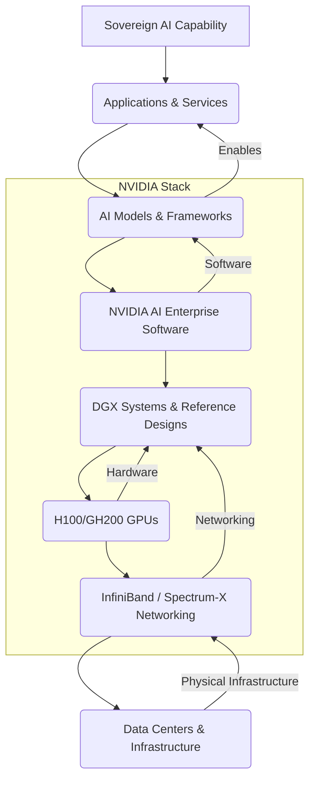

---
categories:
- Infrastructure
- Strategy
- AI
- Geopolitics
comments: true
cover:
  image: https://images.pexels.com/photos/30547568/pexels-photo-30547568.jpeg?auto=compress&cs=tinysrgb&h=650&w=940
date: 2025-06-20 08:10:28.339000
description: Explore how Nvidia is cornering the market on national AI infrastructure
  with its holistic "Sovereign AI" strategy, blending hardware, software, and strategic
  partnerships.
tags:
- AI
- Nvidia
- Sovereign AI
- Geopolitics
- Data Centers
- AI Infrastructure
- Jensen Huang
- GPU
- Machine Learning
title: "The Secret Sauce Behind Nvidia\u2019s Sovereign AI Strategy"
---

The world of artificial intelligence is undergoing a seismic shift. From a globalized, cloud-centric model, we're seeing an accelerating trend towards **national autonomy in AI**. This isn't just about data privacy; it's about national security, economic competitiveness, and the ability to shape a nation's digital future on its own terms. At the heart of this transformation, one company stands out as the primary architect: **Nvidia**.

You've heard of Nvidia's GPUs powering everything from gaming rigs to cutting-edge research labs. But their recent pivot towards what CEO **Jensen Huang** calls "Sovereign AI" is far more profound than simply selling chips. It's a holistic, full-stack strategy designed to make nations AI-independent, and it's rapidly reshaping the global AI landscape.

Let's peel back the layers and uncover the secret sauce behind Nvidia’s audacious Sovereign AI strategy.

## What Exactly is "Sovereign AI"?

Before diving into Nvidia's role, let's define our terms. **Sovereign AI** refers to a nation's or region's ability to develop, own, and control its own AI infrastructure and capabilities. This includes everything from the physical data centers and compute resources to the data itself, the models, and the applications built on top of them.

Why is this suddenly a geopolitical imperative?

1.  **Data Security & Privacy:** Nations want to ensure sensitive citizen data, classified information, and proprietary industrial data remains within their borders and subject to their laws.
2.  **National Security:** AI is a dual-use technology. Control over AI development is crucial for defense, intelligence, and critical infrastructure protection.
3.  **Economic Competitiveness:** Owning AI capabilities allows nations to foster local innovation, create jobs, and develop AI-powered industries that contribute to their GDP, rather than relying solely on foreign AI providers.
4.  **Cultural Preservation:** AI models trained on specific national datasets can better understand and preserve local languages, dialects, and cultural nuances, preventing a global monoculture in AI.
5.  **Resilience & Autonomy:** Reducing dependence on foreign cloud providers or AI services mitigates risks associated with supply chain disruptions, geopolitical tensions, or changes in foreign policy.

In essence, Sovereign AI is about digital self-determination in the age of intelligence.

## Jensen Huang's Vision: Beyond the Chipmaker

Jensen Huang, Nvidia's charismatic co-founder and CEO, has been a vocal proponent of Sovereign AI. He sees it not just as a business opportunity, but as an inevitable evolution driven by geopolitical realities. As he put it, "Every country needs to own its own data. It needs to own its own intelligence. It needs to own its own AI." [source](https://www.nvidia.com/en-us/news/ai-data-centers-country/)

Nvidia's traditional strength lies in hardware, particularly its Graphics Processing Units (GPUs), which have become the de facto standard for AI training and inference. But their strategy for Sovereign AI goes far beyond simply selling H100s. It's about providing the *entire toolkit*—a complete, vertically integrated stack that allows nations to build their AI capabilities from the ground up.

## The Pillars of Nvidia's Sovereign AI Strategy

Nvidia's secret sauce isn't just one ingredient; it's a meticulously crafted recipe involving several key components working in concert.

### 1. Unrivaled Hardware Dominance

This is the foundation. Nvidia's H100 and GH200 Grace Hopper Superchip are the current gold standards for AI compute. These aren't just powerful chips; they are engineering marvels designed specifically for the intense parallel processing demands of large language models (LLMs) and complex AI workloads.

*   **H100 Tensor Core GPU:** The workhorse for AI training, featuring Transformer Engine technology to accelerate large model training.
*   **GH200 Grace Hopper Superchip:** Integrates the high-performance Grace CPU with the H200 Tensor Core GPU, optimized for terabyte-scale models and HPC applications.

These chips are the engines, but they require a sophisticated chassis to run optimally. This brings us to Nvidia's system designs.

### 2. The Comprehensive Software Ecosystem (CUDA & Beyond)

Hardware is inert without software, and this is where Nvidia’s "moat" truly shines. **CUDA**, Nvidia's parallel computing platform and programming model, is the undeniable king of AI development. Decades of investment have built an ecosystem so vast and entrenched that it's incredibly difficult for competitors to replicate. Developers simply prefer to build on CUDA.

Beyond CUDA, Nvidia offers a comprehensive software stack tailored for AI development and deployment:

*   **NVIDIA AI Enterprise:** A cloud-native software suite that provides all the tools, frameworks, and pre-trained models necessary for AI development and deployment, from data science to large-scale training and inference. This includes optimized versions of popular frameworks like PyTorch and TensorFlow.
*   **NeMo:** A framework for building, customizing, and deploying large language models. This is crucial for nations wanting to train LLMs on their local data.
*   **Triton Inference Server:** For efficient, scalable deployment of AI models in production.
*   **NVIDIA RAPIDS:** Libraries for data science and analytics that leverage GPU acceleration.

This software ecosystem ensures that the powerful hardware is fully utilized, providing developers with familiar tools and optimized performance.

### 3. High-Speed Networking: The AI Data Center's Nervous System

Training colossal AI models requires not just powerful GPUs, but also lightning-fast communication *between* those GPUs. This is where Nvidia's networking expertise, acquired through its Mellanox acquisition, comes into play.

*   **InfiniBand:** A purpose-built, high-bandwidth, low-latency interconnect that is the backbone of most large-scale AI supercomputers (like DGX SuperPODs). It's designed for collective communications across hundreds or thousands of GPUs, crucial for distributed model training.
*   **Spectrum-X Ethernet:** Nvidia's optimized Ethernet platform for AI, offering similar performance benefits to InfiniBand for AI workloads over standard Ethernet networks.

Without these specialized networking solutions, the full potential of thousands of GPUs cannot be realized, making them a critical, often overlooked, component of a sovereign AI strategy.

### 4. Reference Architectures & Blueprints: Accelerating Deployment

Nvidia doesn't just sell components; they sell complete, validated designs for building AI supercomputers.

*   **NVIDIA DGX SuperPOD:** A modular, scalable AI data center blueprint. Nations can literally acquire the design and all necessary components (DGX systems, InfiniBand networking, storage, cooling) to build a multi-petaflop or exaflop AI supercomputer tailored to their needs. This dramatically reduces the complexity and time required for deployment.
*   **NVIDIA OVX:** Reference designs for digital twin and industrial metaverse applications.
*   **NVIDIA MGX:** A modular reference architecture for building flexible, configurable data center servers optimized for AI and HPC.

These blueprints turn what would be a multi-year, highly complex engineering project into a much more streamlined deployment, enabling nations to rapidly stand up their own AI infrastructure.

### 5. Strategic Partnerships and Localization

Perhaps the most critical aspect of Nvidia's Sovereign AI strategy is its willingness to engage directly with governments, telecommunications companies, and local partners worldwide. Instead of just shipping boxes, Nvidia is actively involved in helping nations build and operate their AI capabilities.

Recent examples abound:

*   **Japan:** Partnering with SoftBank to build a generative AI computing infrastructure, leveraging Nvidia's DGX SuperPOD. [source](https://nvidianews.nvidia.com/news/nvidia-teams-with-softbank-on-generative-ai-computing-infrastructure-for-japan)
*   **India:** Collaborating with major Indian companies like Reliance and Tata Group to develop AI infrastructure and applications, including LLMs for specific Indian languages. [source](https://www.nvidia.com/en-us/data-center/india/)
*   **France:** Working with local cloud providers and research institutions to develop national AI capabilities.
*   **Singapore, UAE, Sweden, Indonesia, Vietnam:** Nvidia has announced or is actively pursuing collaborations to establish national AI computing centers. [source](https://www.nvidia.com/en-us/solutions/sovereign-ai/)

This localized approach often includes:
*   **Technology Transfer:** Training local engineers and scientists.
*   **Customization:** Helping nations fine-tune AI models on their specific datasets.
*   **Long-term Support:** Ensuring the sustainability of these national AI initiatives.

## The True "Secret Sauce": Full-Stack AI Sovereignty

The real genius of Nvidia's Sovereign AI strategy lies in its **holistic, full-stack approach**. They aren't just selling GPUs; they are offering the entire recipe for building a national AI capability from the ground up:

This diagram illustrates how Nvidia's components integrate at every layer. A nation doesn't just buy a chip; they potentially license a blueprint for an entire data center, receive the optimized software stack, get assistance with deployment, and are empowered to train their own models.

This vertical integration provides several distinct advantages:

1.  **Guaranteed Performance:** Every component is designed to work seamlessly together, ensuring maximum performance for complex AI workloads.
2.  **Simplified Deployment:** Nations don't have to piece together disparate hardware and software from various vendors. Nvidia offers a coherent, pre-validated solution.
3.  **Future-Proofing:** As AI evolves, Nvidia's integrated stack ensures compatibility and provides a clear upgrade path.
4.  **Ecosystem Lock-in (Positive for Nvidia):** Once a nation invests in Nvidia's stack, the benefits of the integrated ecosystem make it highly compelling to continue with Nvidia for future expansions and upgrades.

## Challenges and The Road Ahead

While Nvidia's strategy is undeniably powerful, it's not without its challenges:

*   **Geopolitical Risks:** Export controls and trade restrictions (e.g., US regulations on advanced AI chip exports to certain countries) can impact Nvidia's ability to execute its strategy globally.
*   **Competition:** While no single competitor matches Nvidia's full-stack offering, AMD is gaining ground with its MI300X GPUs, and Intel continues to push its AI accelerators. Cloud providers like Google (TPUs) and AWS (Trainium/Inferentia) are also developing custom ASICs.
*   **Cost:** Building and maintaining a national AI supercomputer is an incredibly expensive undertaking, limiting the number of nations that can fully pursue this path.
*   **Talent Gap:** Even with the best technology, nations need skilled AI researchers, engineers, and data scientists to fully leverage their sovereign AI capabilities.

Despite these hurdles, the momentum for Sovereign AI is undeniable. Nvidia's proactive and comprehensive approach has positioned it not just as a chip supplier, but as a strategic partner to nations seeking digital independence in the age of AI. Their secret sauce isn't just their incredible technology; it's their astute understanding of geopolitics and their ability to provide an end-to-end solution for a nation's most critical digital ambition. As AI reshapes the world, Nvidia is ensuring that nations, not just corporations, have the tools to shape their own destiny.